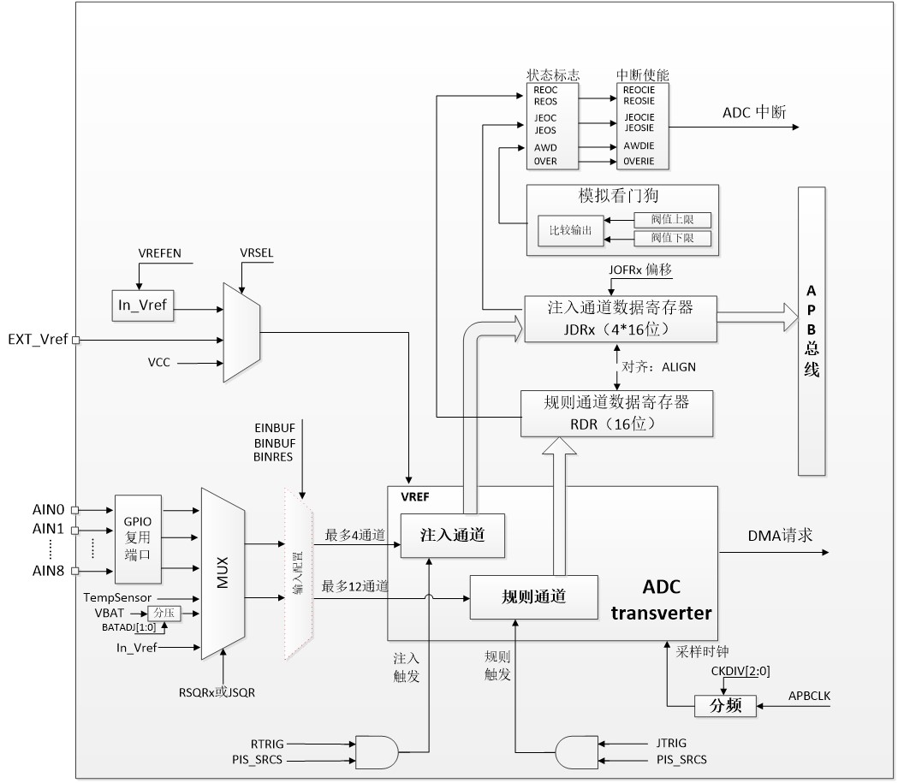
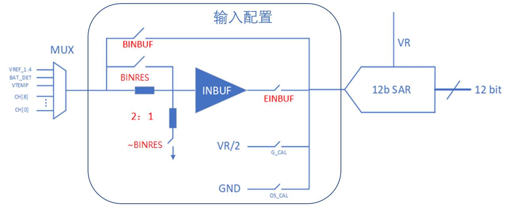
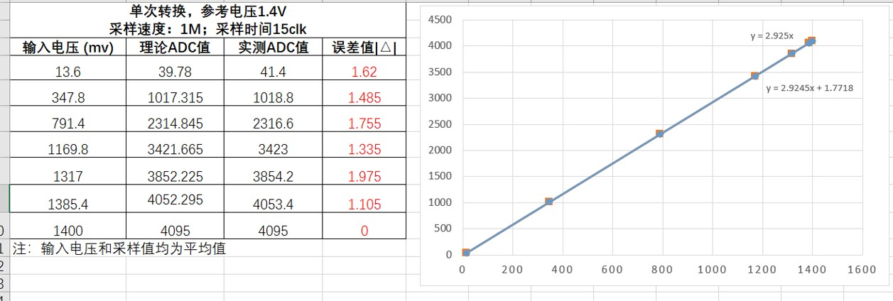

# 应用笔记_ADC基础和应用

## 1 ADC模块介绍
### 1.1 ADC功能
ADC是Analog-to-Digital Converter的缩写。指模/数转换器或者模拟/数字转换器。是指将连续变量的模拟信号转换为离散的数字信号的器件，LE5010/5110集成一个12位高精度SAR-ADC模块，其具有以下特点：
+ 最多支持12通道（9个外部输入、Temp sensor、内部1.4V参考源和vbat）
+ 支持规则转换、注入转换以及模拟看门狗，每个时间事件支持独立产生中断
+ 支持单次或连续转换模式
+ 支持自动将通道0转换为通道“n”的扫描模式
+ 可配置的数据对齐方式
+ 可独立设置各通道采样时间
+ 支持不连续采样模式
+ 可配置的参考源选择
+ 可配置的转换时钟分频
+ 规则通道转换期间可产生DMA请求
+ 支持外设互联触发
+ 支持内部1/3分压、buf驱动能力增益配置

### 1.2 ADC系统框图
ADC系统如图所示：

## 2 输入选择

用户可以根据不同的应用场景，通过不同的配置选择不同的ADC输入方式，ADC输入框图如下：

| ENINBUF | BINBUF | BINRES |  输入通道模式说明               | 应用场景 |
|---------|--------|--------|--------------------------------|----------|
| 1       |   0    |   1    |  输入信号经过输入buf运放驱动ADC  |适合采样信号驱动能力弱场景，例如采样对象为外部电阻分压；注意：该模式不适合采样信号太小或太大的应用，因为此时inbuf运放效果不理想 |
| 1       |   0    |   0    |  输入信号1/3分压，并经过输入buf运放驱动ADC  | 适合外部信号源电压高于ref电压场景，注意：内部1/3分压电阻电阻值约1M，该模式下，系统会有持续漏电现象 |
| 0       |   1    |   1    |  bypass并关闭输入buf运放，输入信号直接驱动ADC  | 适合除上述场景外的其他场景，例如采样输入驱动能力强、采样信号比较小或比较大的场景 |
| 0       |   0    |   x    |   bypass并关闭输入buf运放，输入信号直接驱动ADC  | 适合除上述场景外的其他场景，例如采样输入驱动能力强、采样信号比较小或比较大的场景 |  | 适合在对ADC进行增益和偏置校准时使用
 |
> 1. 除了上述配置外的其他配置，不建议用户使用

## 3 模式选择
### 23.1 规则组和注入组

LE5010/5110支持两种ADC使用方式：规则组和注入组。  

规则组：在任意多个通道上（最多12个）按一定的规则以任意顺序进行的一系列模/数转换。转换结果存在同一个寄存器。  
例如：ADC_IN3、ADC_IN8、ADC_IN2、ADC_IN2、ADC_IN0、ADC_IN2、ADC_IN2、ADC_IN7。  

注入组：独立于规则组之外，是规则转换的补充，最多支持4通道，每个通道转换结果寄存器独立；转换优先级高于规则组。
> 典型应用场景：  
1、用户需要采集4个通道数据，希望在4个都转换完成后一起取出。 
2、用户在用规则组采集N路通道数据，突发进程需要立刻采集另外一路ADC数据。  

### 3.2 单次和连续转换

单次转换：顾名思义，每触发一次，ADC完成一个通道转换，规则组和注入组一样。  

连续转换：  
规则组：ADC结束一个转换后立即启动一个新的转换，直到转换完预定的规则组数停止。  
注入组：不支持连续转换模式，自动注入除外。
> 1. 自动注入jauto：可结合规则组，扩展规则组通道数量。  
> 2. 如果自动注入使能，规则组在转换完最后一个自动开始转换注入通道
### 3.3 扫描模式
扫描模式在规则组合注入组应用中存在一定差异：
规则组：ADC会扫描所有通道，每个通道都执行一次转换；如同时开启连续模式，ADC会不断的扫描每个通道不会停止。

注入组：ADC会扫描所有通道，每个通道都执行一次转换。
> 1. 扫描模式下，通道数设置无效。
### 3.4 不连续模式（或叫间断模式）

规则组：DISCNUM不连续转换通道数N，每次触发会启动N个通道转换，直到序列中的所有转换均完成为止。

	例如：n = 3，要转换的通道 = 0、1、2、3、6、7、9、10
                         第1次触发：转换序列0、1、2
                         第2次触发：转换序列3、6、7
                         第3次触发：转换序列9、10并生成REOS事件
                         第4次触发：转换序列0、1、2
注入组： DISCNUM无效，每次触发会启动1个通道转换，直到序列中的所有转换均完成为止。
> 1. 不可同时使用自动注入. 
> 2. 避免和规则组同时使用不连续模式

## 4 采样速率

### 4.1 采样时钟速率
时钟速率=APBCLK / CKDIV

其中APBCLK为APB时钟，最大支持64M，最小为总线时钟16分频  
CKDIV为ADC模块独立的分配系数，支持1~128分频  
所以采样时钟最快可以支持到64M，最慢支持总线时钟16*128分频  
### 4.2 转换速率
转换速率=采样时钟速率 /（T+采样时间）  
T表示ADC转换时间，固定15个clk     
| SAMPLE[1:0] | 采样时间(单位：1/Fck) | ADC12转换速率 T = 15 |  
|-------------|----------------------|----------------------|
|     0       |         1            |       Fck/16         |
|     1       |         2            |       Fck/17         |
|     2       |         4            |       Fck/19         |
|     3       |         15           |       Fck/30         |

## 5 ADC测量精度
在1M+15clk下，误差基本可以保证在2个LSB以内，12位ADC测试精度可达10.5位。

## 6 ADC注意事项
1、在触发ADC采样完成之前，避免重复触发ADC采样 。 

2、规则组多通道连续转换模式，在一个通道完成转换后用户必须及时从ADC_RDR寄存器取出数据，否则容易被下一通道覆盖。

3、ADC外部采样电路，建议加一个104电容，采样效果更佳。

4、在多通道连续高速采样应用中，建议对通道的采样时间设为15个clk，否则由于ADC内部电容放电不及时，两个通道间容易造成干扰。
