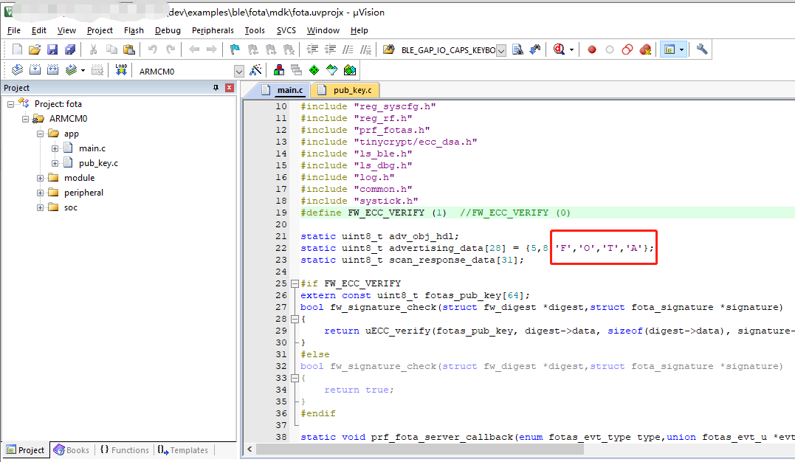

# LE5010 OTA应用说明


## 第1章   OTA镜像处理流程

### 1.1  BLE 应用下 Flash的分区使用情况：


和OTA相关的有两个区域：**OTA SETTINGS** 和 **info Page**。下面具体分析：

### 1.2  OTA 分类

#### 1.2.1 前台 OTA

​	OTA功能以独立的程序映像烧录在芯片Flash特定地址，独立于应用程序映像。在实施OTA升级前，需要跳出应用，重启执行OTA功能。在OTA过程中，不能完成原有应用功能，只有OTA状态呈现，因此称作 *前台OTA* 。

#### 1.2.2 后台OTA

​	OTA功能与应用编译在同一程序映像中。实施OTA升级时，原有应用功能依然可以运行，因此称作 *后台OTA* 。

#### 1.2.3  双区OTA

​	可用于应用程序存储的Flash空间一分为二。一部分存储当前运行的应用固件，另一部分存新固件。当新固件全部收到之后，重启，将老固件擦除，新固件搬移到老固件所在的位置。这种方式固件存储区一份为二，因此称作 *双区OTA* 。这种方式的好处在于，若新固件接收过程中出现异常，老固件可以重新运行。

#### 1.2.4 单区OTA

​		当应用程序固件较大，可用于应用程序存储的Flash空间无法容纳两份应用程序固件的时候。固件升级只能通过 *单区OTA* 的方式进行。在固件升级前，先进入OTA模式，擦除原有固件，接收新固件，若接收失败，则继续维持OTA状态，必须重新接收新固件。

​	综合上述4个概念，可行的OTA方式有：`**前台单区OTA**`，`**前台双区OTA**`，`**后台双区OTA**`。这三种方式我们均支持。


### 1.3 关键概念

#### 1.3.1 Flash可用空间

​	Flash会存放信息页，Bootloader，协议栈，持久数据和OTA功能映像等内容，在这些区域之外，Flash剩下的大片连续区域称作 *Flash可用空间*

#### 1.3.2 固件大小最大值

​	开发者需要对应用程序当前版本和后续一切新版本的程序映像大小最大值有一个估计。双区OTA的条件是 `Flash可用空间大小 > 2 * 固件大小最大值`

#### 1.3.3 应用程序映像地址和新固件下载地址

​	在单区OTA中：`新固件下载地址 == 应用程序映像地址`

​	在双区OTA中：`新固件下载地址 > 应用程序映像地址 + 应用程序大小` 并且 `新固件不能超出Flash可用空间范围`

#### 1.3.4 OTA 功能程序映像地址（仅针对前台OTA）

​	前台OTA的OTA功能程序存放地址和执行地址均不同于用户应用程序。OTA功能程序既不能覆盖Flash其他区域信息，又要确保尽可能留出更大的Flash可用空间，因此在编写和链接的时候，要特别注意程序大小及链接地址。


### 1.4  Bootloader 启动流程（OTA相关）

> 代码路径：ls_sdk\bootloader\boot_ram\le501x\boot_ram_le501x.c


&emsp;Bootloader 的一项功能就是引导应用程序的启动，这时就需要知道image的起始地址image_base；这个image_base 地址一般是在Flash的INFORMATION区域。这里还需要考虑前后台单双分区OTA 的情况。


图表 1: OTA镜像处理流程


**步骤一**：从 INFORMATION 区域读取出 image base 确定镜像起始地址；默认是0x18034000 (KEIL工程下，这个值是在 编译结束后在 after_build.bat 中写入的)： 


**步骤二**：从 OTA SETTINGS 区读取新 image 的信息，包括起始地址和镜像大小；如果读回的数据不是全F， 表示有 OTA 的镜像已经更新，需要

\1) 将新的镜像搬移到步骤一读取到的 image base 地址（一般是 0x18034000）;

\2) 清除前台OTA升级标志位 （使用的是系统的寄存器 SYSCFG->BKD[7] ）；

**步骤三**：判断是否进行前台OTA;

前台OTA需要判断，前台OTA升级标志和OTA的类型是前台单区OTA；满足条件就从Flash 0x28 的偏移地址读取 image base（默认是 0x0x18072000 , 这个值是在 ls_sdk\tools\le501x\after_build.bat 中写入的）


 

**步骤四**：boot_app从image_base 处启动；


### 1. 5  OTA和Flash操作相关API：

#### 	1 .5.1 OTA结束后将镜像信息写入OTA SETTINGS区域

OTA结束以后需要将OTA镜像的地址和镜像的大小写到Flash的OTA SETTINGS区域；调用的接口：

```c
void ota_copy_info_set(struct fota_image_info *ptr);
```

**参数说明：**

```c
1. struct fota_image_info
2. {
3.   uint32_t base;  // OTA镜像起始地址
4.   uint32_t size;  // OTA镜像大小
5. };
```


#### 1. 5. 2  Flash接口

##### 		1.5.2.1  Read

```c
void spi_flash_quad_io_read(uint32_t offset, uint8_t * data, uint16_t length);
```

参数说明：

> 1. uint32_t offset : 偏移地址；
> 2. uint8_t * data : 读取数据的buffer 指针；
> 3. uint16_t length : 读取的数据长度；


##### 		1. 5. 2. 2  Program

```c
void spi_flash_quad_page_program(uint32_t offset,uint8_t *data,uint16_t length);
```

参数说明：

> 1. uint32_t offset : 偏移地址；
> 2. uint8_t * data : 要写入数据的buffer 指针；
> 3. uint16_t length : 写入数据长度；


##### 		1. 5. 2. 3  Sector Erase （4KB擦除）

```c
void spi_flash_sector_erase(uint32_t offset);
```

参数说明：

> uint32_t offset : 偏移地址；


##### 	1. 5. 2. 4  Page Erase （256 Bytes擦除）

```c
void spi_flash_page_erase(uint32_t offset);
```

参数说明:

> uint32_t offset : 偏移地址；


##### 1. 5. 2.5  软件复位

```c
void platform_reset(uint32_t error);
```

------


## 第2章  OTA服务的添加和APP升级流程测试

这里以在SDK中的ble_dis例程中添加OTA服务为例，演示如何在项目中添加OTA服务，以及如何利用安卓OTA APP进行固件升级；

### 2. 1  添加OTA服务

#### 2. 1. 1  添加OTA相关头文件

```c
#include "prf_fotas.h"
#include "tinycrypt/ecc_dsa.h"
```


#### 2. 1. 2  添加 OTA profile


 

#### 2. 1. 3  添加ECC校验函数和OTA服务回调函数

具体代码参考SDK中的fota示例代码：

 


#### 2. 1. 4  修改DK_MAX_PROFILE_NUM宏

这里仅以 dis server 例程为例，项目中以具体使用的 profile 数量为准；


 


### 2. 2  OTA APP升级测试 

**测试方法**：

烧录 dis server 的例程，通过安卓OTA APP将uart server固件更新进去； 

#### 2. 2. 1  烧录好添加了OTA服务的dis固件；

烧录好添加完添加了OTA服务的dis server固件。

#### 2. 2. 2  生成 uart server bin 文件

以KEIL环境为例，编译好uart server例程；用下面的命令将 *ls_ble_sdk\dev\examples\ble_uart_server\mdk\UVBuild* 目录下的 **ble_uart_server.axf**  转成 **ble_uart_server.bin**  文件：

```shell
fromelf --bincombined --output=ble_uart_server.bin ble_uart_server.axf
```

 


#### 2. 2. 3  将生成的ble_uart_server .bin文件传到手机；

#### 2. 2. 4  使用OTA APP连接对应的设备


 

#### 2. 2. 5  开始更新

选择要更新固件的 bin 文件，点击 Start FOTA 进行升级：（默认双分区升级镜像放在 0x18020000 地址，可以根据项目情况修改）


 

#### 2. 2. 6  OTA 完毕 

OTA结束后，APP底部会出现 ‘OTA complete,status:0’ 的提示；**忽略结束时**APP提示的错误；


 

### 2. 3  安卓OTA APP源码

源码仓库 ：<https://github.com/linkedsemi/BLE_FOTA_APP>


## 第3章  OTA之固件签名升级流程

 

### 3. 1  固件签名简介

对用于升级的固件有安全性要求的场景下，可以使用固件签名。启用固件签名功能后，SBL会检查签名是否合法，如果不合法，则拒绝升级，以此保障新固件的来源可靠,固件签名采用ECDSA算法。

1. 利用“tools/signing/key_gen.py” 生成一对密钥，包含公钥、私钥。

2. FOTA (dev\examples\ble\fota) 中，定义宏“FW_ECC_VERIFY”为1，并将公钥拷贝到 “sbl/pub_key.c”文件中，编译生成带有验证签名功能的FOTA。

3. 新固件生成后，利用 tools/signing/signing.py 生成固件签名文件。手机OTA升级时，除了选择固件文件之外，还要选择此签名文件。

   

### 3. 2  操作步骤（前台OTA）


#### 3. 2. 1  密钥生成

打开” tools/signing/key_gen.py”中脚本,运行后会生成一对密钥:


 

  

#### 3. 2. 2  带签名验证功能的固件生成

打开“**dev\examples\ble\fota**”文件夹,并将宏“**FW_ECC_VERIFY**”设置为1,并将公钥“ **verifying_key**”拷贝到“**pub_key.c**”文件中,再编译出相应的“**fota.hex**”固件。


 


 

前台OTA的模式需要注意，我们进入OTA模式是需要调用这个函数：“**request_ota_reboot()**”，这时候我们会进行复位进入OTA的应用里，而且广播名称也会变成fota项目工程中定义的名称，如下图部分代码所示：



 

将上面的步骤全部走完后就可以编译fota这个项目工程，如下图所示生成了一个“fota.hex”文件，这个文件将在下面会使用到，也就是在调用“request_ota_reboot()”这个函数后就会跑fota这个应用中，在这个应用中便可以使用APP进行升级。


 

  当然上面的步骤还只是调用“request_ota_reboot()”这个函数后进行的操作，现在将介绍在哪调用这个函数，这个步骤和和前台OTA操作不一样，因为前台OTA是直接将OTA这个功能移植到了我们的应用中去了，而后台OTA的操作就需要调用一个函数后才能进这个OTA的应用中。

  详细步骤就是：在调用“request_ota_reboot()”这个函数后，我们会在做一个标记，做完这个标记后设备会进行复位重启，这时候设备在重启的时候检测这个标记是否被标记上，如果有被标记就会跑OTA的应用，否则就会走原来的应用，在OTA操作成功后会将这个标记清除，此时我们的应用部分也被升级掉了，这时去跑原来的应用也就是跑升级后的固件了。


下图就是在我们的应用部分调用“request_ota_reboot()”这个函数然后再去下载的文件，

这个例程是在AT指令中添加了一个OTA的指令，在发送“AT+OTA”这条指令后便会触发这个函数：


需要注意一共需要下载4个文件：

1. 协议栈“fw.hex”; 
2. second bootloader “info_sbl.hex”; 
3. 应用部分“xxxx.hex”; 
4. OTA部分“fota.hex”

或者下载2个文件：

1. 协议栈、second bootloader、应用部分的合并文件：“XXX_production.hex”
2. OTA部分“fota.hex”


#### 3. 2. 3  签名文件生成

新固件生成后，利用“tools/signing/signing.py”生成固件签名文件。手机OTA升级时，除了选择固件文件之外，还要选择此签名文件,注意需要使用以下命令进行生成“signing_key.pem”

```shell
python signing.py [ota_firmware].bin signing_key.pem
```


注：此时我使用的是ble_uart_server作为测试例程，所以在生成签名文件的时候“[ota_firmware].bin”使用的就是 “ble_uart_server.ota.bin”，（注意：此时的ble_uart_server这个工程是模拟修改了一些bug后的新固件，所以后面是将这个新固件去升级原始的老固件。）


 


 

 

 

 

注意:这条指令必须使用python3打开,否则会出问题,如果没有生成这个“signature.bin”文件,有可能是因为安装了Python2导致不能识别这条指令。并且注意这个签名文件只是针对这个“ble_uart_server.ota.bin”进行了签名，在OTA时需要将这两个文件添加进去才能进行升级，并且这个签名文件错误也会升级不成功。

### 3. 3  操作步骤（后台OTA）

#### 3. 3. 1  添加相应代码

这部分在需要添加后台OTA的应用代码中进行加入。

```c
#define FW_ECC_VERIFY (1)

#if FW_ECC_VERIFY
extern const uint8_t fotas_pub_key[64];
bool fw_signature_check(struct fw_digest *digest,struct fota_signature *signature)
{
	return uECC_verify(fotas_pub_key, digest->data, sizeof(digest->data), signature->data, uECC_secp256r1());
}
#else
bool fw_signature_check(struct fw_digest *digest,struct fota_signature *signature)
{
	return true;
}
#endif

 
static void prf_fota_server_callback(enum fotas_evt_type type,union fotas_evt_u *evt,uint8_t con_idx)
{
	switch(type)
	{
		case FOTAS_START_REQ_EVT:
  		{
			// ota_settings_write(SINGLE_FOREGROUND); 
		    ota_settings_write(DOUBLE_FOREGROUND); 
            enum fota_start_cfm_status status;
		    if(fw_signature_check(evt->fotas_start_req.digest, evt->fotas_start_req.signature))
		    {
		      status = FOTA_REQ_ACCEPTED;
		    }
			else
		    {
		      status = FOTA_REQ_REJECTED;
		    }
		    prf_fotas_start_confirm(con_idx, status);
        }
        break;
		case FOTAS_FINISH_EVT:
		    if(evt->fotas_finish.integrity_checking_result)
		    {
		      if(evt->fotas_finish.new_image->base != get_app_image_base())
		      {
		        ota_copy_info_set(evt->fotas_finish.new_image);
		      }
              else
		      {
		        ota_settings_erase();
		      }
		      platform_reset(RESET_OTA_SUCCEED);
	    	}else
		    {
		      platform_reset(RESET_OTA_FAILED);
		    }
         break;
		 default:
    		LS_ASSERT(0);
  		 break;
	}
}
```

```c
static void prf_added_handler(struct profile_added_evt *evt)
{
	LOG_I("profile:%d, start handle:0x%x\n",evt->id,evt->start_hdl);
	switch(evt->id)
	{
        case PRF_FOTA_SERVER:
            prf_fota_server_callback_init(prf_fota_server_callback);
            create_adv_obj();
        break;

        default:

        break;
	}
}
```

```c
case SERVICE_ADDED:
	dev_manager_prf_fota_server_add(NO_SEC);
break;
```

```c
case PROFILE_ADDED:
	prf_added_handler(&evt->profile_added);
break;
```

 

#### 3. 3. 2  密钥生成

前后台OTA的固件签名是一样操作的，详见：[3.2.1 密钥生成](#_密钥生成) 章节  

#### 3. 3. 3  带签名验证功能的固件生成

前后台OTA带签名验证功能固件却不一样，

打开我们需要进行添加后台OTA的应用工程，我这边测试使用的是ble_uart_serve ，首先打开“dev\examples\ble\ble_uart_serve”文件夹,并按照 [3.3.1 添加相应代码](#_添加相应代码) 章节所述进行代码的添加。


并将公钥“ verifying_key”拷贝到“pub_key.c”文件中,（如下图所示）再编译相应的应用工程，我这边测试使用的是ble_uart_serve ，所以会生成一个“ble_uart_server_production.hex”固件。

 

 


#### 3. 3. 4  签名文件生成

前后台OTA的签名文件是一样操作的，详见：[3.2.3 签名文件生成](#_签名文件生成) 章节  


### 3. 4  OTA APP升级测试

#### 3. 4. 1  准备升级文件

在使用APP对模块进行升级的时候需要准备三个文件：

一、需要准备好带签名验证功能的固件，可以查看“带签名验证功能的固件生成”的篇章;

二、需要准备好签名文件以及做了签名操作的新固件，可以查看“签名文件生成”的篇章;

三、需要准备好OTA升级的手机版应用程序（.APK文件）。

#### 3. 4. 2  升级操作步骤

步骤如下：

首先通过j-flash将“带签名验证功能的固件”下载到开发板中，此项操作我们暂且称为“老固件”;


然后再将手机中安装好APP;


将签名文件以及做了签名操作的新固件下发给手机，打开APP后，选择这两个文件进入升级，

搜索到设备后点击连接;


 

选择文件将做了签名操作的新固件和签名文件导入进去;


​        


**开始OTA**，注意地址位置需要和你们的代码的位置，以及前后台的模式进行调整。

下图便是启动了验证以及升级成功的界面。


​       


------


## 修订记录

| **版本** | **修订日期** | **修订说明**                    | **作者** |
| -------- | ------------ | ------------------------------- | -------- |
| V1.0     | 2021-3-30    | 初始版本                        | jxia     |
| V1.1     | 2021-7-28    | 增加签名认证的加密OTA介绍       | wyu      |
| V1.2     | 2021-10-25   | 调整为Markdown格式,修改部分内容 | jxia     |
|          |              |                                 |          |

