# LE5010睡眠模式的应用说明

## 1. 睡眠模式的介绍

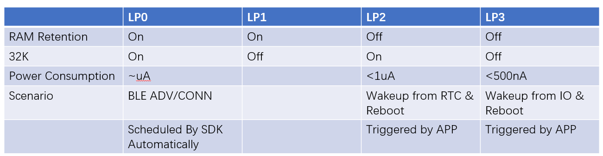

常用的三种睡眠模式，LP0、LP2、LP3各自的特点：

* **LP0**：蓝牙正常工作，空闲情况下进入睡眠状态：SDK软件自动进入睡眠模式，睡眠前的IO口保持动作SDK已经处理了，应用软件不用在处理；该模式下可以通过BLE事件或者外部中断唤醒；

* **LP2**：睡眠之后蓝牙不工作，可以通过RTC和外部中断引脚唤醒，每次唤醒相当于复位；底电流1.5uA;

* **LP3**：睡眠之后蓝牙不工作，可以通过外部中断引脚唤醒，每次唤醒相当于复位。

  进入LP2和LP3需要软件配置睡眠唤醒的方式，然后调用接口进入睡眠模式：不能通过BLE事件唤醒。

  >  注：所有睡眠模式下，当使用串口打印时，需要将RX上拉（避免RX漏电导致功耗偏高。原因：UART RX 口为浮空输入时，会有漏电，需要配置内部上拉）;

## 2. BLE应用睡眠配置

### 2.1 LP0模式

#### 2.1.1 软件配置

 LP0的睡眠和广播间隔，发送功率还有外设的工作状态有关； 软件在ble_loop 中会检查是否有协议栈事件和外设工作要处理，如果没有会自动进入睡眠流程；

睡眠之前需要配置睡眠相关的宏，如下：

```c
#define SDK_DEEP_SLEEP_ENABLE 1
#define DEBUG_MODE 0
```

另外，由于LP0 模式下只要外设还在工作，就无法进入睡眠模式，所以外设使用完毕后需要反初始化处理，包括外设用到IO口，以串口的反初始化为例：

```
HAL_StatusTypeDef HAL_UART_DeInit(UART_HandleTypeDef *huart);
void uart1_io_deinit(void);
```

**关于系统的主频**，SDK默认的主频是64M，不同主频下的功耗是有差异的，如果需要修改系统主频，可以在app_config.h配置相关的宏：

```
#define SDK_HCLK_MHZ   (16)  // 配置主频为 16M
```

**关于builtin timer**， builtin timer在LP0模式下，定时时间到了以后也可以唤醒系统；


#### 2.1.2 **功耗测试数据**：

##### 2.1.2.1 测试环境

* SDK 版本：V0.9.1；
* 测试例程:example/ble/ble_dis；
* 硬件：QFN32评估板；

##### 2.1.2.2 综合测试数据

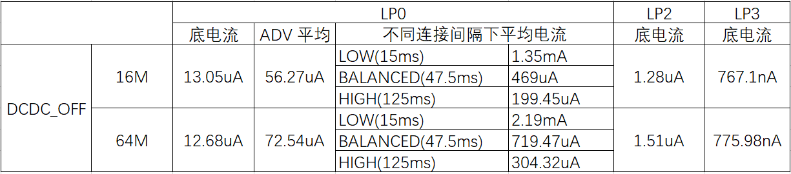

##### 2.1.2.3 实测功耗数据:

######  1.  DCDC-OFF  16M主频一秒钟广播间隔 底电流

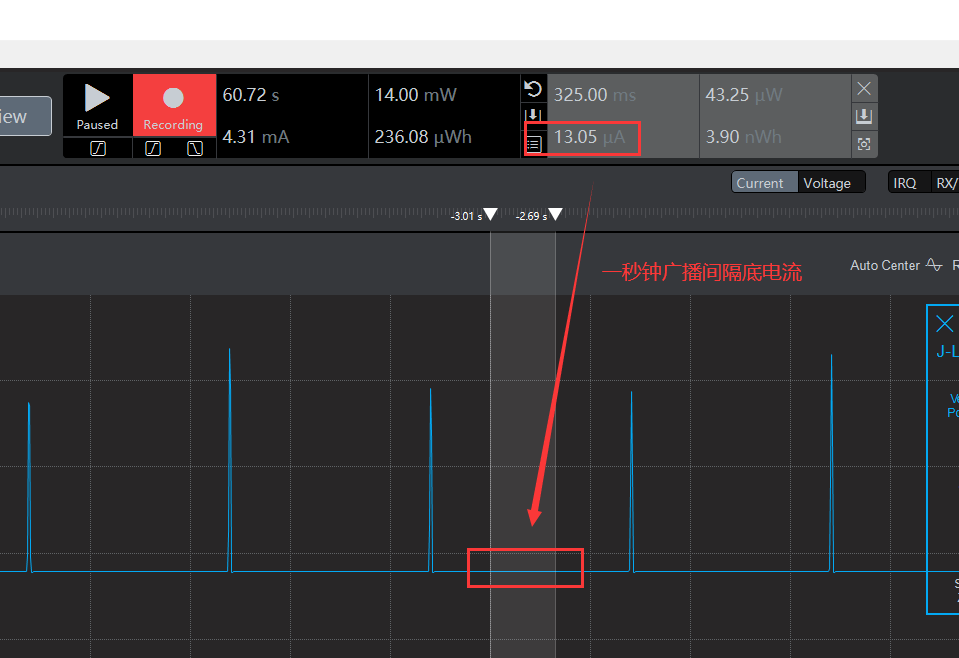

###### 2.  DCDC-OFF 16M主频一秒钟广播间隔平均功耗：

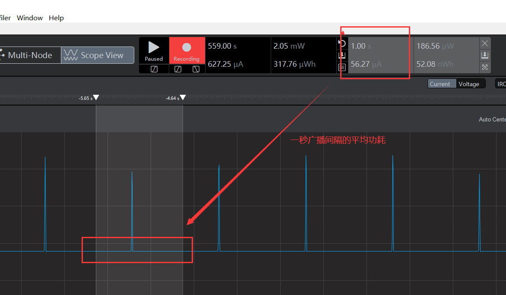

###### 3 . DCDC-OFF 64M主频一秒钟广播间隔底电流:

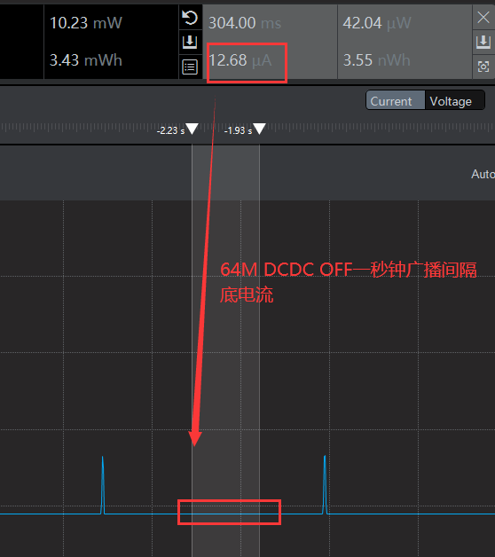

###### 4. DCDC-OFF 64M主频一秒钟广播间隔平均功耗:

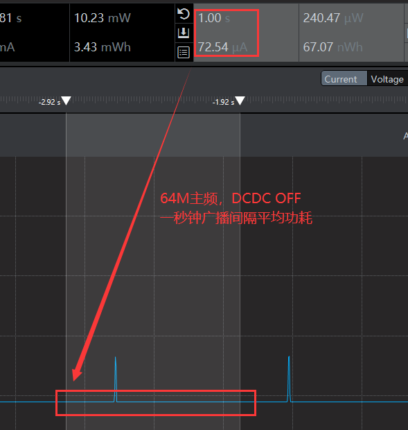

###### 5. 16M主频不同连接间隔下的平均功耗：

* LOW (15ms 连接间隔) :

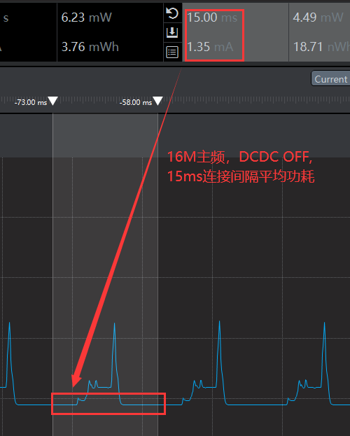

* BALANCED (47.5ms连接间隔):

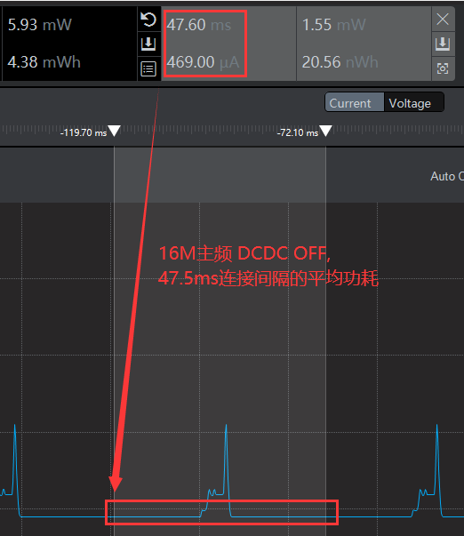

* HIGH (125ms连接间隔):

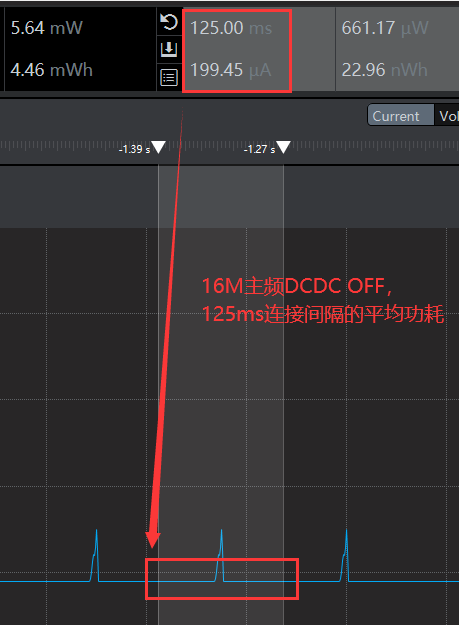

###### 6.64M主频不同连接间隔下的平均功耗：

* LOW (15ms 连接间隔):

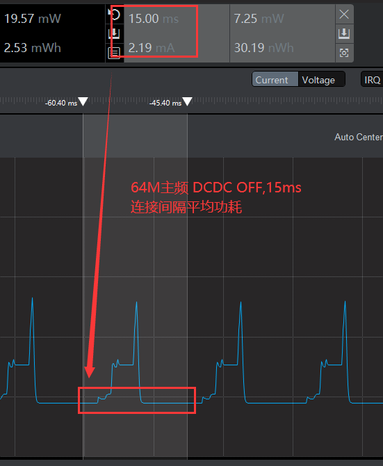

* BALANCED (47.5ms连接间隔):

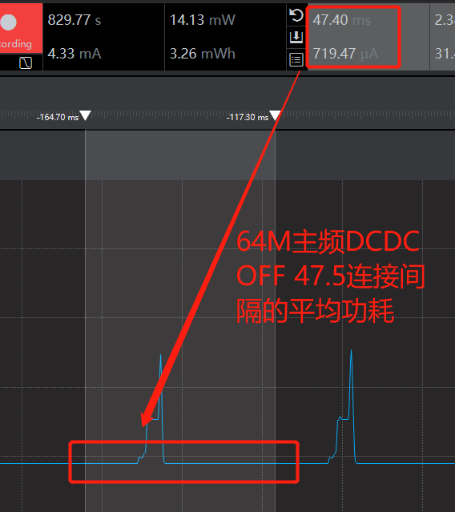

* HIGH (125ms连接间隔):

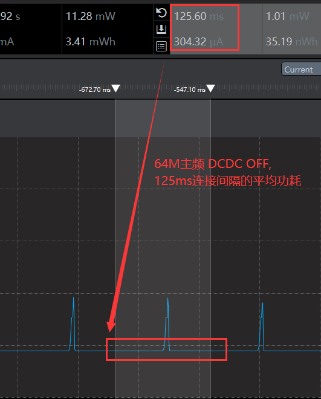

###  2.2 LP2模式

进入睡眠状态需要将外设以及映射到的IO进行反初始化、软件定时器关掉；**LP2模式可以通过RTC和外部中断唤醒，可同时使用**；**外部中断是固定的四个引脚：PA00,PA07,PB11,PB15;**

#### 2.2.1 软件配置

##### 2.2.1.1 添加相关头文件

```c
#include "lsrtc.h"                  
#include "field_manipulate.h"，
#include "sleep.h"
```

##### 2.2.1.2 配置睡眠相关宏：

```c
#define SDK_DEEP_SLEEP_ENABLE 1
#define DEBUG_MODE 0
```

##### 2.2.1.3 唤醒源配置：PB15上升沿和RTC唤醒

```c
static void  ls_sleep_enter_lp2(void)
{
      struct deep_sleep_wakeup wakeup;
	  memset(&wakeup,0,sizeof(wakeup));
	  wakeup.pb15 = 1 ;                          //选择PB15作为唤醒io
	  wakeup.pb15_rising_edge = 1;               //选择上升沿唤醒; 1 为上升沿唤醒，0 为下降沿唤醒；
	  wakeup.rtc = 1 ;                           //选择LP2模式
   	  enter_deep_sleep_mode_lvl2_lvl3(&wakeup);  //调用睡眠函数
}
```

##### 2.2.1.4 配置外部中断和RTC唤醒时间 ：

```c
void exit_iowkup_init(void)
{	
	io_cfg_input(PB15);                       
    io_pull_write(PB15, IO_PULL_DOWN);         
    io_exti_config(PB15,INT_EDGE_RISING);   
    io_exti_enable(PB15,true);                
}
void RTC_WKUP_INIT(void )
{
     HAL_RTC_Init(RTC_CKSEL_LSI);	 
	 RTC_wkuptime_set(1);
}
```

#### 2.2.2 实测功耗

* 16M主频底电流:

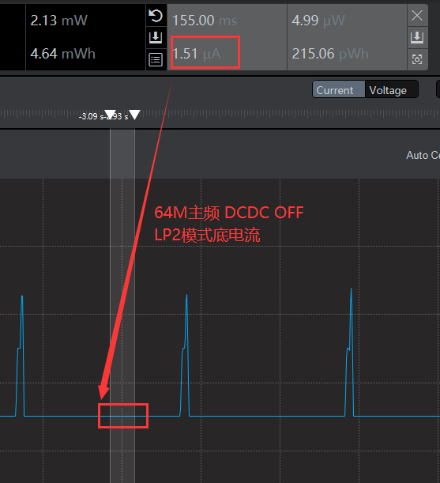


### 2.3 LP3模式

LP3睡眠模式可以用外部中断唤醒，**外部中断同样也是固定的四个引脚：PA00,PA07,PB11,PB15**;

#### 2.3.1 软件配置

##### 2.3.1.1 在app_config.h配置睡眠相关的宏：

```c
#define SDK_DEEP_SLEEP_ENABLE 1
#define DEBUG_MODE 0
```

##### 2.3.1.2 配置唤醒模式：PA07上升沿唤醒

```c
static void ls_sleep_enter_LP3(void)
{
  struct deep_sleep_wakeup  wakeup;
	memset (&wakeup,0,sizeof(wakeup));
	wakeup.pa07 = 1;
	wakeup.pa07_rising_edge = 1;  // 1 为上升沿唤醒，0 为下降沿唤醒；
	enter_deep_sleep_mode_lvl2_lvl3(&wakeup);//调用睡眠函数
}
```

##### 2.3.1.3 外部中断配置

```c
void exitpa07_iowkup_init(void)
{	
    io_cfg_input(PA07);                       
    io_pull_write(PA07, IO_PULL_DOWN);         
    io_exti_config(PA07,INT_EDGE_RISING);   
    io_exti_enable(PA07,true);                
}
```

#### 2.3.2 实测功耗：

* 16M主频DCDC_OFF底电流:

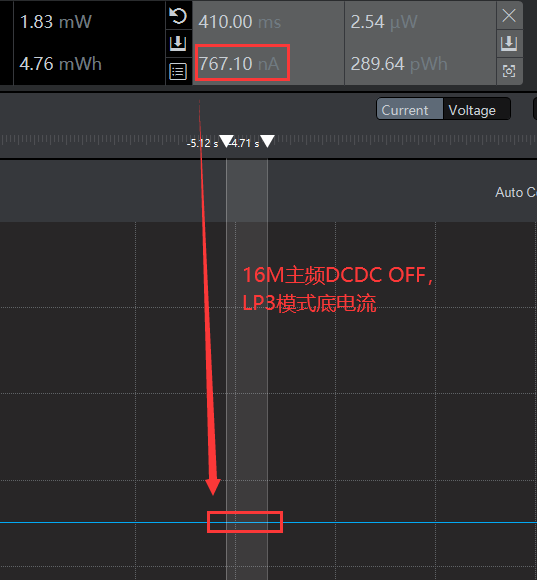


## 3. 单独做MCU应用睡眠配置

LE5010可以单独在使用MCU功能，不使用BLE功能；**此时LP0的睡眠模式需要调用相关的接口才能进睡眠，LP2和LP3模式的睡眠和BLE应用的接口相同；**

LP0睡眠模式，**调用 deep_sleep_no_ble() 接口进入睡眠模式**，进入睡眠后可以通过RTC或者外部中断脚唤醒；在睡眠之后为了防止外设漏电，需要将外设和对应引脚反初始化处理；


### 3.1 软件配置


* 添加头文件

```
#include "sleep.h"
```

* 在app_config.h配置如下两个宏：

```c
#define SDK_DEEP_SLEEP_ENABLE 1
#define DEBUG_MODE 0
```


## 4.  获取唤醒源


LE5010 睡眠唤醒后，可以通过接口获取唤醒源，通过唤醒源可以判断是RTC唤醒还是某个唤醒引脚唤醒的

### 4.1 唤醒源接口

* API接口：

```c
uint8_t get_wakeup_source(void);
```

不同唤醒源对应的返回值代码路径：     ls_ble_sdk\dev\soc\arm_cm\le501x\sleep.h

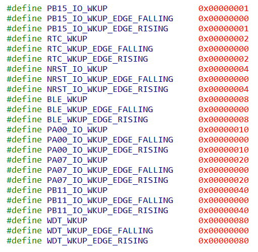

### 4.2 API测试代码：


获取RTC唤醒和PB15下降沿唤醒时，打印出唤醒源测试代码：

```c
    case STACK_READY:
    {
        uint8_t addr[6];
        bool type;
        dev_manager_get_identity_bdaddr(addr,&type);
        LOG_I("type:%d,addr:",type);
        LOG_HEX(addr,sizeof(addr));
        HAL_RTC_Init(RTC_CKSEL_LSI);	 
	    RTC_wkuptime_set(1);	
		uint8_t wkup_source = get_wakeup_source();	
		if(wkup_source == RTC_WKUP)
		{					
			LOG_I("WKUP_SOURCE = %d",wkup_source);  // 打印唤醒源
			dev_manager_prf_dis_server_add(NO_SEC,0xffff);
			ls_uart_init();
		}
		else 
		{
			ls_sleep_enter_lp2();
		}	      
    }break;
```

#### 4.2.1 RTC 唤醒

上电后进入休眠，RTC一秒后唤醒进行服务的添加和外设的初始化。

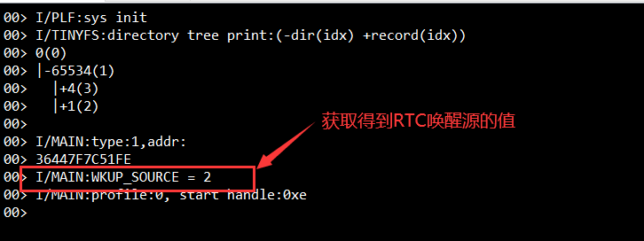

#### 4.2.2 PB15 下降沿唤醒

上电后进入休眠，PB15下降沿唤醒进行服务的添加和外设的初始化。

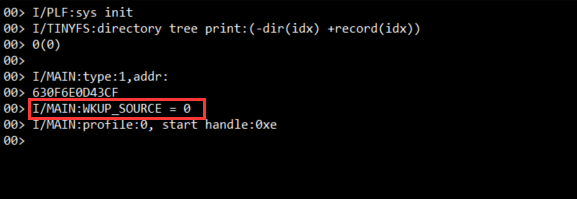

## 5. 注意事项：

* 5010/5110芯片支持4个GPIO唤醒：PA00、PA07、PB11、PB15。且支持上升沿或下降沿唤醒。
* 当配置多个唤醒源，且唤醒沿不一致时，如果其中唤醒源上升沿唤醒，会误触发其他配置了下降沿的唤醒源产生下降沿唤醒标志位。
  应用时，建议用户两种规避方式：
  * 尽量使用上升沿唤醒；
  * 使用下降沿唤醒时，唤醒后通过读取IO输入数据寄存器bit位判断是哪个唤醒IO发生唤醒。

