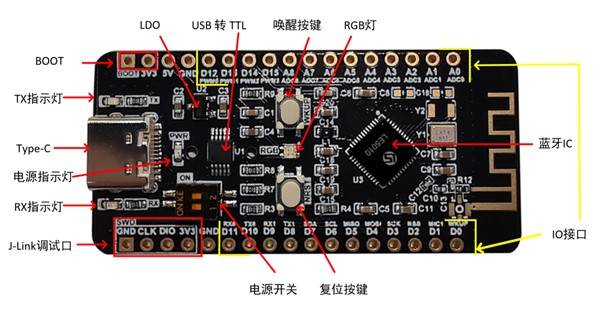
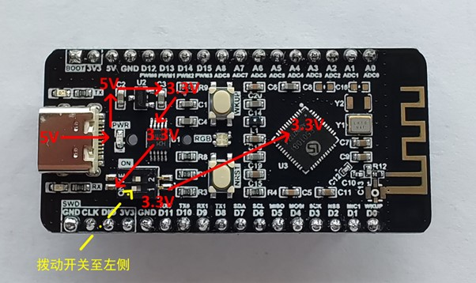
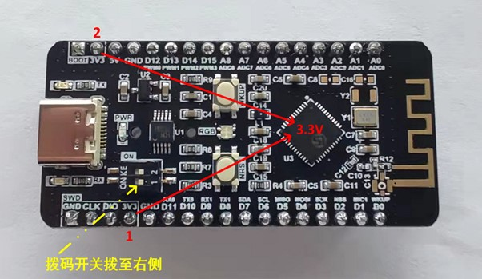
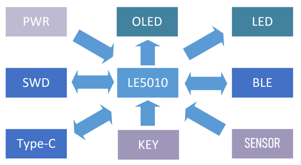
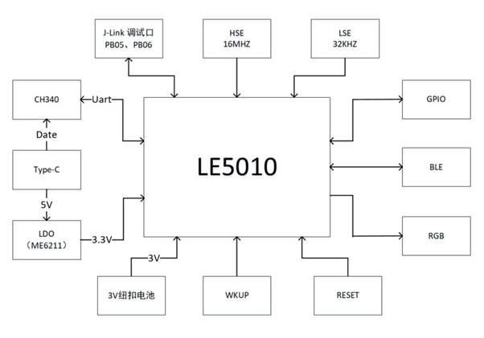
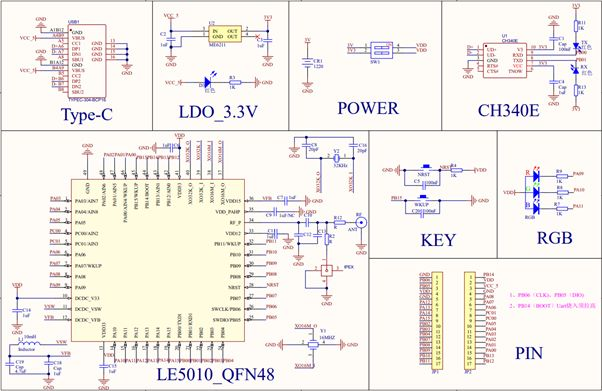
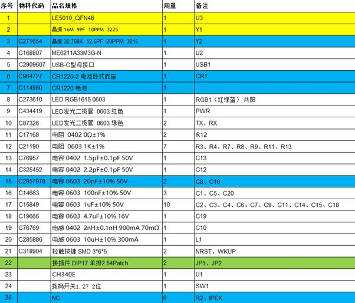

# Evaluation Boards

## 第1章   LE5010 Solo开发板硬件设计

### 1. 1    开发板硬件资源

图1 LE5010 Solo Board 实物图

 

图1 LE5010 Solo Board为凌思微 LE5010 QFN48封装的开发学习板

1、板宽为25.4*53.09mm，兼容面包板，板载天线保持黑漆倒角， PCB沉金工艺，丝印清晰，外观简洁美观。

2、25个外接 IO（包括数字和模拟IO）

3、TYPE-C口供电（5V）,外部电源供电（3.3V）

4、一个RGB灯, 不影响功耗测试

5、具有USB-UART转换芯片 (Type-C口兼容UART通信烧录)

6、J-link（SWD模式）四线烧入调试口

7、具有TX/RX 串口状态灯和PWR电源指示灯

8、具有一个复位按键和唤醒按键（低电平有效）

​    

 

### 1. 2    开发板IO口分配

#### 1. 2. 1     板上外设

 LE5010 Solo Board开发板采用LE5010_QFN48封装IC芯片，扣除电源、晶振、RF管脚，共有34个IO口（包括复位、BOOT、烧录以及UART口），这里将这34个IO口分为3类，分别为学习板上外设、数字IO口、模拟IO口，具体如下表格。

下列每个表格中都有蓝色和黄色两种颜色，  **LE5010_QFN48_IO_Config**代表LE5010（QFN48封装）芯片的引脚编号和对应管脚定义的功能，**LE5010 LinkedBolck  Solo_V1.0_IO_Config**代表LE5010 Solo Board板子器件和外拉IO口的丝印编号以及Demo演示功能。表1为板上外设为与芯片直连，没有拉出测试另外的焊盘。表二和表三分别为数字IO和模拟IO，将芯片管脚拉到2.54间距的焊盘，用户可以通过杜邦线、面包板搭建搭建直接所需电路。

| **LE5010 LinkedBolck  Solo_V1.0_IO_Config** |                                        | **LE5010_QFN48_IO_Config** |                  |
| ------------------------------------------- | -------------------------------------- | -------------------------- | ---------------- |
| **丝印编号**                                | **Demo演示功能**                       | **引脚编号**               | **芯片管脚定义** |
| RGB                                         | 红灯                                   | 15                         | PA11             |
| RGB                                         | 绿灯                                   | 14                         | PA10             |
| RGB                                         | 蓝灯                                   | 9                          | PA09             |
| NRST                                        | 复位按键                               | 28                         | NRST             |
| WKUP                                        | 睡眠唤醒                               | 45                         | PB15             |
| RX                                          | 接CH340的RX                            | 20                         | PB00(TX)         |
| TX                                          | 接CH340的TX                            | 21                         | PB01(RX)         |
| DIO                                         | Jlink（SWD模式）                       | 25                         | PB05             |
| CLK                                         | Jlink（SWD模式）                       | 26                         | PB06             |
| BOOT                                        | UART烧入时，需要在上电前，将该管脚拉高 | 44                         | PB14             |

表1：板上外设IO口配置

 

#### 1. 2. 2     数字IO

 

| **LE5010 LinkedBolck Solo_V1.0_IO_Config** |                  | **LE5010_QFN48_IO_Config** |                  |
| ------------------------------------------ | ---------------- | -------------------------- | ---------------- |
| **丝印编号**                               | **Demo演示功能** | **引脚编号**               | **芯片管脚定义** |
| D0                                         | WKUP             | 32                         | PB11             |
| D1                                         | MIC              | 31                         | PB10             |
| D2                                         | SPI0_NSS         | 30                         | PB09             |
| D3                                         | SPI0_SCK         | 29                         | PB08             |
| D4                                         | SPI0_MOSI        | 27                         | PB07             |
| D5                                         | SPI0_MISO        | 24                         | PB04             |
| D6                                         | I2C0_SCL         | 23                         | PB03             |
| D7                                         | I2C1_SDA         | 22                         | PB02             |
| D8                                         | UART1_TX         | 19                         | PA15             |
| D9                                         | UART1_RX         | 18                         | PA14             |
| D10                                        | UART0_TX         | 17                         | PA13             |
| D11                                        | UART0_RX         | 16                         | PA12             |
| D12                                        | PWM0             | 8                          | PA08             |
| D13                                        | PWM1             | 7                          | PA07             |
| D14                                        | PWM2             | 6                          | PA06             |
| D15                                        | PWM3             | 3                          | PA05             |

表2：数字IO口配置

 

#### 1. 2. 3     模拟IO

 

| **LE5010 LinkedBolck  Solo_V1.0_IO_Config** |                  | **LE5010_QFN48_IO_Config** |                  |
| ------------------------------------------- | ---------------- | -------------------------- | ---------------- |
| **丝印编号**                                | **Demo演示功能** | **引脚编号**               | **芯片管脚定义** |
| A0                                          | ADC0             | 42                         | PB12             |
| A1                                          | ADC1             | 43                         | PB13             |
| A2                                          | ADC2             | 46                         | PA00             |
| A3                                          | ADC3             | 47                         | PA01             |
| A4                                          | ADC4             | 48                         | PA02             |
| A5                                          | ADC5             | 1                          | PA03             |
| A6                                          | ADC6             | 2                          | PA04             |
| A7                                          | ADC7             | 4                          | PC00             |
| A8                                          | ADC8             | 5                          | PC01             |

表3：模拟IO口配置

 

#### 1. 2. 4     IO配置注意事项

1、 板上外设直接从芯片拉到外设上，没有另外拉到学习板2.54mm管脚上。

2、 数字IO支持任意映射，该学习板正面丝印D0~D15下方的丝印为Demo演示功能，客户可以通过修改SDK任意映射。

3、 PC01上电默认高电平，应用开发时，硬件设计需要注意初始电平特点，建议该IO设计成低电平有效，防止上电时误触发动作。

 

### 1. 3    开发板电源开关说明

#### 1. 3. 1     拨码开关使用说明

LE5010 Solo Board开发板采用2位1.27间距的拨码开关，通过拨动开关控制电路开关闭合，往左边拨为打开，反之，则为闭合。其中第1位开关控制外部3.3V供电，此3.3V为外部接口的5V转换得到。第2位CR1220型号的纽扣电池供电，当学习板外部接口上电时，禁止拨动开关到左侧，避免外部电源与纽扣电池出现相互漏电现象。为了方便客户使用，推荐使用第1位开关。

#### 1. 3. 2     5V供电

使用5V供电时，拨码开关第一行的开关需拨动到左侧，表示打开开关，此时左右两边导通。

5V电源供电的整体路径为： 

1、 Type-C口5V供电，当插入Type-C数据线时，PWR红灯高亮。

2、 通过一颗LDO电源芯片，将5V转换为3.3V。这里LDO型号为ME6211A33M3G-N，电流输出能力为500mA，输入端和输出端各加一颗1uF贴片电容，起到滤波和旁路的作用。

3、 3.3V先给CH340E供电，然后通过切换拨码开关第一行的开关，使得3.3V电源给5010芯片供电。当需要测试LE5010芯片的功耗时，也可以将拨码开关拨动至右侧，用万用表串联在拨码开关两边，测试电流大小。

#### 1. 3. 3     3.3V供电

使用3.3V供电时，拨码开关第一行的开关需拨动到右侧，表示关闭开关，此时左右两边断开。

LE5010 Solo Board学习板上下脚各有一个3V3电源口，该电源口直连芯片供电管脚，通过给3V3电源口提供3.3V电源即可。

## 第2章   LE5010 Solo开发板整体框图

### 2.1 开发板功能模块图

 

图2：LE5010 Solo Board功能模块图

 

图2为LE5010 Solo Board功能模块图，其功能结构大体分为四个类别，九个部分：

1、MCU：LE5010

- 凌思微LE5010拥有强大的MCU功能，大多数应用于消费类和工控类产品，拥有SOP16/SSOP24/QFN32/QFN48四种封装，本次设计采用QFN48封装。

2、BOTH：BLE、SWD、Type-C

- 蓝牙BLE5.1，拥有超低功耗，通过板载天线增强信号增益
- 1个4pinSWD接口，可支持在线调试
- 1个Type-C接口，可通过 CH340 芯片直接与电脑通信

3、IN：PWR、KEY、SENSOR

- Type-C电源供电（5V）以及1.8~3.6V供电
- 1个复位按键，1个唤醒按键
- 兼容主流的温度、湿度、压力传感器，9轴传感器，红外，MIC等

4、OUT：LED、OLED/TFT

- LED采用RGB彩灯，不影响功耗测试
- 兼容主流的SSD-0.96寸TFT和点阵

###  2.2 开发板系统框图

 
图3：LE5010 Solo Board系统框图

 

图3为LE5010 Solo Board系统框图主控芯片为LE5010，支持BLE5.0/5.1。使用外部高速晶振HSE，规格为16M/9pf/10ppm（晶振外挂的两颗电容不接，芯片内部已内置电容，通过修改寄存器配置大小），为了达到最佳性能，建议用户使用原厂认证品牌型号。烧入方式支持J-link在线烧录调试，Uart离线烧录，有一个复位按键和睡眠唤醒按键（低电平有效），一个共阳的RGB灯（低电平有效）。

## 第3章   开发板使用说明

### 4. 1    烧录与调试

LE5010 Solo Board可用SWD四线接口或者可用J-LINK下载器JTAG下载器的SWD模式连接烧入，开发环境可以选择Keil或者VS CODE。具体环境搭建以及应用请参考[Getting Started — Linkedsemi Documentation Center 文档 (ls-doc.readthedocs.io)](https://ls-doc.readthedocs.io/zh_CN/latest/src/sdk/getting_started.html)

 

### 4. 2    串口使用说明

1、 用Type-C接口将LE5010 Solo Board开发板和电脑连接，电源指示灯会常亮。

2、 安装USB转TTL驱动（CH340驱动），打开电脑设备管理器查看是否安装成功。 

3、 下载SSCOM串口助手，打开串口，查看双方是否通信正常。

 

### 4. 3    软件调试注意事项

在线文档[LE5x1x注意事项 — Linkedsemi Documentation Center 文档 (ls-doc.readthedocs.io)](https://ls-doc.readthedocs.io/zh_CN/latest/src/sdk/notice_le5010.html)

## 第4章   LE5010开发示例

### 5. 1    GPIO示例

LE5010开发板有25个IO口被拉出可被复用，可以配置输出高低电平、读取电平、配置上升、下降沿中断、配置内部上、下拉。

- 具体具体配置请参考[GPIO — Linkedsemi Documentation Center 文档 (ls-doc.readthedocs.io)](https://ls-doc.readthedocs.io/zh_CN/latest/src/sdk/peripheral/gpio.html)

### 5. 2    UART示例

UART（Universal Asynchronous Receiver/Transmitter）通用异步收发传输器，UART 作为异步串口通信协议的一种，工作原理是将传输数据的每个字符一位接一位地传输。

安装CH340驱动，打开sscom串口助手，设置波特率为115200。**注意当使用到串口通信时，需要将拨码开关的第一行开关拨动到左侧。反之，不使用时，需要拨动到右侧。**

- 具体配置请参考[UART — Linkedsemi Documentation Center 文档 (ls-doc.readthedocs.io)](https://ls-doc.readthedocs.io/zh_CN/latest/src/sdk/peripheral/uart.html)

### 5. 3    BLE串口透传示例

BLE_UART_SERVER是具备蓝牙串口透传功能且无安全要求的单连接示例。串口透传，指的是作为无线数据传输通道，蓝牙芯片将Uart上收到的数据不经任何处理直接发送给蓝牙对端，同时也将蓝牙收到的数据推送到串口上。

该例程LE5010 Solo Board学习板为从机，发送广播信号，手机为主机，扫描广播信号。在手机上下载Nordic软件，打开蓝牙，与学习板建立连接，传输数据。

- 具体配置请参考[BLE_UART_SERVER（串口透传）示例说明 — Linkedsemi Documentation Center 文档 (ls-doc.readthedocs.io)](https://ls-doc.readthedocs.io/zh_CN/latest/src/sdk/demo/ble/ble_uart_server.html)

 

## 第5章   LE5010 Solo技术支持

 

1、在线文档： [https://ls-doc.readthedocs.io/zh_CN/latest/index.html#](https://ls-doc.readthedocs.io/zh_CN/latest/index.html)

2、SDK 链接：

- Github：https://github.com/linkedsemi/ls_ble_sdk

- Gitee：https://gitee.com/linkedsemi/ls_ble_sdk

 

## 附录1      例程路径：SCH&BOM

 

 
附录1.1  LE5010 Solo Board SCH

 

 
附录1.2 LE5010 Solo Board BOM

 

## 修订记录

| **版本** | **修订日期** | **修订说明**                                                 | **作者** |
| -------- | ------------ | ------------------------------------------------------------ | -------- |
| **V1.0** | 2022-01-13   | 初始版本                                                     | Zhye     |
| **V1.1** | 2022-03-15   | 1、   增加IO口分配  2、   补充电源开关说明                   | Zhye     |
| **V1.2** | 2022-04-07   | 1、  同步LE5010  LinkedBolck Solo_V1.0硬件信息  2、   增加开发板应用示例 | Zhye     |
