# Hardware Design Guide

各种封装原理图、PCB参考示例以及晶振的规格书可以从百度网盘里面下载：

链接：[下载网址](https://pan.baidu.com/s/18KF_j5CXj38vueFcs6xa1g?pwd=1234 ) 
提取码：1234 

## 一、原理图和PCB以及注意事项

### QFN48

#### 原理图：

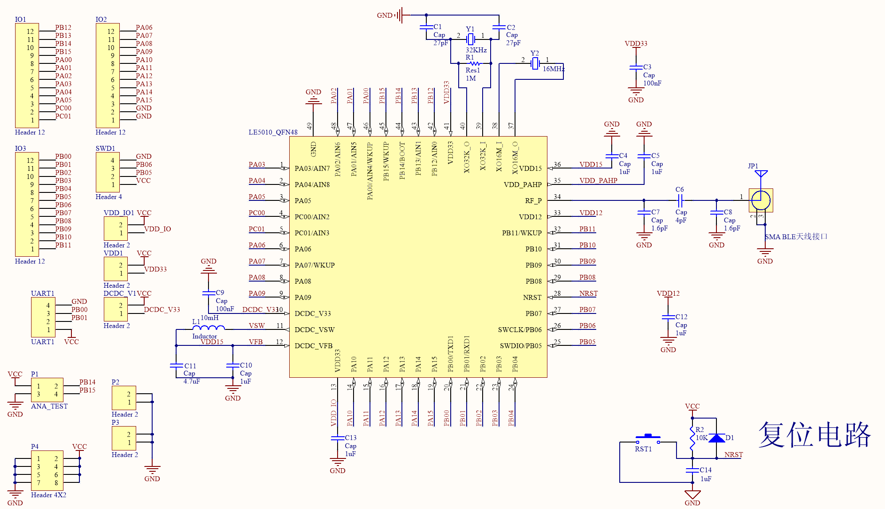

#### PCB：

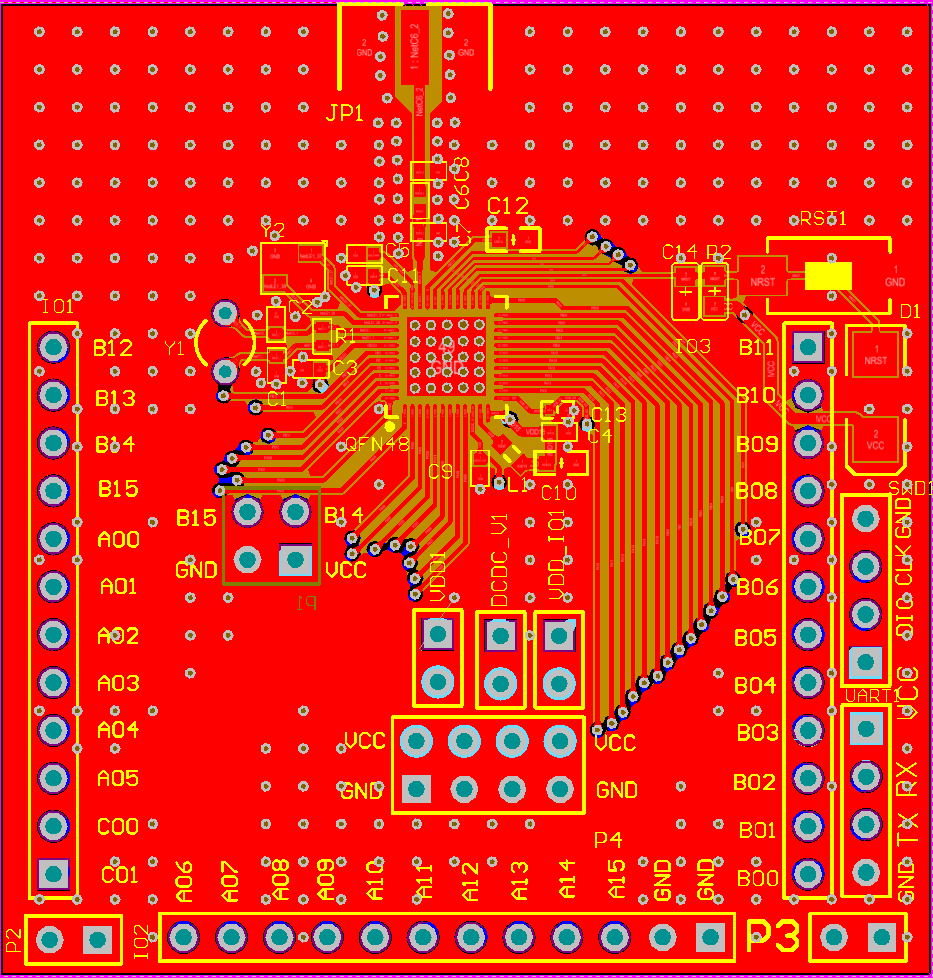

#### 注意事项：

**1、 NRST为复位引脚，低电平复位，复位后需要将其释放，芯片才能正常工作**

**2、 PB00和 PB01上电后默认为 UART1的 TX、RX接口，可在程序中更改功能**

**3、在使用 UART烧录时，需要将 PB14强制拉高**

**4、匹配电路数值仅供参考，需针对不同的PCB进行匹配**

**5、容值较小的电容需要更靠近芯片的PIN脚，同时电源线需要尽量避开高频信号线**

**6、上电时，PC01会输出高一段时间，大概20ms，然后会配置成输入模式，在配置IO的时候需要注意。**

**7、当LP0与LP2，或者LP0与LP3一起使用时，需要外接32K晶振，如果没有外接32K晶振，则必需将PB14与XO32K_I 连接。**

### QFN32 (1)

#### 原理图：

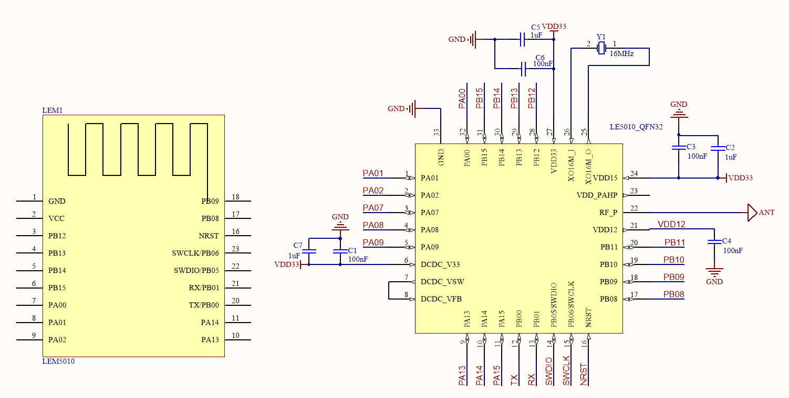

#### PCB：

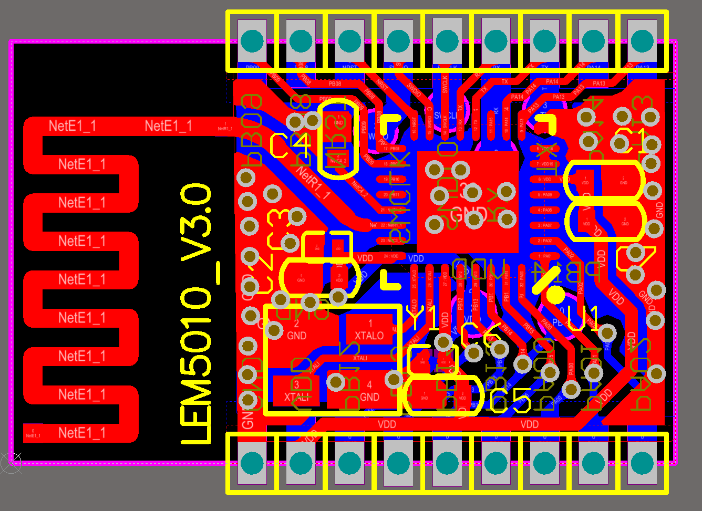

### QFN32 (2)

#### 原理图：

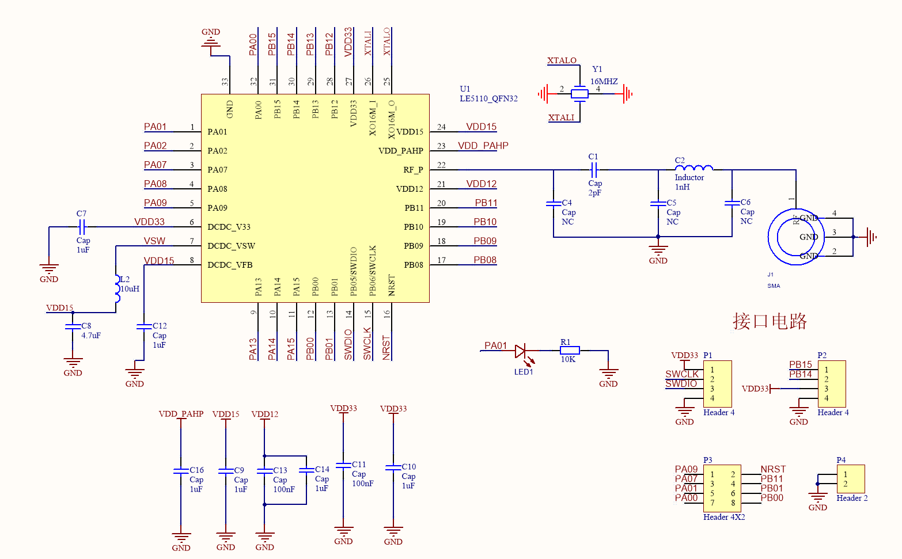

#### PCB：

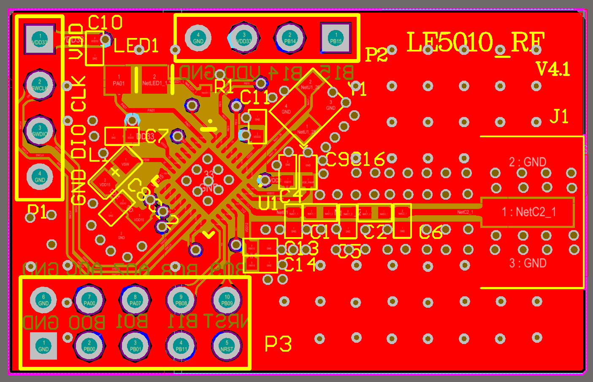

#### 注意事项：

##### **1、 NRST为复位引脚，低电平复位，复位后需要将其释放，芯片才能正常工作**

##### **2、 PB00和 PB01上电后默认为 UART1的 TX、RX接口，可在程序中更改功能**

**3、 在使用 UART烧录时，需要将 PB14强制拉高**

**4、匹配电路数值仅供参考，需针对不同的PCB进行微调**

**5、容值较小的电容需要更靠近芯片的PIN脚，同时电源线需要尽量避开PWM信号线**

### SOP16 (1)

#### 原理图：

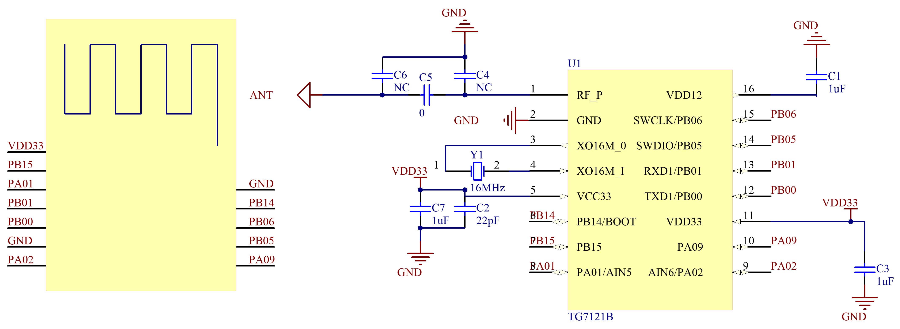

#### PCB：

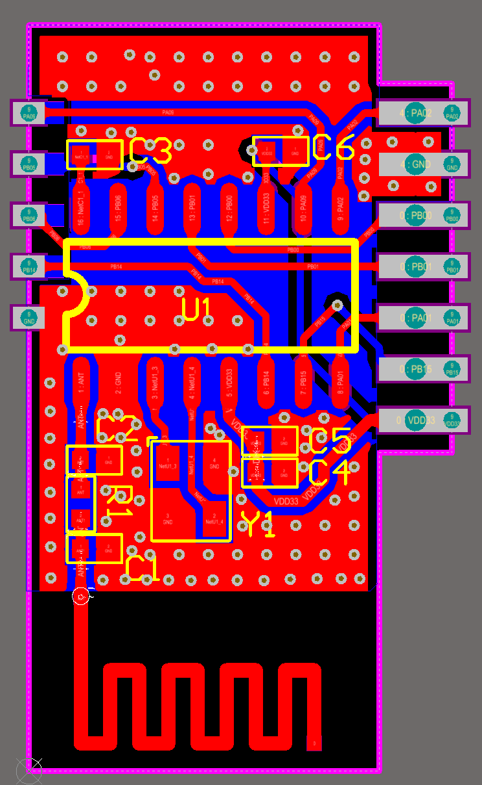

### SOP16 (2)

#### 原理图：

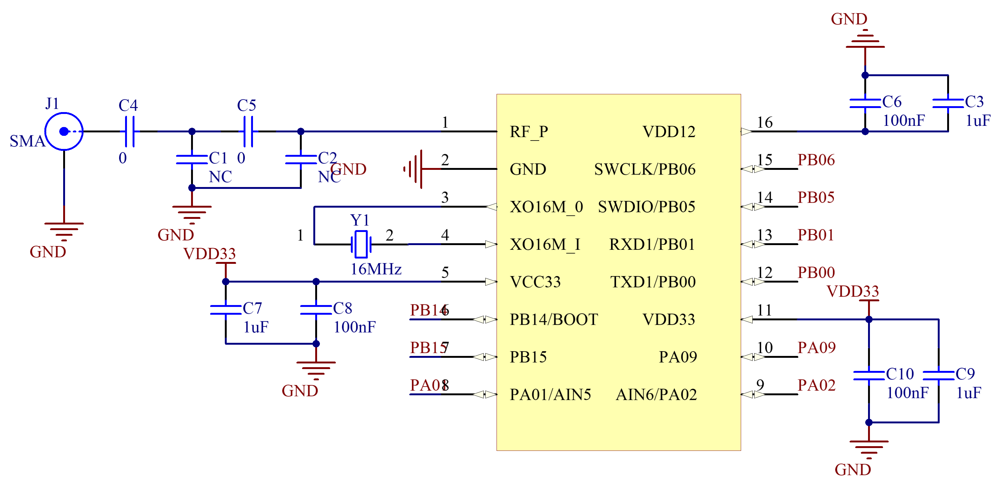

#### PCB：

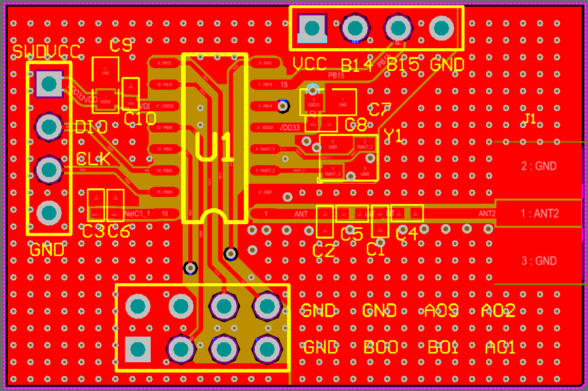

#### 注意事项：

**1、 PB00和 PB01上电后默认为 UART1的 TX、RX接口，可在程序中更改功能**

**2、 在使用 UART烧录时，需要将 PB14强制拉高**

**3、 PIN5和PIN11都必须外接3.3v电源，但在接线时不能直接短接，中间的线路必须先经过电容，在接入PIN脚**

**4、 匹配电路的数值仅供参考，具体数值需要根据不同的PCB进行匹配**

### 晶振推荐使用：

SX32Y016000L91T-UZ (泰晶) 、L327S160F (蓝晶) 、7M16000037(TXC)

## 二、PCB画制的注意事项

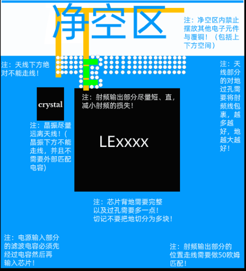

### 2.1、天线注意事项

  （1）、使用板载天线的时候，必须要求留足够的净空区，且在净空区中不能有其他的元器件或者覆铜。

  （2）、设计匹配电路的时候，尽量紧靠，天线与芯片的直接距离尽量近，且走线直、短。

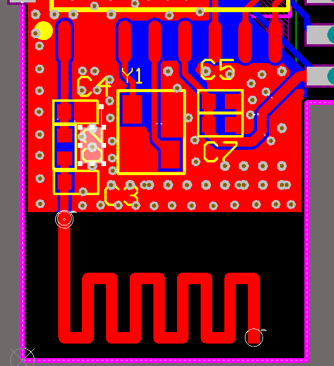

#### 2.1.1 下图的错误点

(1)：天线的净空区不够，且有走线，走线会吸收掉部分辐射出来的信号，导致天线的辐射效率变低。

(2)：天线到芯片的PIN走线下方有许多杂线，会干扰射频的工作，导致发射出来无线信号质量差。

(3)：没有做匹配电路，只预留了一个电阻为作为测试点，最小的匹配电路为L型的电路，单个器件调节阻抗能力有限，很难达到理想的效果。

(4)：由于空间问题，没有留下足够的地，可能导致驻波比很差。

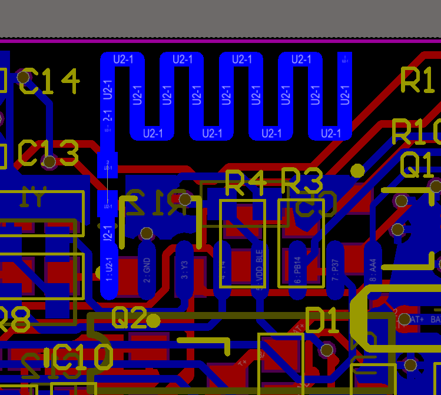

#### 2.1.2 匹配电路布局注意事项

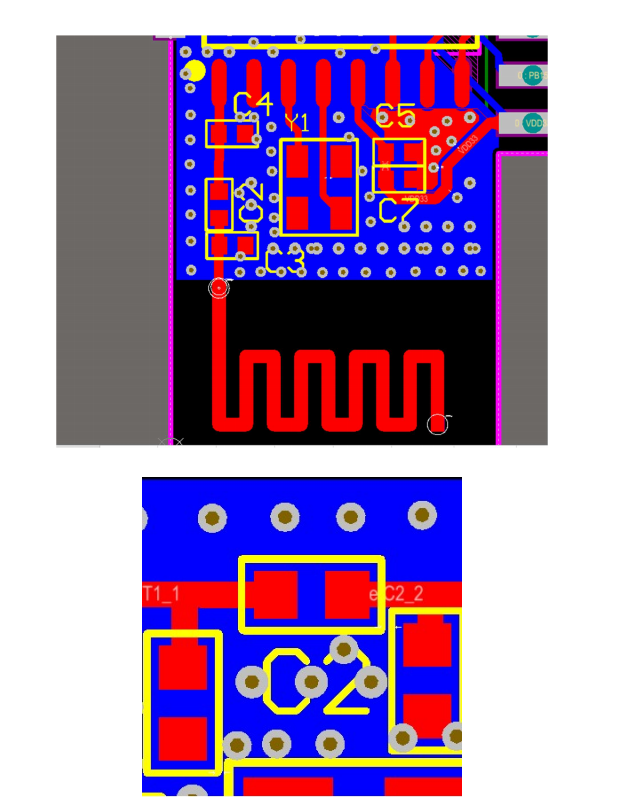

​    上述两幅图的主要问题是在匹配电路上面，图1匹配不够紧靠，会导致走线的阻抗不连续，增加了后续匹配的复杂度。图2出现了如果树木枝桠的走线，称为stub，一旦形成stub，阻抗一定是不连续，无论是天线或者其他场景的布局走线中，一定要避免出现这种情况。

### 2.2、电源的注意事项

QFN32和SOP16的封装都有两个3.3V的电源输入，在靠近电源pin脚的位置上面，需要各自放一个对地电容，再接线进入PIN脚。如果有过孔，要尽量避免电容出现stub的情况，中间需要经过对地的电容，进行滤波处理，再进入目标的电源PIN脚，防止产生串扰影响。

电源在进入PIN脚之前，一定要有对地的电容滤波，且经过电容后，直接进入对应的PIN，如果是2层板，有高频信号线与电源线相交，需再增加一个对地电容，然后再接入对应的电源引脚。

QFN48上面有3个电源引脚，处理时，电源网络尽量星型分布，同时产生的环路尽量小。

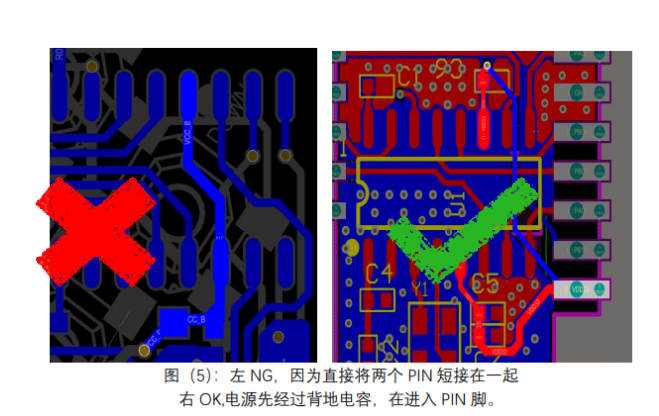

### 2.3、DCDC电路

 DCDC电路的主要结构如下所示：SW为方波输出信号，经过LC滤波之后，稳定在1.5V左右，给VDD15供电。

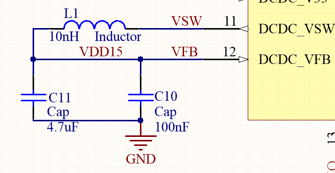

​    SOP16封装默认没有DCDC的PIN脚，QFN32和QFN48封装的DCDC电路可以忽略，只要将对应的VFB和SW短接，同时VDD15接3.3V电源输入即可。

### 2.4、地的覆铜

针对QFN32和QFN48的封装的背面，一定要和PCB的GND连接在一起，形成回路。PCB布局的背面，尽量保证完整的地，但不要出现死铜。天线与芯片的PIN脚连接下方的地必须完整，不能有走线，或者其他东西，连接线周围也是同理，而且面积越大越好。

