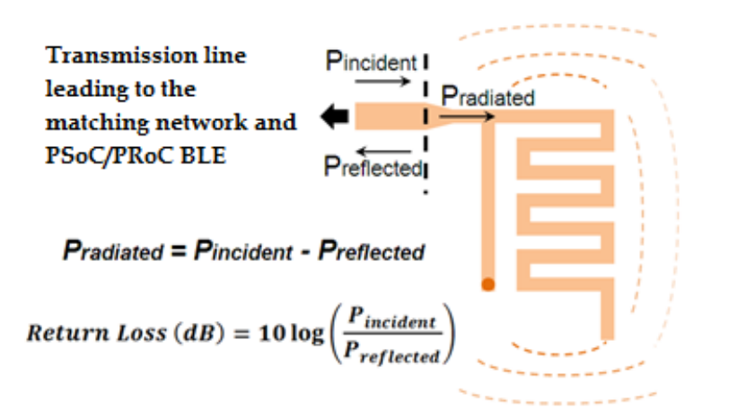
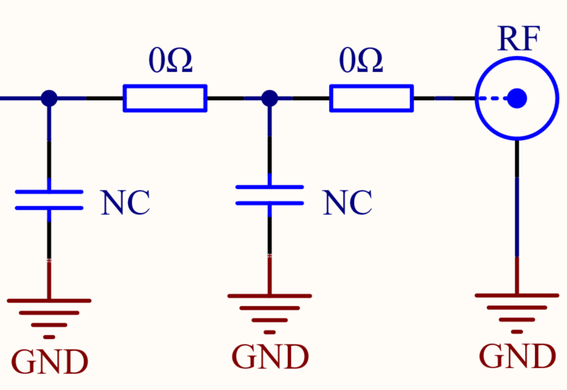
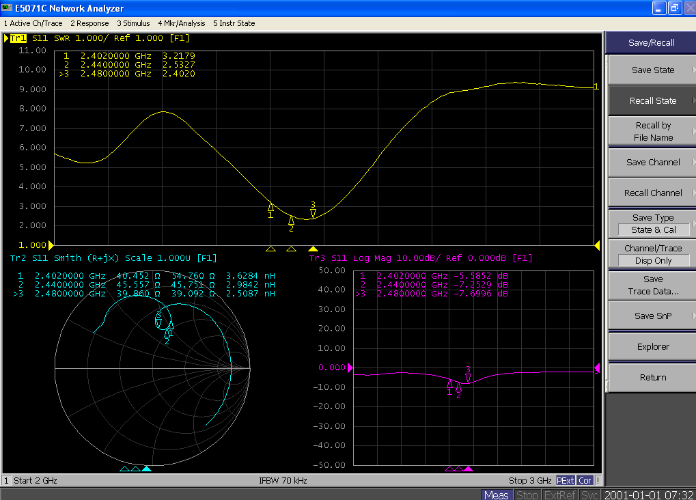
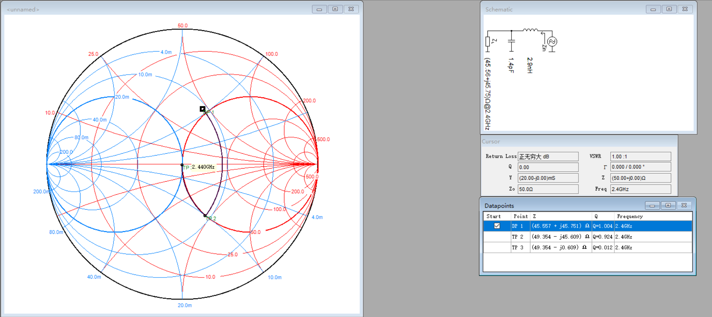
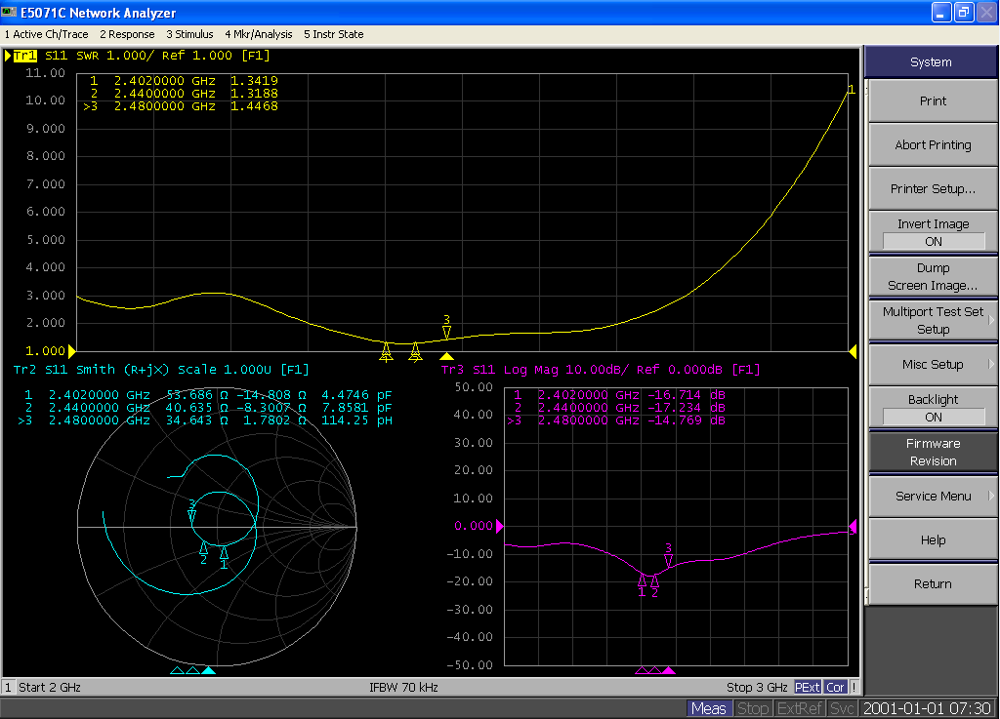

# RF_Antenna_Matching_Guide

## 1.1 概述

### 1.1.1 天线参数

**回波损耗**：输入信号反射回来的功率与输入信号功率的比值，S11是回波损耗的倒数（对数的倒数相当于它整体的负数形式，即1/lgX=-lgX）。大多数情况下，回波损耗 ≥ 10 dB 时（**S11≤ –10 dB**），表示90%的入射功率被传给天线以进行发射

| S11(dB) | Return Loss（dB） | P reflected | P radiated |
| :-----: | :---------------: | :---------: | :--------: |
|    0    |         0         |     100     |     0      |
|   -10   |        10         |     10      |     90     |
|   -20   |        20         |      1      |     99     |

**带宽**：天线的频率响应，BLE工作在2.4GHz~2.8GHz范围，所以通常测试会标志2402MHz、2440、2480中高低三个点，扫描带宽设置在2G~3G

### 1.1.2 PCB天线

针对BLE应用场景，介绍以下三种类型天线，这些天线是PCB的组成部分，所以既便宜有容易设计生产。

| 特性 |                     蛇型天线                      |                  倒F天线（IFA）                   |                蛇型倒F天线（MIFA）                |
| :--: | :-----------------------------------------------: | :-----------------------------------------------: | :-----------------------------------------------: |
| 外观 | .jpg) | .jpg) | .jpg) |
| 面积 |                    8.5mm*5.5mm                    |                    26mm*7.8mm                     |                     14.5*5.5                      |
| 性能 |            无馈点，回波损耗S11相对较差            |              有馈点，回波损耗S11较好              |          有馈点，集成了IFA天线结构的特点          |
| 应用 |       面积偏小，距离要求不高（RGB彩灯&BLE）       |         面积大，辐射性较好（心率检测器）          |    面积小，对传输距离有一定要求（鼠标、键盘）     |

这里我们推荐使用倒F天线（IFA）和蛇型倒F天线（MIFA），建议将MIFA使用再需要极小的PCB空间的应用中，如鼠标、键盘、模组。对于IFA天线，建议将其应用在要求天线一侧的尺寸远小于另一侧的尺寸的应用中，如心率监视器。

## 1.2 测试环境

**1、安捷伦 (Agilent) E5071c  网络分析仪（9K～8.5Ghz**）

.jpg)

**2、50 欧姆特性阻抗的同轴线缆**

1、一根两头SMA 头的同轴线缆

2、一小段带SMA头的开口线缆

.jpg)

**3、测试固件**

**SDK0.92版本：ls_sdk\dev\examples\ble\host_test**

具有操作步骤见 1.4.3 芯片上电置于接收模式

.jpg)

## 1.3 测试方法

首先，确保扫描的频带在BLE频带中（2402Mhz~2480Mhz）。然后，接入网络分析仪进行测量。大多数情况下，我们默认天线端阻抗为50Ω，所以只要**一个Π型电路来调匹配即可**。通过调整Π型电路上的器件（串联/并联电容或电感），使得天线阻抗**接近50欧姆、天线回波损耗大于10dB、驻波比小于1.4。**

当然，针对部分厂商要求严格一点会使用双Π电路，一个Π型电路调整芯片端（Chip）出来的阻抗，另外一个Π型电路调整天线端（ANT）的阻抗，确保两端都是50欧姆。

### 1.3.1 单Π型电路

.jpg)

在Π型匹配电路与天线之间断开，通过同轴线缆，接入网络分析仪，进行匹配调试，匹配网络部分一般需要两个组件（电容/电感）调整。

### 1.3.2 双Π型电路

.jpg)

在两个Π型电路之间断开，然后依次通过同轴线缆，接入网络分析仪，进行匹配调试。一般每个匹配网络需要2个组件（电容/电感），共4个组件来调整。

### 1.3.3 同轴线缆连接注意事项

.jpg)

1、同轴线缆开头端尽量与天线在同一个水平，**避免出现弯角或拐角连接**

2、同轴线缆中间的信号线进入天线走线，**外层GND包裹线需要接到PCB板上的GND，这里可以通过刮开PCB板上的绿油（阻焊层），然后上锡与同轴线缆GND连接，保证GND回路最短**

## 1.4 测试步骤

### 1.4.1 初始设置

如下图序号顺序，依次进行点击初始化设置

.jpg)

1、**点击Start和stop按键**，分别将启动频率和停止频率设置为 2 GHz 和 3 GHz，将格式设为 Smith 图表

2、 **点击Marker按键**，标记三个Mark点，将各标记的频率分别设为 2.402 GHz、2.44 GHz 和 2.48 GHz

3、**点击Dispaly按键**，同时显示多个窗口，将Trace设置为3，Num设置为3。

4、**依次点击以下按键，设置窗口类型**

**trace_prev->format->log mag（回波损耗）**

**trace_next->format->smith->（R+jX）（阻抗实部和虚部）**

**trace_next->format->smith->PWR（驻波比）**

### 1.4.2 校准

1、**连接SMA-SMA同轴线缆**，校准参考平面，点击以下按键

- **Cal->calibrate->1-Port Cal**
- Open负载端口连接同轴线缆->**open键**

- Short负载端口连接同轴线缆->**short键**

- 50欧姆Match负载端口连接同轴线缆->**load键**

- 执行校验->**done键**，然后网络分析仪会计算系数，并将 50 Ω 负载显示在 Smith 图表上，明确标记为 50

- 最后保存当前测试环境，方便后续调试调用->**save/Recall->save state->file dialog->save**

2、**连接SMA头的开口线缆**，把参考面延伸到开口线缆的开口端，确定最终参考面，测试天线阻抗

开口电缆的外导体和内导体短接，做一个短路校准

**Cal->Port Extensions**（端口延伸功能默认Off）->打开端口延伸功能 **On->Extension Port1-**>调节端口延时和线损两个参数

**Freq1 设置为2.5Ghz**，通过观察Smith图，手动调整线损失（Loss）和端口时延（Coax.Extension），使得Mark2（2440M）在smith圆图最右侧

### 1.4.3 芯片上电置于接收模式

1. 硬件连接参见[ 开发板连接&烧录](./BQB_Test_Guide)

2. 测试固件：**host_test_production.hex**

3. 使用sscom串口助手进行RX串口命令，串口波特率**115200**：**（在TX模式下，由于天线处于发信号模式，天线阻抗会来回变化，所以一般测试RX模式）**

   * 复位指令 **01 03 0C 00**
   * 接收指令(**2440Mhz**) : **01 1d 20 01 19** 

   .jpg)

4. RX 长接收设置：

   Jlink_command设置连接到芯片后执行下面指令。

   * command 命令：**w4 500000d0 88000800**

.jpg)

### 1.4.4 调整匹配

阻抗匹配仿真一般有两种方法，第一种是使用 E5071c 网络分析仪自带的软件进行仿真，第二种使用电脑Smith Chart 圆图软件进行仿真，这里推荐使用第二种，详细见 1.4.6 Smith圆图软件仿真

（1）点击Analysis按键（仪器只带仿真）

选择匹配电路类型，通过在Π型电路上串/并电容或电感（一般电容从1PF，电感从1nH开始递增），进行仿真。然后断开连接，根据匹配的参数焊接到PCB上。再连接仪器，关闭匹配电路仿真，测量实际的天线阻抗。一般仪器仿真出来和PCB板测试出来的效果有一定误差，仪器仿真只是大概了解阻抗匹配的一个变化趋势，需要根据变化趋势多次调整电容或电感参数值大小来接近理想值(50欧姆)

（2）利用Smith Chart（电脑软件仿真）

点击KeyBoard，通过观察综测仪串口设置阻抗的实部和虚部以及频率，一般在以2440为基准，通过调整右上角的匹配电路（串/并电容或电感）移动Mark至smith图中心50欧姆附近位置

### 1.4.5 Smith圆图简介

参考文档：**[https://mp.weixin.qq.com/s/ZIqIinE5UitF-KKOrgQ1sg](https://mp.weixin.qq.com/s/ZIqIinE5UitF-KKOrgQ1sg)**

**反射系数**：反射波电压与入射波电压之比

.jpg)

反射系数被定义为：.jpg)

其中Zin为变化后的阻抗，Zo为变化前阻抗，在这里我们设置为50欧姆。

电路中的阻抗为一个复数，表示为Z=R+jX，可以通过直角坐标系表示出来。其中R为电阻，在平面坐标系的X轴上，从原点往右依次增大到无穷。X为电抗，变现为感性或者容性，在平面坐标的Y轴上，Y轴正半轴为感抗，负半轴为容抗。下列为smith圆图由来的历史，从电阻圆何电抗圆两个方面大致讲述史密斯先生是怎么把一个平面的坐标系给“掰弯”成smith圆图的过程，加深对smith图的理解。

.jpg)

在复平面中，有三个点，反射系数都为1，就是横坐标的无穷大，纵坐标的正负无穷大。然后将通过把黑线掰弯，使得三个点重合在一起

.jpg)

.jpg)

最后，将三个无穷的电整合到smith圆的最右侧点，对应平面坐标系，红色X轴不变，黑色Y轴变成一个圆弧

**电阻圆**

.jpg)

|        | 直角坐标系（左图）对应阻抗                           | smith圆图（右图）对应反射系数 |
| ------ | ---------------------------------------------------- | ----------------------------- |
| 黑色线 | 实部为0，表现电抗性。最上方为+∞j，最下方为-∞j        | 最上方和最下方都为1           |
| 红色线 | 虚部为0，表现电阻性，从左到右的电阻值由0欧姆到无穷大 | 从左到右的反射系数从-1到1     |
| 绿色线 | 实部为50Ω                                            | 0                             |

**电抗圆**

.jpg)

实轴的上方表示**电感Z=jwL** 虚轴的正方向，紫色的线上的阻抗虚部为1

实轴的上方表示**电容Z=-j/wc** 虚轴的负方，蓝色的线上的阻抗虚部为-1

线上的阻抗特性，是从复平面，平移到史密斯原图的，所以特性跟着颜色走，特性不变。在smith中**上半圆标注天线阻抗呈感性，下半圆呈容性**。当阻抗为感性时需要接电容。反之，为容性时需要接电感。其中，串联和并联的方向是不一样的，最终的目标是将整体阻抗移动到中心点50欧姆附近。当**并电容或电感时，整体是顺着圆往左偏移。反之，则是顺着圆往右偏移**。

.jpg)

大概可以总结为：**下容上感，左并右串，顺着圆走，往圆心转**

### 1.4.6 Smith圆图软件仿真

一般调匹配我们会使用smith chart软件，这里我们使用Smith V3.10，下列为该软件的一个操作步骤讲解

.jpg)

**①**Remark标记：点击Keyboard按键,通过输入re（电阻）、im（电抗）、frequency（频率）设置Mark标记点

.jpg)

**②** Smith圆图：红色线为阻抗圆，蓝色线为导纳圆，圆心为50欧姆，圆心所在直线最左侧为0欧阻抗，最右测为阻抗无穷大

**③**器件栏：主要用到的四种，串电容、串电感、并电容、并电感

**④**匹配电路栏：当点击器件栏的器件是，对应会显示增加的器件电路

**⑤**天线匹配参数栏：显示天线匹配的一些特性参数，包括阻抗(Z)、回波损耗（Return Loss）、驻波比（VSR）等

### 1.4.7 匹配规则事项

（1）信号刚出来一般先并联一个对GND的电容（1pF以上，除去信号中的高次谐波）

（2）并联对GND的落地电容不能太大，电容值越大，容抗越大，避免讯号都流到GND，一般不要超过6pF

（3）保证整个频带的阻抗轨迹尽可能收敛，可以以中心频点2440来调匹配

（4）一般器件都存在工艺误差，考虑PCB板的稳定性和产品的良率，电感/电容值不要过小，一般电容在1pF以上，电感在1nH以上

（5）考虑量产现货情况，电感/电容值不要太过冷门，一般选择整数倍

## 1.5 测试demo

**下面LE5010_solo学习板为例进行详细说明**

### 1.5.1 匹配前

0欧姆电阻短接

|                            | 2402M  | 2440M  | 2480   |
| :------------------------: | ------ | ------ | ------ |
| S11回波损耗 log mag（dbm） | -5.6   | -7.3   | -7.7   |
|     smith天线阻抗（Ω）     | 40.452 | 45.557 | 39.860 |
|         驻波比PWR          | 3.22   | 2.53   | 2.40   |

### 1.5.2 smith图匹配

如下图所示，标记2440M频率点在smith的位置，未匹配前的阻抗在**上半圆偏右位置**，根据上述总结的结论“**下容上感，左并右串，顺着圆走，往圆心转**”，我们知道阻抗为感性，需要串联或者并联电容。通常会对**GND并联一个1uF以上的电容，去除信号中的高次谐波**。所以先并联一个1.4pf电容，使得阻抗落在电抗圆内。此时整理阻抗为容性，所以需要串联或并联电感。又因为我们最终的目的是将阻抗点调整到圆心，即50Ω处，所以此时需要串联一个电感。

### 1.5.3 匹配后

0欧姆电阻短接，对GND并联一个1pF电容

.jpg)

|                            | 2402M   | 2440M   | 2480    |
| :------------------------: | ------- | ------- | ------- |
| S11回波损耗 log mag（dbm） | -16.714 | -17.234 | -14.769 |
|     smith天线阻抗（Ω）     | 53.686  | 40.635  | 34.643  |
|         驻波比PWR          | 1.34    | 1.31    | 1.44    |

