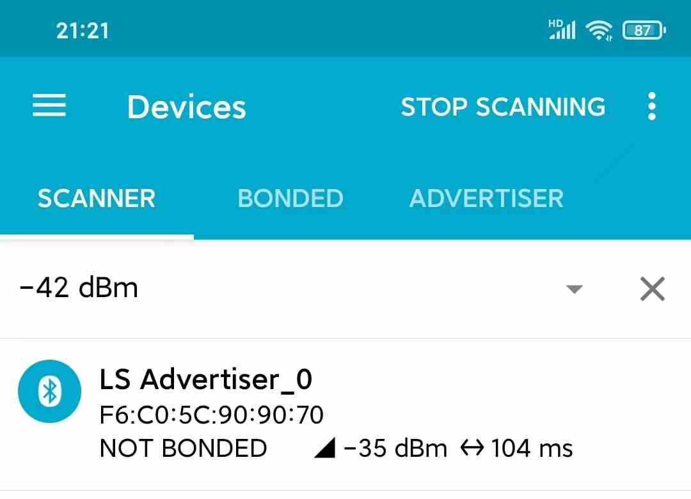
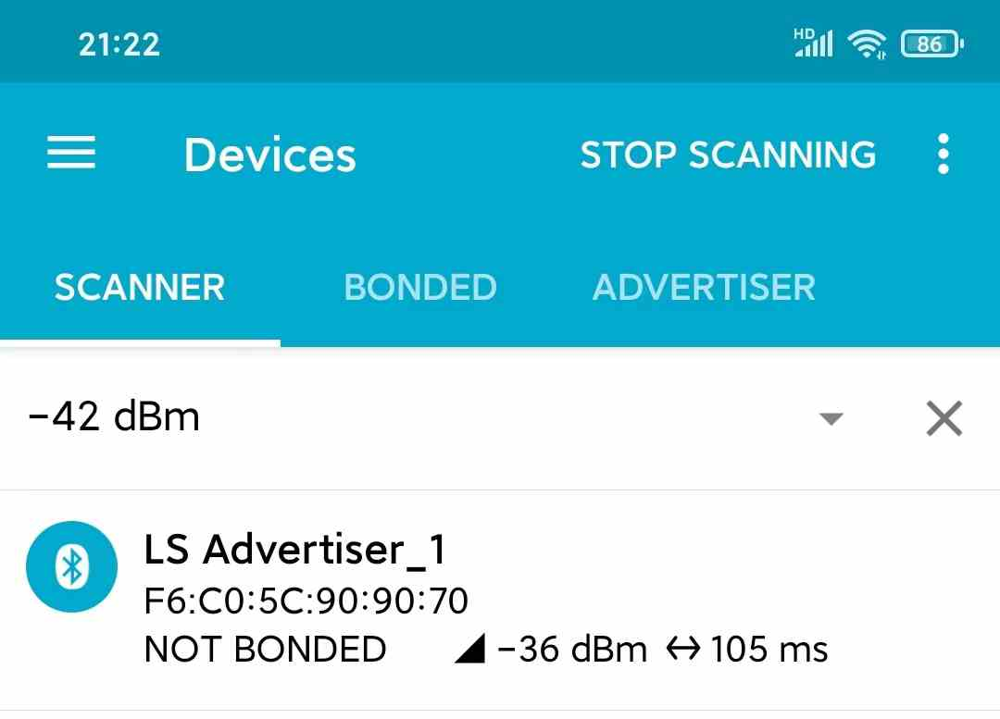
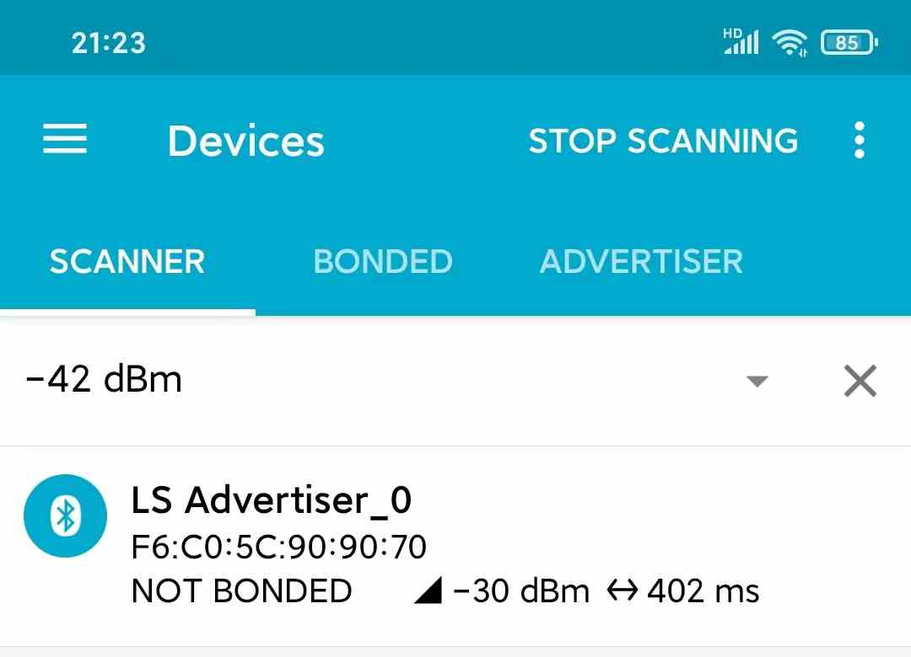
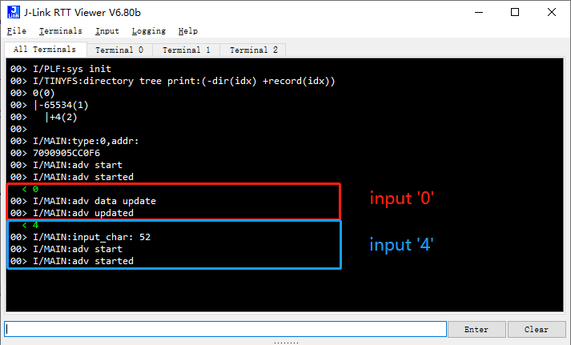

# BLE_ADVERTISER（BLE广播）示例说明

例程路径：<install_file>\examples\ble\ble_advertiser

一、示例基本配置、流程及说明:
-----------------------------
BLE_ADVERTISER是演示基本的不可连接ADV示例。在这个示例里，应用会通过监测RTT input的内容来对ADV的参数进行调整，包括ADV payload内容和ADV周期。

### 1.1 发广播包

+++++++++++++++++++++++++++++++

在发广播包之前，首先需要调用create_adv_obj()创建广播对象。函数具体实现为：

    static void create_adv_obj()
    {
        struct legacy_adv_obj_param adv_param = {
            .adv_intv_min = 160,
            .adv_intv_max = 160,
            .own_addr_type = PUBLIC_OR_RANDOM_STATIC_ADDR,
            .filter_policy = 0,
            .ch_map = 0x7,
            .disc_mode = ADV_MODE_GEN_DISC,
            .prop = {
                .connectable = 0, // nonconnectable adv
                .scannable = 1,
                .directed = 0,
                .high_duty_cycle = 0,
            },
        };
        dev_manager_create_legacy_adv_object(&adv_param);
    }

- adv_intv_min/adv_intv_max分别表示广播包的最小和最大周期，单位为625us，一般配置成同一个值。此处配置为160，实际广播周期为160*0.625=100ms


- ch_map表示每组广播包的个数，默认为7（二进制111，每一个bit代表一个channel），表示在37/38/39这3个channel上都会发送


- 本示例里，**connectable配置为0，表示不可连接广播包。**配置为1（可连接广播包）也可以实现基本的功能，但一旦被第三方主机连上则测试无法进行，因此特别配置为不可连接广播包类型

在广播对象创建完成后，调用start_adv()开启广播。在这一步需要特别注意，组建advertising_data和scan_response_data内容需要通过使用宏ADV_DATA_PACK，返回值为最终的长度，作为参数之一传入dev_manager_start_adv()。如果没有advertising_data或scan_response_data，对应的length需要填0。**不可以填如与实际内容不匹配的length，例如sizeof(advertising_data)，否则协议栈的解析有可能出错！**

关于宏ADV_DATA_PACK的解释如下：

```
#define ADV_DATA_PACK(buf,field_nums,...) (adv_data_pack((buf),(field_nums),__VA_ARGS__) - (buf))
```

ADV_DATA_PACK是通过不定参函数adv_data_pack()来实现的。

- buf表示存储advertising_data/scan_response_data的buffer
- field_nums表示要填入advertising_data/scan_response_data里item的个数。例如，如果只是填入shortened_name这一个item，则field_nums设置为1，如果除此之外还要塞入mac地址，field_nums则需要设置为2，以此类推
- field_nums后面的不定参数，包括每一个item的type/buffer/length，也就是说每一个item，后面需要3个参数与之对应

举例如下：

    uint8_t adv_data_length = ADV_DATA_PACK(advertising_data, 2, GAP_ADV_TYPE_MANU_SPECIFIC_DATA, manufacturer_data, sizeof(manufacturer_data),GAP_ADV_TYPE_COMPLETE_LIST_128_BIT_UUID, ble_svc_uuid_128, sizeof(ble_svc_uuid_128));
    
    uint8_t scan_rsp_data_len = ADV_DATA_PACK(scan_response_data, 1, GAP_ADV_TYPE_COMPLETE_LIST_16_BIT_UUID, &ble_svc_uuid_16, sizeof(ble_svc_uuid_16));
    
    dev_manager_start_adv(adv_obj_hdl, advertising_data, adv_data_length, scan_response_data, scan_rsp_data_len);

上面的代码里，adv_payload里填入了2个item，分别是manufacturer_specific_data和128bit_UUID，scan_rsp里添加入了1个item，是16bit_UUID

### 1.2 RTT输入控制广播参数

++++++++++++++++++++++++++++++++++

RTT通常被用来打印日志，但也支持用户输入和应用程序获取用户输入。连上JLink，打开RTT Viewer，即可看到RTT输入框。应用程序里，通过调用SEGGER_RTT_GetKey接口，即可获得输入的数据。

本示例里，只支持字符‘0’~‘9’的输入响应：

- 输入‘0’：会修改广播设备名的最后一个字符，例如，默认广播设备名为"LS Advertiser_0"，在检测到输入‘0’后，设备名会被修改为"LS Advertiser_1"，再次检测到输入‘0’则会被修改为"LS Advertiser_2"，以此类推直到"LS Advertiser_9"后再回绕回"LS Advertiser_0"
- 输入‘1’~‘9’：会根据输入的字符修改广播间隔。例如，输入字符‘3’，广播包的间隔会调整为300ms，输入‘8’，则广播间隔会被调整为800ms

其他输入内容默认被忽略。

二、示例验证步骤及结果:
-------------------------

- 程序默认配置运行结果：



- RTT输入字符‘0’后结果：



- RTT输入字符‘4’后结果：



上述测试过程中RTT Viewer输出/输入日志截图：



三、特别说明:
-------------------------

1、关于更新adv相关参数的接口说明

++++++++++++++++++++++++++++++++++++++++++

- 更新adv payload：协议栈提供的接口为dev_manager_update_adv_data，具体可以参考ls_advertiser_update_adv_data的实现。更新adv payload是直接调用该接口实现的，协议栈在更新完成之后会上报ADV_UPDATED消息，不需要其他处理。

  ***注意：在一次adv payload update完成前，不可以重复进行adv payload update行为！***

- 更新adv interval：协议栈提供的接口为dev_manager_update_adv_interval，具体可以参考ls_advertiser_update_adv_interval的实现。

  ***但需要注意的是，该函数调用之后adv interval不会立刻生效，需要将adv停止后，再重新start，新的adv interval才会生效！这一点与修改adv payload不一样。***

