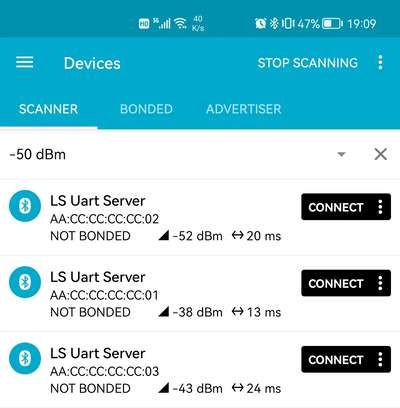
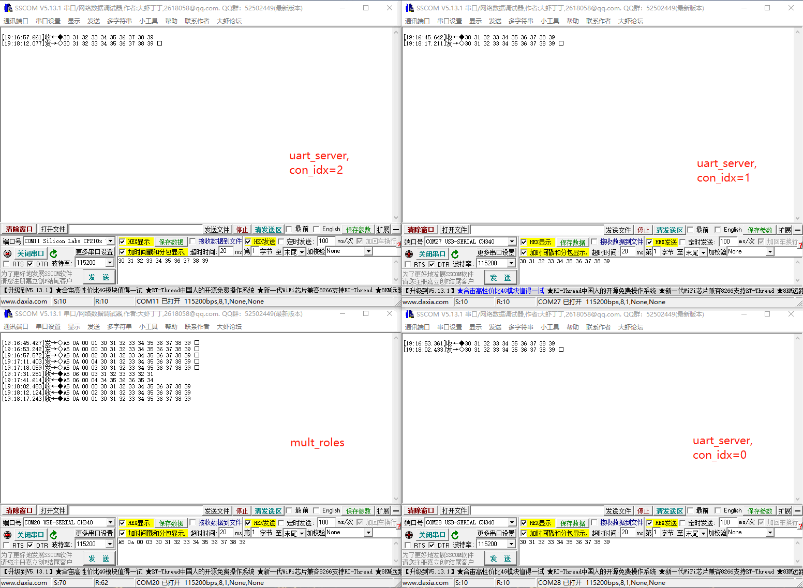
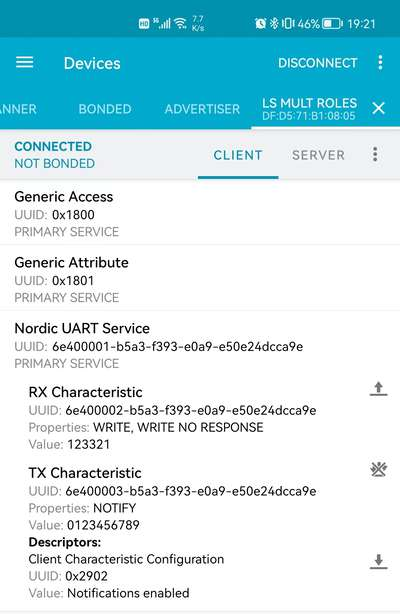
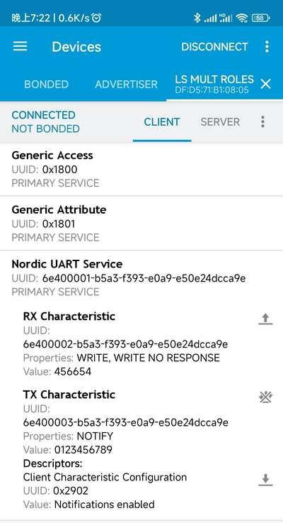

# BLE_MULT_ROLES（多主多从串口透传）示例说明

例程路径：<install_file>\examples\ble\ble_mult_roles

一、示例基本配置、流程及说明:
--------------------------------
BLE_MULT_ROLES（以下简称mult_roles）是多主多从串口透传示例。宏SDK_MAX_CONN_NUM定义了最大支持连接数，默认为5。宏UART_SERVER_MASTER_NUM则定义了在多个连接中主机的最大数目，默认为2。因此多连接里从机的最大数目就是SDK_MAX_CONN_NUM-UART_SERVER_MASTER_NUM=3。

多主多从可以看作是在多连接从机场景的基础上再集成了多主机功能，因此充当从机角色多连接的场景可以参考[BLE_UART_SERVER_MULT_LINK](./ble_uart_server_mult_link.md)示例说明，主机的基本处理可以参考[BLE_SINGLE_ROLE](./ble_single_role.md)示例说明里的主机部分，此处不再赘述。这里重点解释主机多连接的处理。

### 1.1 全局变量说明

++++++++++++++++++++

与主机连接相关的全局变量，很多也都是数组：

- uart_client_tx_buf：表示蓝牙接收到的，来自从机的数据向Uart发送时的缓存。由于Uart推送数据是有延迟的，因此可能存在某一路蓝牙连接的数据还没有推送完成，其他连接又收到蓝牙数据的可能，所以需要每一路都要开一个独立的buffer
- uart_client_ble_buf_array：表示Uart收到的数据向蓝牙发送时的缓存。与Uart推送数据类似，蓝牙发数也是有延迟的，所以考虑到多路并行，这个buffer也需要设置为每一路一个buffer
- uart_client_recv_data_length_array：表示Uart收到数据的长度
- uart_client_wr_cmd_done_array：表示每一路（做主机）数据发送的CLIENT_WRITE_NO_RSP_DONE标志位，这个类似于做从机时的uart_server_ntf_done_array
- uart_client_mtu_array：表示每一路连接的MTU值，类似uart_server_mtu_array
- con_idx_client_array：作为主机，保存不同连接的con_index
- cccd_config_array：保存不同连接的cccd_config值
- uart_client_xxx_attribute_handle：保存不同连接的svc/attribute declaration handle
- uart_client_xxx_pointer_handle：保存不同连接的svc/attribute value handle

### 1.2 重点流程说明

+++++++++++++++++++++++++++++++++

#### 1.2.1 connection index管理

++++++++++++++++++++++++++++

与[BLE_UART_SERVER_MULT_LINK](./ble_uart_server_mult_link.md)类似，mult_roles也需要对con_idx进行管理。更复杂的，由于有主机/从机角色同时存在，会导致一些环节的处理必须考虑角色（比如数据发送时调用的接口），因此con_idx还需要区分不同的角色分别管理，于是就有了search_conidx和search_client_conidx两个函数。

#### 1.2.2 开启scan的时机

++++++++++++++++++++++++++++

scan的开启与adv总体类似。scan开启的时机主要有：

- SCAN_OBJ_CREATED时，也就是程序刚开始运行第一次开scan
- INIT_STOPPED消息里，这个通常是在建连接时，init事件结束时，当检测到当前（以主机角色）连接数小于支持的最大连接个数时
- DISCONNECTED消息里，表示有连接（以主机角色）断掉

二、示例验证步骤及结果:
-------------------------
使用ble_uart_server生成相对应的production hex，修改mac地址，分别为0xaa 0xcc 0xcc 0xcc 0xcc 0x01/0x02/0x03，下载到三个测试板里，重新上电，可以用手机搜到三个设备adv：

将mult_roles编译生成production hex，下载到第四块测试板里，重新上电，mult_roles会自动与3个设备建立连接。使用两部手机，用nRF Connect扫描adv，可以看到设备名为"LS Mult Roles"的adv，分别建立连接。此时mult_roles分别与两主机、三从机建立了连接。打开4个串口助手，分别接到4个测试设备的串口，通过串口打印观察主从机数据透传。分别进行一轮收发后Uart数据如下：

与之对应的2个主机（手机）截图如下：

三、特别说明：
-----------------

1. 关于主机/从机和Client/Server

从蓝牙协议的角度，Client/Server是Host ATT协议的概念，主从机角色与其没有必然关系。mult_roles里Client是主机，而Server都是从机，因此在本示例里没有对两组概念做严格区分。