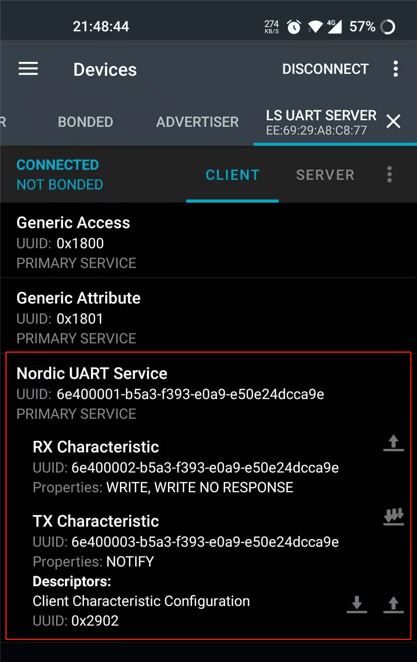
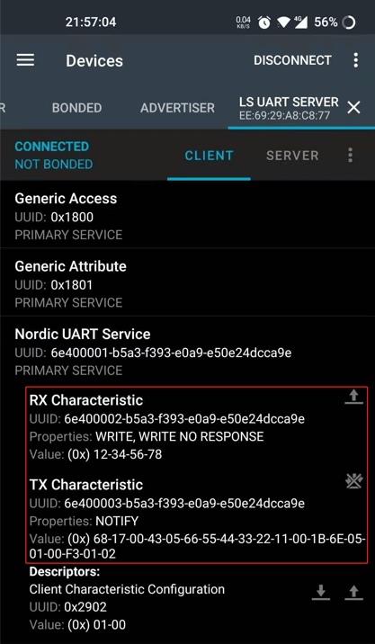
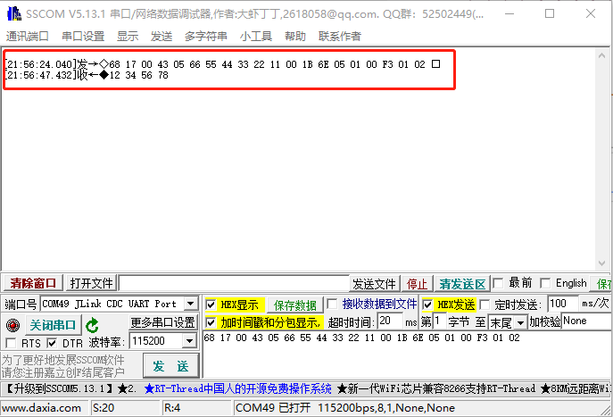

# BLE_UART_SERVER（串口透传）示例说明

例程路径：<install_file>\examples\ble\ble_uart_server

一、示例基本配置、流程及说明:
-----------------------------
BLE_UART_SERVER（以下简称uart_server）是具备蓝牙串口透传功能且无安全要求的单连接示例。串口透传，指的是作为无线数据传输通道，蓝牙芯片将Uart上收到的数据不经任何处理直接发送给蓝牙对端，同时也将蓝牙收到的数据推送到串口上。

``` {mermaid}
    sequenceDiagram
    participant U1 as Uart1
    participant S as Server
    participant C as Client
    participant U2 as Uart2
    par Server Action
    	Note over S: start adv
    and Client Action
    	Note over C: start scan
    end
    S->>C: ADV
    C->>S: connect_req
    Note over S, C:  Establish BLE Connection
    opt Client data transmit
        U2->>C: Uart data
        C->>S: Write cmd/req
        opt Write rsp
            S->>C: Write rsp(for Write req)
        end
        S->>U1: Uart data
    end

    opt Server data transmit
        U1->>S: Uart data
        S->>C: Send Notification/Indication
        opt Indication cfm
            C->>S: Indication confirm(for indication)
        end
        C->>U2: Uart data
    end
```

### 1.1 准备工作之一：串口相关初始化

++++++++++++++++++++++++++++++++
串口透传，首先需要初始化串口相关的功能模块，主要包括使能串口硬件模块，以及创建一个用于数据查询和处理的软件定时器。调用的相关接口如下：

    ls_uart_init(); // 串口模块初始化
    HAL_UART_Receive_IT(&UART_Server_Config, &uart_server_rx_byte, 1);  // 串口接收使能，每次接收1byte，存放到uart_server_rx_byte内
    ls_uart_server_init(); // 初始化软件定时器

串口参数默认配置IO为PB00/PB01，波特率为115200，具体可以参考ls_uart_init()的实现。软件定时器周期配置为50ms。

### 1.2 准备工作之二：服务添加及注册

++++++++++++++++++++++++++++++++
串口透传需要添加uart_server服务，这里主要包括服务定义和服务内部的特征值/描述符定义。

    static const struct att_decl ls_uart_server_att_decl[UART_SVC_ATT_NUM] =
    {
        [UART_SVC_IDX_RX_CHAR] = {
            .uuid = att_decl_char_array,
            .s.max_len = 0,
            .s.uuid_len = UUID_LEN_16BIT,
            .s.read_indication = 1,   
            .char_prop.rd_en = 1,
        },
        [UART_SVC_IDX_RX_VAL] = {
            .uuid = ls_uart_rx_char_uuid_128,
            .s.max_len = UART_SVC_RX_MAX_LEN,
            .s.uuid_len = UUID_LEN_128BIT,
            .s.read_indication = 1,
            .char_prop.wr_cmd = 1,
            .char_prop.wr_req = 1,
        },
        [UART_SVC_IDX_TX_CHAR] = {
            .uuid = att_decl_char_array,
            .s.max_len = 0,
            .s.uuid_len = UUID_LEN_16BIT,
            .s.read_indication = 1,
            .char_prop.rd_en = 1, 
        },
        [UART_SVC_IDX_TX_VAL] = {
            .uuid = ls_uart_tx_char_uuid_128,
            .s.max_len = UART_SVC_TX_MAX_LEN,
            .s.uuid_len = UUID_LEN_128BIT,
            .s.read_indication = 1,
            .char_prop.ntf_en = 1,
        },
        [UART_SVC_IDX_TX_NTF_CFG] = {
            .uuid = att_desc_client_char_cfg_array,
            .s.max_len = 0,
            .s.uuid_len = UUID_LEN_16BIT,
            .s.read_indication = 1,
            .char_prop.rd_en = 1,
            .char_prop.wr_req = 1,
        },
    };
    static const struct svc_decl ls_uart_server_svc =
    {
        .uuid = ls_uart_svc_uuid_128,
        .att = (struct att_decl*)ls_uart_server_att_decl,
        .nb_att = UART_SVC_ATT_NUM,
        .uuid_len = UUID_LEN_128BIT,
    };

这里的定义大多符合SIG关于服务/特征值/描述符的规范，具体可参照代码实现及蓝牙官方协议。这里重点提一下一些自定义配置：

- max_len为该特征值操作的最大长度，单位为byte，对于改特征值的操作不可以超出max_len，否则多余的部分会被丢弃

- read_indication表示收到对方的读请求时，是否将该请求发送至应用层，通常配置都为1

添加服务需要首先调用

    dev_manager_add_service((struct svc_decl *)&ls_uart_server_svc);

之后应用会收到SERVICE_ADDED消息，再调用

    gatt_manager_svc_register(evt->service_added.start_hdl, UART_SVC_ATT_NUM, &ls_uart_server_svc_env);

### 1.3 发广播包/建立连接

+++++++++++++++++++++++

在uart_server服务注册完成后，所有准备工作已经完成，此时可以调用create_adv_obj()创建广播对象。关于广播的创建和发送可以参考[BLE_ADVERTISER示例说明](./ble_advertiser.md) 

广播包发出来之后，可以通过手机APP（例如nRF Connect）扫描该设备的广播包，并建立连接，成功后本地能在gap_manager_callback()里收到CONNECTED消息，手机端也会自动进行服务发现流程，通常如下：



二、示例验证步骤及结果:
-------------------------
串口发送68 17 00 43 05 66 55 44 33 22 11 00 1B 6E 05 01 00 F3 01 02，可以在手机APP上收到该数据；同样的，手机APP推送0x12345678，也可以在串口上打印出来，如下图：





三、特别说明:
-------------------------

1、关于数据从串口接收到蓝牙发送的处理

++++++++++++++++++++++++++++++++++++++++++

为什么使用软件定时器轮询处理数据收发？由于uart_server是单连接数据透传，因此串口上的数据是没有固定格式的，无法预知后后续会有多少字节的数据会被收到，因此每次只能接收1字节。接收1字节完成后，串口接收完成callback函数HAL_UART_RxCpltCallback()会被调用，将收到的数据保存到全局buffer里。而将收到的串口数据推送的蓝牙对端的动作在定时器里做，不在HAL_UART_RxCpltCallback()里做的原因，主要是考虑到中断回调函数里不宜有过多逻辑处理，且每次收到1字节就启动蓝牙发送会导致数据收发效率低下，因此在软件定时器里周期性检查、处理接收的数据是更为合理的选择。

2、关于MTU

++++++++++++++++++

MTU是BLE ATT的概念，它定义了在ATT层Client与Server之间任意数据包的最大长度。除了write_req，其余的数据发送接口（send_notification/send_indication/write_cmd），一旦传入的length超出了一定范围（MTU - 3），超出该范围的数据会被丢弃。所以在uart server里，会对串口接收到的数据进行处理，每次调用send_notification接口进行数据发送时都会保证传入的数据都会被协议栈接收并处理。
至于为何不选择有回复的send_indication/write_req，是因为这两个命令要求数据接收方在GATT层必须回复response（空包，无实际数据内容），这会降低数据通信的效率，因此使用较少。

3、关于通信速率评估

+++++++++++++++++++++++

既然是透传，某些特殊场景下可能就需要考虑数据通信速率。uart server的实际通信速率会受若干因素影响，比如串口波特率、CPU处理速度、MTU长度、蓝牙射频性能、设备距离远近以及外部环境干扰等等，
因此应用对通信速率如果有要求，需要事先评估。例如，115200的波特率，串口通信最大速率在100Kb/s左右，那么整个系统的透传速率就不可能超过这个理论值；MTU默认23字节时的通信速率，也肯定会低于更大MTU配置时的值，因此执行MTU Exchange也是提高通信速率的方式之一，等等。

4、关于OTA测试

+++++++++++++++++++++++++++++++++++++++++++++

ble_uart_server支持简单的OTA功能测试（双区模式）。使能如下宏定义即可打开OTA测试功能：

```
#define UART_SERVER_WITH_OTA 1
```

在这种情况下，除了uart_server service，应用还会自动添加fota profile。一个最简单的OTA测试流程如下：

1. 将默认的ble_uart_server_production.hex下载烧录到待测板，重启，手机APP确保能搜到设备名为"LS Uart Server ota prf"的广播包
2. 修改UART_SVC_ADV_NAME，例如改成"LS Uart Server after ota"，重新编译ble_uart_server工程，将生成的ble_uart_server.ota.bin下载到手机里
3. 使用BLE_FOTA手机APP，扫描连接待测设备，之后选择ble_uart_server.ota.bin，配置其他参数，开始ota
4. ota完成后，BLE_FOTA会显示ota status:0，表示OTA完成。重新扫描设备，应当能搜到"LS Uart Server after ota"的广播包，表示OTA成功

默认情况下，OTA功能在ble_uart_server里是关闭的。