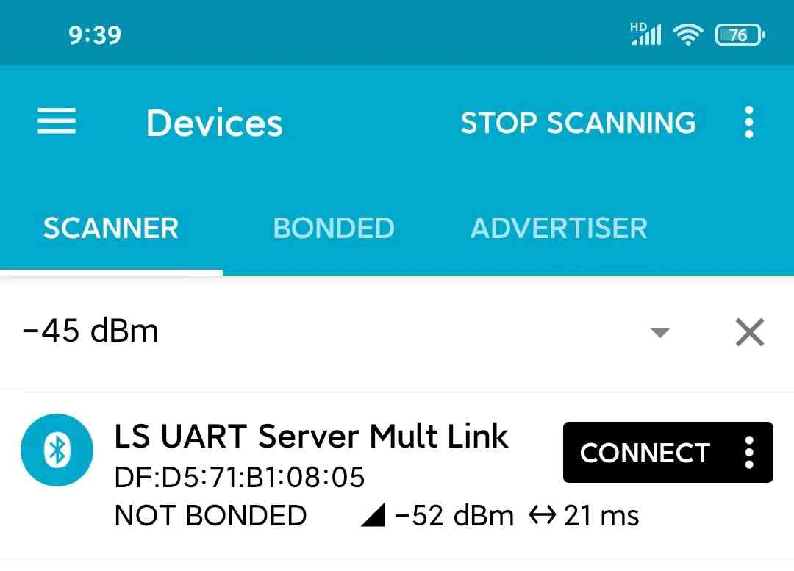
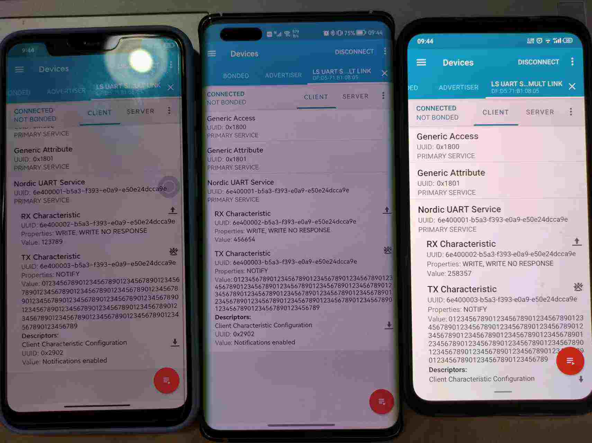
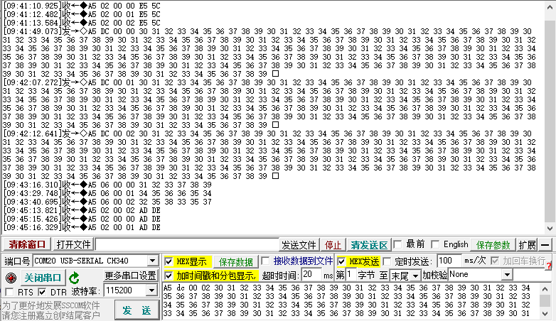

# BLE_UART_SERVER_MULT_LINK（多连接从机串口透传）示例说明

例程路径：<install_file>\examples\ble\ble_uart_server_mult_link

一、示例基本配置、流程及说明:
--------------------------------
BLE_UART_SERVER_MULT_LINK（以下简称mult_link）是多从机角色的蓝牙串口透传示例。多从机角色，指的是可以和多个主机同时建连接，同步实现多路串口透传功能。mult_link大多数流程，例如服务添加、发广播、串口中断处理以及长包的拆包等，与单连接的串口透传示例类似，这些逻辑重复的内容可以参考[BLE_UART_SERVER示例说明](./ble_uart_server.md)，此处不再赘述。这里重点解释与多从机相关的处理。

### 1.1 全局变量说明

++++++++++++++++++++

由于是多连接，因此与连接的一些数据结构会从单个变量变成数组，包括：

- uart_server_tx_buf：表示来自蓝牙主机的数据向Uart发送时的缓存。由于Uart推送数据是有延迟的，因此可能存在某一路蓝牙连接的数据还没有推送完成，其他连接又收到蓝牙数据的可能，所以需要每一路都要开一个独立的buffer

- uart_server_ble_buf_array：表示Uart收到的数据向蓝牙发送时的缓存。与Uart推送数据类似，蓝牙发数也是有延迟的，所以考虑到多路并行，这个buffer也需要设置为每一路一个buffer
- uart_server_recv_data_length_array：表示Uart收到数据的长度
- uart_server_ntf_done_array：表示每一路数据发送的NTF_DONE标志位。多连接的场景下，有可能其中某些连接交互比较流畅，而另一些连接则可能出现堵塞
- uart_server_mtu_array：表示每一路连接的MTU值。MTU是主从双方相互协商的结果，不同的主机可能有不同的MTU值
- con_idx_array：保存不同连接的con_index
- cccd_config_array：保存不同连接的cccd_config值

有些变量与连接无关，仍然是只有一个instance，不是数组：

- uart_server_tx_busy：表示Uart是否处于TX busy状态。由于Uart只有一个，是否busy也与连接数无关
- 其他，例如builtin timer inst指针，广播包相关参数、以及服务相关的变量等

### 1.2 重点流程说明

+++++++++++++++++++++++++++++++++

#### 1.2.1 connection index管理

++++++++++++++++++++++++++++

con_idx是蓝牙连接的唯一标志，支持多连接的应用需要对con_idx进行管理。通过调用search_conidx函数，对con_idx进行检查，用返回值来判断其合法性。

#### 1.2.2 串口数据格式

+++++++++++++++++++++++++++++++

在单连接的BLE_UART_SERVER示例里，串口数据是没有格式的，蓝牙收到的数据也是单纯的透传。但在多连接的场景下，为了对收到数据的来源进行标志，应用通过串口传送出去的蓝牙数据应当包含con_idx相关信息。mult_link串口数据格式为：

```
sync_byte + length + link_id + payload
```

- sync_byte：起始同步字节，默认为0xA5
- length：表示payload部分的长度，不包括sync_byte/length/link_id
- link_id：表示连接号，等于连接的con_idx
- payload：数据有效载荷

对于蓝牙建连接/断连接事件，串口上也会上报相应的消息，格式为：

- 0xA5 02 00 con_id 0xE5 0x5C（建连接）
- 0xA5 02 00 con_id 0xAD 0xDE （断连接）

#### 1.2.3 发送adv的时机

++++++++++++++++++++++++++++

adv的发送完全受控于应用。当一个连接建立成功时，adv会自动停止，同时协议栈会上报ADV_SOTPPED消息，由应用来决定是否要重新发送adv。考虑到当前设备要建多连接，adv的开启时机主要有：

- ADV_OBJ_CREATED时，也就是程序刚开始运行第一次发送adv
- ADV_SOTPPED消息里，当检测到当前连接数小于支持的最大连接个数时。如果连接数已经达到配置的最大值，则不能再发adv，否则协议栈会报错
- DISCONNECTED消息里，表示有连接断掉。在这种情况下，只有当前连接个数是配置的最大值-1时，才会开启adv。同一个adv obj hdl，在adv已经处于发送状态的情况下，应用不可以再次发送adv

二、示例验证步骤及结果:
-------------------------
修改app_config.h宏SDK_MAX_CONN_NUM为3（表示最多和3个主机同时建立连接），编译后将生成的ble_uart_server_mult_link_production.hex下载到flash里运行起来，手机APP搜到广播包：




使用三部手机（从左到右分别对应con_idx=0/1/2）分别连上该设备，双向数据透传，之后再断连接，测试结果如下：



对应的串口调试助手上的数据如下：




