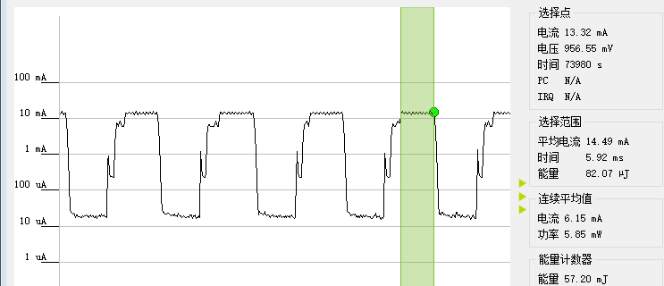
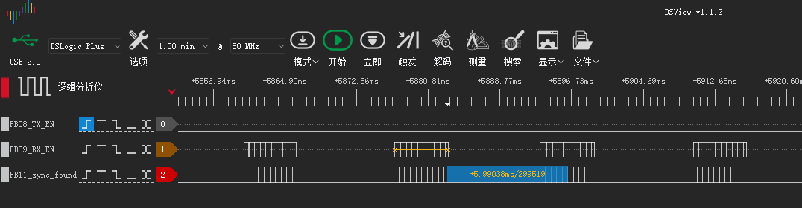

# LS 2.4G demo说明（with freertos)

LS 2.4G with freertos位于SDK的example\prop_24g\ls_prop_24g_freertos下，是加入了对freertos支持的2.4G用例，其演示的主要场景是利用freertos，实现固定周期的休眠/数据收发功能，其中包含的2.4G收发、Uart透传、休眠唤醒等功能与不带freertos的2.4G测试用例大致相同，这些内容可以参考[LS 2.4G demo](./ls_24g_with_sw_timer_lp0.md)。

## 一、基于freertos timer的休眠唤醒

本示例里，在用户初始化函数user_rx_init里创建了一个基于freertos的timer，其用途是控制系统的休眠唤醒。休眠与唤醒的周期，分别通过宏RX_DURATION_MS和RX_TIMER_INTERVAL_MS来控制的，默认值分别为6ms和10ms，表示应用每工作6ms就进入休眠，10ms后唤醒。

休眠与唤醒的切换，主要是在user_rx_timer_cb里完成的。每当timer timeout时，该函数会被调用，根据内部的flag来确定下一步的行为是休眠还是运行。

休眠的处理包括：

- timer change period到RX_TIMER_INTERVAL_MS
- 调用app_status_set(false)容许系统进入休眠
- 等待uart tx工作完成
- 外设deinit
- 停止2.4G工作

配置完休眠后，系统会在freertos的idle_task里调用系统休眠的流程，进入休眠，直到RX_TIMER_INTERVAL_MS时间后，系统会唤醒

运行的处理包括：

- timer change period到RX_DURATION_MS
- 清除uart_tx_busy标志位
- 调用app_status_set(true)阻止系统进入休眠
- 外设初始化，主要是Uart
- 2.4G初始化，并默认进入RX模式

配置完运行后，系统会持续工作RX_DURATION_MS时间，之后再次调用函数，切换sleep_flag进入休眠

## 二、运行结果

编译下载生成的production hex文件，将测试板接到功耗监测板，运行起来之后监控功耗曲线如下：

上图中电流维持10mA左右的时间在6ms左右，即为配置的RX_DURATION_MS时间。前面有一段功耗较低但也处于active状态的部分，主要是系统需要提前唤醒，为定时器的处理做好准备。

做一个tx_only的2.4G demo（可参考ls_prop_24g里的app_user_24g_tx_only.c），应用全速发2.4G数据包，将生成的production hex下载到另一个测试板里运行起来。同时将本示例的2.4G的硬件控制信号输出到IO上（需要额外配置，默认应用代码没有），通过逻分采样波形如下：

其中RX_EN表示RF RX状态的硬件信号，拉高表示RF处于RX状态，拉低表示RF RX停止；sync_found是硬件同步信号，拉高表示RF有同步到空中的射频信号（在指定channel同步到同一个preamble + access address），每次sync_found拉高都伴随着RX_EN拉低，在2.4G场景下基本意味着成功收到一个数据包。

