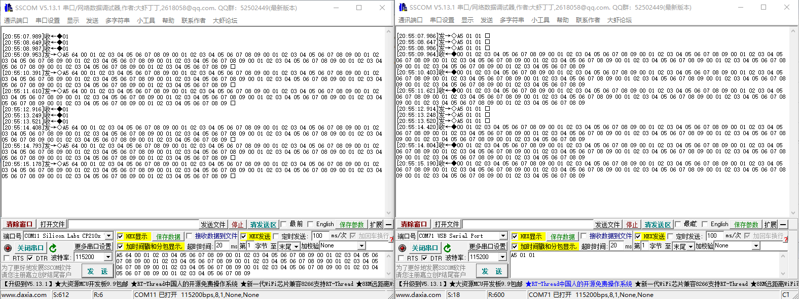
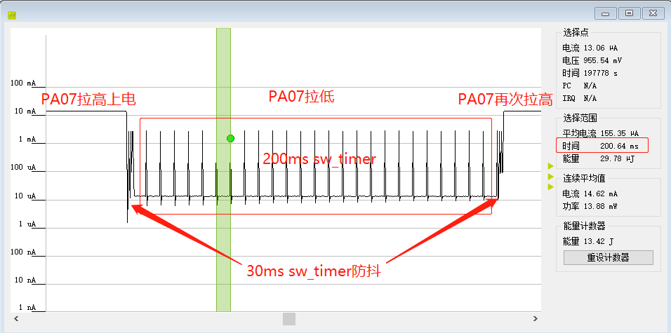

# LS 2.4G demo说明（with sw_timer & LP0)

LS 2.4G demo位于SDK的example\prop_24g\ls_prop_24g下，除了通用2.4G通信功能外，还包含sw_timer定时器，以及LP0低功耗模式的休眠唤醒。demo运行的流程是：

1. production hex烧入Flash后，拉高PA07，运行程序
2. 应用检测到PA07为高，会默认调用外设和2.4G初始化函数，并阻止系统进入休眠。此时系统处于2.4G接收状态，Uart收到数据后会通过2.4G发送出去，发送完成后自动回到2.4G接收状态
3. 拉低PA07，会触发IO的exti中断，通过开启周期为30ms的sw_timer去抖后，调用外设的deinit函数，修改PA07的exti配置，容许系统进入休眠。之后系统会很快进入LP0休眠模式
4. 再次拉高PA07，系统被exti唤醒后，软件检测到PA07为高，会重新恢复到2.4G接收状态，直到PA07再次拉低

## 一、2.4G通信

### 1、准备工作

- 频点配置：通过宏RF_CHANNEL_DEFAULT定义，支持2360~2510，其中2360~2400和2482~2510通信效果较好

- PHY配置：通过宏RF_PHY_DEFAULT定义，目前支持1M和2M

- 系统初始化：调用sys_init_24g函数
- 2.4G射频初始化：调用RF_24g_Init函数

### 2、2.4G收发

demo里的2.4G数据收发以类似Uart串口透传的方式实现。当串口接收到符合格式要求的数据的时候，会把数据推送到2.4G发送出去，而从2.4G接收到的数据，也会在做适当处理后推送到串口上。

- 2.4G数据发送函数为RF_24g_Tx，其原型为

`enum prop_24g_status RF_24g_Tx(uint8_t *txBuf, uint8_t txLen, void (*Tx_cmpt_cb)(void *), void *param)；`

其中txBuf为发送数据的buffer指针，txLen为发送数据的长度，Tx_cmpt_cb为TX完成后的回调函数，param为回调函数的参数。回调函数是在中断里会被直接调用，因此其具体实现不宜过于复杂，需要考虑代码执行时间。

- 2.4G数据接收函数为RF_24g_Rx，其原型为

`enum prop_24g_status RF_24g_Rx(uint8_t *rxBuf, uint8_t *rxLen, void (*Rx_cmpt_cb)(void *), void *param)；`

其中rxBuf为接收数据的buffer指针，rxLen为保存接收数据长度的指针，Rx_cmpt_cb为RX完成后的回调函数，param为回调函数的参数。和TX的回调函数类似，Rx_cmpt_cb的实现也不要太复杂。

由于是透传功能，因此demo里RX是初始化时会默认打开的，在app_user_24g_rf_init函数里会被调用。而在2.4G TX发送完成和Uart TX完成后，也会默认打开2.4G RX继续接收（app_user_24g_tx_cb里实现）。

应用可以通过调用RF_24g_Stop函数来停止当前的2.4G行为，但需要注意的是，**只有RX行为会被停止，TX是无法停止的。**RF的TX行为一旦动起来只能等待数据发送完成后自行停止。另外，**不要试图在中断处理函数里调用RF_24g_Stop函数**，原因是该函数内部需要等待一个标志位，该标志位会在硬件状态机中止后的中断里被清除。

## 二、sw_timer

在BLE模式下，如果是LP0模式下的定时需求，应用可以通过builtin timer来实现。在2.4G的应用下，没有协议栈的支撑，需要调用sw_timer来实现LP0模式下的定时。

创建一个sw_timer首先需要创建一个struct sw_timer_env类型的全局变量，之后实现一个timer的timeout callback函数，通过sw_timer_callback_set来设置这个callback函数以及对应的调用参数。之后需要通过调用函数sw_timer_period_set来设置定时器的周期，最后就是调用sw_timer_start来开启定时器。

***注意：sw_timer的callback必须有bool类型的返回值，其中true表示这个timer需要继续工作，false表示timer将被stop。***

类似BLE模式下的builtin timer，sw_timer支持在active和LP0 sleep下生效。不支持LP2/LP3 sleep模式。LP2模式下的定时只能通过RTC来实现。

demo里创建了两个timer实例，一个是始终工作的200ms timer，另一个是作为IO插入的防抖timer，周期为30ms。第一个timer的callback里只是在反复toggle IO，没有其他操作。第二个timer是在PA07的exti中断里启动，用来检测PA07的高低电平，来决定应用是否要进入休眠。

## 三、LP0休眠

在满足某些特定条件下，系统会默认进入LP0休眠模式。前提包括如下几点：

- 所有外设处于idle状态（应用调用了外设的deinit函数）
- 应用容许进入休眠模式（调用app_status_set(false)）
- 2.4G硬件不处于TX状态

这部分代码流程应用不需要太关注。**需要注意的是，如果2.4G处于RX状态，应用可以不调动RF_24g_Stop，系统会默认关闭RX流程后再进入休眠。**具体可以参考ls_24g_sleep_wakeup里的实现。

## 四、其他

1、Uart数据格式为：A5+length(1字节)+数据(1字节)，其中数据长度不能超过253字节

2、Uart透传测试结果如下：

3、功耗测试结果如下：

注意：PA07拉高时，由于系统处于2.4G RX状态，因此功耗在10mA+，所以看不到200ms sw_timer在功耗上的体现。可以通过使用示波器或逻辑分析仪查看PA00的高低电平来检测sw_timer的运行状态。