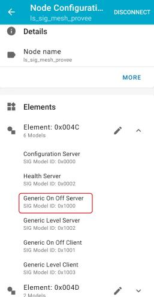

# sig mesh provee 示例说明

## Introduction

sig_mesh_provee例程实现了具有六个model的简单mesh设备，支持 PB-ADV 和PB-GATT两种配网方式。在client和server端各有一个generic onoff model、一个Generic Level model和一个自定义的vendor model，应用程序可以通过具体的model实现model中定义的功能：

- **Generic onoff model**: 通过mesh app或provisioner主机设备控制节点led灯的开关状态
- **Generic Level model**: 可以控制LED灯的亮度
- **Vendor model**: 实现主机和provee节点间的uart数据透传

## Hardware Prerequisites

- **LE5010/5110 RF Board**
  
  

- **LE5010/5110 Solo Board**

  

默认的provee节点配置使用的是LE5010/5110 RF Board,其他开发板类似

## Software Prerequisites

- **手机APP及主机provisioner：**

​		nRF Mesh

​		provisioner例程、串口调试助手

开发环境搭建及下载说明参考[开发指南](https://ls-doc.readthedocs.io/zh_CN/latest/src/sdk/getting_started.html)

## Usage

### Step1: 配置软件

从github或gitee下载SDK，进入到**ls_sdk\examples\mesh\sig_mesh\sig_mesh_provee**示例文件夹，使用keil MDK或VScode编译程序

### step2: 下载程序

sig_mesh_provee示例编译成功后，找到生成的sig_mesh_provee_production.hex文件，使用**Jflash**或**LS DownLoad Tool v2.1**串口下载工具下载程序到开发板中

### step3: 设备配网

在本章节中，将演示使用nRF Mesh App如何配网，用户也可以再用一块开发板下载例程**ls_sdk\examples\mesh\sig_mesh\sig_mesh_provisioner**，然后使用串口调试工具发送AT指令进行配网，关于这部分可参考文档**Mesh Provisioner指令.pdf**，下面仅演示使用nRF Mesh App配网

#### 3.1 发现设备

打开 nRF Mesh App选择底部的Network按钮，然后点击右下方的蓝色“+”号图标，此时APP已经开始扫描设备了，我们可以在屏幕上看到未配网的设备

​									          

#### 3.2 识别设备

选择名称为**ls_sig_mesh_provee**的设备，此时App将尝试与该设备建立连接，连接成功后可以在界面中看到**IDENTIFY**按钮，点击识别按钮 **IDENTIFY** 后，用户可以看到配网按钮 **PROVISION**

​									       

#### 3.3 配网

点击配网按钮 **PROVISION**，App 会开始配网设备，之后会显示**Configuration Complete**，表示节点初始配置完成。点击**ok**后可以看到节点的单播地址分配成功，Composition Data解析完成，此时板子上PA01连接的LED灯会点亮。

​								     

#### 3.4 配置（Configuration）

当配网和初始配置完成后，用户可以继续配置节点的其余信息，将 AppKey 绑定至每个元素 (element) 的每个模型 (model) 中、设置模型的发布（publish）信息等。

下图展示了如何将 AppKey 绑定至 Primary Element 中的 Generic OnOff Server Model 上：

​							        

​							        

完成上面操作步骤后，就可以通过App控制板子PA01所连接LED的状态，点击上图4中的**ON/OFF**按钮控制LED开关，左侧的**READ STATE**按钮可以获取当前LED灯的状态。

#### 3.5 组网（Group）

上面我们完成一个设备的配网和配置，接下来对另一个设备也完成入网，之后将这两个节点绑定到一个组（Group）内,通过发布（Pulish）消息同时控制两个板子上LED灯的状态。

1. 回到App主界面，点击**ADD NODE**按钮，找到另一个设备，重复上面步骤 3.1-3.4完成入网

​	   	          

2. 回到App主页面，选择底部的**Groups**,点击**CREATE GROUP**创建一个Group，设置好组名称和地址后点击**ok**

​			         

3. 回到节点模型配置界面找到**SUBSCRIBE**，两个节点分别订阅（Subscribe）刚刚创建的Group,确保两个节点的Appkey是同一key(图中都是Application key 1)，操作步骤如下图所示:

​											                

​											                 

4.完成上面步骤后就可以通过App控制PA01所连接的LED灯亮灭

​							       