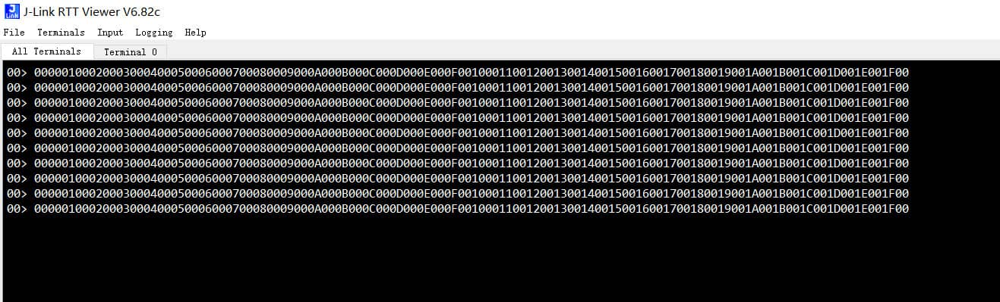

# I2S_IT 使用示例

例程路径: ls_sdk\examples\peripheral\spi_i2s\i2s_it_master
         ls_sdk\examples\peripheral\spi_i2s\i2s_it_slave

## 一、程序基本配置及说明：

i2s_it示例程序演示了使用中断的方式实现i2s master和i2s slave之间的数据传输，例程以200ms的间隔传输10组数据

程序开始时先进行系统初始化和i2s初始化：

```c
    /* system init app     */
    sys_init_none();
    /* init i2s and GPIO   */
    i2s_init();
```

I2S IO端口设置：

        /* Configure the GPIO AF */
        /* CK--------------PB12 */	
        /* WS--------------PB13 */	
        /* SD--------------PB14 */	
        /* MCK-------------PB15 */

```C
    /* master device */
    pinmux_iis2_master_ck_init(I2S_CK_PIN);
    pinmux_iis2_master_ws_init(I2S_WS_PIN);
    pinmux_iis2_master_sd_init(I2S_SD_PIN, 1); 
    pinmux_iis2_master_mck_init(I2S_MCK_PIN);
 
    /* slave device */
    pinmux_iis2_slave_ck_init(I2S_CK_PIN);
    pinmux_iis2_slave_ws_init(I2S_WS_PIN);
    pinmux_iis2_slave_sd_init(I2S_SD_PIN, 0); 
    pinmux_iis2_slave_mck_init(I2S_MCK_PIN);
```
SD（Serial Data）Pin需要根据发送/接收分别配置为输出/输入模式：

```c
    pinmux_iis2_master_sd_init(I2S_SD_PIN, 1);  // 1 表示配置为输出
    pinmux_iis2_slave_sd_init(I2S_SD_PIN, 0);   // 0 表示配置为输入
```


## 二、操作步骤及结果：

### 2.1 操作步骤

**说明**：

I2S初始化结构体配置说明：

```C
    I2sHandle.Instance                  = SPI2;                         /*选择I2S Instance */
    I2sHandle.Init.Mode                 = I2S_MODE_MASTER_TX;           /*设置I2S模式，可选择（主机/从机）发送/接收*/
    I2sHandle.Init.Standard             = I2S_STANDARD_PCM_LONG;        /*设置音频数据通信协议标准 */
    I2sHandle.Init.DataFormat           = I2S_DATAFORMAT_16BIT;         /*设置数据格式 */
    I2sHandle.Init.MCLKOutput           = I2S_MCLKOUTPUT_DISABLE;       /*设置主时钟输出 */
    I2sHandle.Init.OddPrescaler         = I2S_ODDPRESCALER_DEFAULT;     /*设置I2S分频值 */
    I2sHandle.Init.DivPrescaler         = I2S_DIVPRESCALER_DEFAULT;     /*设置I2S奇偶分频 */
    I2sHandle.Init.CPOL                 = I2S_CPOL_LOW;                 /*设置时钟极性CPOL，可选高/低电平*/
```

I2S IT模式数据传输提供了2个API：

HAL_I2S_Transmit_IT ：发送数据

HAL_I2S_Receive_IT  ：接收数据


```c
HAL_I2S_Transmit_IT(I2S_HandleTypeDef *hi2s, uint16_t *pTxData, uint16_t Size)
HAL_I2S_Receive_IT(I2S_HandleTypeDef *hi2s, uint16_t *pRxData, uint16_t Size)

```

下面是HAL_I2S_Transmit_IT 和 HAL_I2S_Receive_IT API中各参数的说明：

``` C
/**
  * @brief  Transmit an amount of data in non-blocking mode with Interrupt
  * @param  hi2s pointer to a I2S_HandleTypeDef structure that contains
  *         the configuration information for I2S module
  * @param  pTxData a 16-bit pointer to data buffer.
  * @param  Size number of data sample to be sent:
  * @note   When a 16-bit data frame or a 16-bit data frame extended is selected during the I2S
  *         configuration phase, the Size parameter means the number of 16-bit data length
  *         in the transaction and when a 24-bit data frame or a 32-bit data frame is selected
  *         the Size parameter means the number of 24-bit or 32-bit data length.
  * @note   The I2S is kept enabled at the end of transaction to avoid the clock de-synchronization
  *         between Master and Slave(example: audio streaming).
  * @retval HAL status
  */
HAL_StatusTypeDef HAL_I2S_Transmit_IT(I2S_HandleTypeDef *hi2s, uint16_t *pTxData, uint16_t Size);

/**
  * @brief  Receive an amount of data in non-blocking mode with Interrupt
  * @param  hi2s pointer to a I2S_HandleTypeDef structure that contains
  *         the configuration information for I2S module
  * @param  pRxData a 16-bit pointer to the Receive data buffer.
  * @param  Size number of data sample to be sent:
  * @note   When a 16-bit data frame or a 16-bit data frame extended is selected during the I2S
  *         configuration phase, the Size parameter means the number of 16-bit data length
  *         in the transaction and when a 24-bit data frame or a 32-bit data frame is selected
  *         the Size parameter means the number of 24-bit or 32-bit data length.
  * @note   The I2S is kept enabled at the end of transaction to avoid the clock de-synchronization
  *         between Master and Slave(example: audio streaming).
  * @note   It is recommended to use DMA for the I2S receiver to avoid de-synchronization
  * between Master and Slave otherwise the I2S interrupt should be optimized.
  * @retval HAL status
  */
HAL_StatusTypeDef HAL_I2S_Receive_IT(I2S_HandleTypeDef *hi2s, uint16_t *pRxData, uint16_t Size);

```

数据传输完成时会调用callback函数：

```c
/* Tx callback */
void HAL_I2S_TxCpltCallback(I2S_HandleTypeDef *hi2s)
{
    ComState = COM_COMPLETE;
}

/* Rx callback */
void HAL_I2S_RxCpltCallback(I2S_HandleTypeDef *hi2s)
{
    ComState = COM_COMPLETE;
    LOG_HEX(aRxBuffer,2 * BUFFERSIZE);
}

```


#### 2.1.1 端口连接

例程需要使用两块开发板，在程序开始运行之前需要按照下面方式连接master和slave设备：

| I2S MASTER BOARD | I2S SLAVE BOARD |
| :--------------: | :-------------: |
|  iis_master_ck   |  iis_slave_ck   |
|  iis_master_ws   |  iis_slave_ws   |
|  iis_master_sd   |  iis_slave_sd   |
|  iis_master_mck  |  iis_slave_mck  |
|       GND        |       GND       |

主时钟输出引脚MCK可根据需求设置，如果不需要主时钟输出，则可以不配置这个引脚

#### 2.1.2  运行程序

主从机程序分别编译后下载到对应的开发板中，需要先在从机上进行复位，然后在主机上进行复位后观察打印窗口数据结果

### 2.2 测试结果

在本例程中，aTxBuffer是预定义的，aRxBuffer大小与aTxBuffer相同。I2S主机通过HAL_I2S_Transmit_IT() 发送aTxBuffer中的数据，从机通过HAL_I2S_Receive_IT()接收数据，通过打印窗口
检查buffer中数据的正确性:




## 三、其他说明：

示例程序仅演示了使用I2S进行简单的数据传输，并未进行实际的音频采样和播放。用户如果要实现音频相关的应用，需要根据实际Audio采样频率计算I2S分频值DivPrescaler和奇偶分频OddPrescaler,
然后将计算好的值配置到初始化参数中（将下面的DEFAULT值改为计算好的值）：
  
```C
    I2sHandle.Init.OddPrescaler         = I2S_ODDPRESCALER_DEFAULT;     
    I2sHandle.Init.DivPrescaler         = I2S_DIVPRESCALER_DEFAULT;   
```
Audio采样频率可能是 192 kHz, 96 kHz, 48 kHz, 44.1 kHz, 32 kHz, 
22.05 kHz, 16 kHz, 11.025 kHz 或 8 kHz等。为达到所需频率，需要根据以下公式计算出OddPrescaler和DivPrescaler：

输出主时钟（SPI_I2SPR 寄存器中的 MCKOE 置 1)时：

FS = I2SxCLK / [(16\*2)\*((2\*I2SDIV)+ODD)\*8)]（通道帧宽度为 16 位时）

FS = I2SxCLK / [(32\*2)\*((2\*I2SDIV)+ODD)\*4)]（通道帧宽度为 32 位时）

关闭主时钟输出（MCKOE 位清零）时：

FS = I2SxCLK / [(16\*2)\*((2\*I2SDIV)+ODD))]（通道帧宽度为 16 位时）

FS = I2SxCLK / [(32\*2)\*((2\*I2SDIV)+ODD))]（通道帧宽度为 32 位时）

其他具体说明可参考User Manual I2S部分