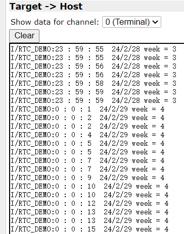
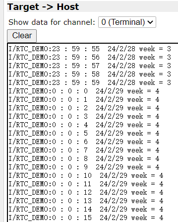
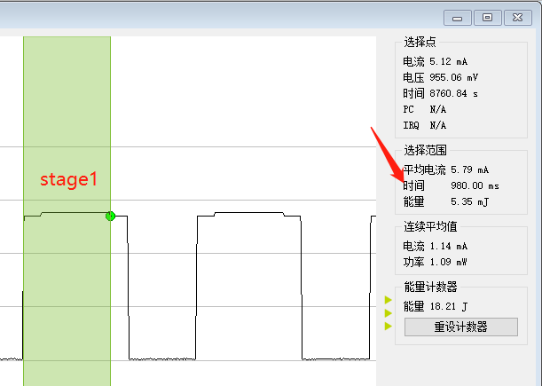
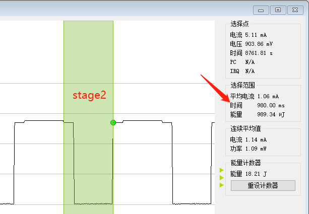
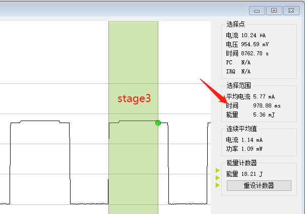
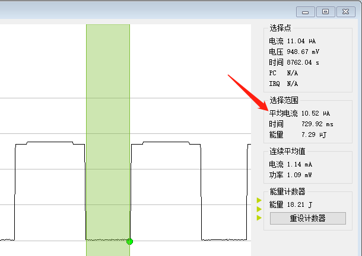
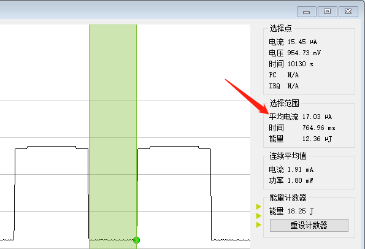
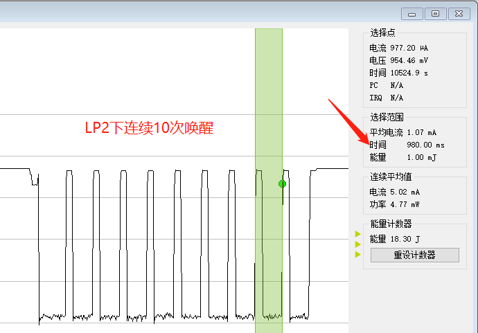
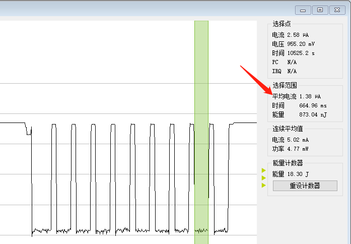

RTC（万年历）使用示例
======================

例程路径：<install_file>/examples/peripheral/rtc

一、程序基本配置及说明:
-------------------------
rtc示例程序包括三个功能配置：万年历测试，LP0模式下RTC唤醒测试和LP2模式下RTC唤醒测试。根据RC时钟源的配置不同，又包括LSI和LSE配置下的上述测试

#define SDK_LSI_USED 1 ->表示使用LSI做RC时钟源

#define SDK_LSI_USED 0 ->表示使用LSE做RC时钟源，**此时板子上需要外挂32768晶振**

当LSI作为RC时钟源时，由于RC实际频率在20KHz左右，而wakeuptime计时的最细粒度也是在1/16秒，所以在此情况下实际误差可能会达到几十ms级别。而应用定时去获取万年历信息也会出现连续两秒的second不连续（没有变化，或者前后差2）的情况。

当LSE作为RC时钟源时，定时是准确的，不会出现LSI的上述现象，但休眠功耗（LP0）会相对偏高。**（LP2模式不支持LSE）**
RTC wakeup time被配置为RTC enable的时候就开始生效，因此无论系统睡醒，RTC wakeup time触发的中断会周期性的触发。

1.1 万年历测试

+++++++++++++++++
配置#define RTC_TEST_CASE 1
该测试是针对RTC内部硬件万年历功能。测试流程，是将万年历初始化为一个具体的日期/时间，之后定时获取万年历运行结果。

1.2 RTC唤醒测试（LP0模式）
+++++++++++++++++++++++++++
配置#define RTC_TEST_CASE 2
在LP0模式下，RTC会通过RTC IRQ（系统处于wakeup时）或LPWakeup IRQ（系统处于sleep时）触发中断。在系统初始化之后，程序会配置RTC wakeup中断，配置唤醒时间为1秒。

stage1：sleep_flag初始值为false，所以在第一次rtc_wkup_callback被调用（RTC中断）之前，系统都不会休眠。

stage2：在rtc_wkup_callback被第一次调用后，sleep_flag被置为true，此时系统会立刻进入LP0模式

stage3：休眠模式下RTC中断唤醒系统，rtc_wkup_callback被调用（LP Wakeup中断），sleep_flag被再次置成false，系统不再休眠，重复stage1

1.3 RTC唤醒测试（LP2模式）
+++++++++++++++++++++++++++
配置#define RTC_TEST_CASE 3，同时SDK_LSI_USED必须为1

该测试是针对LP2模式下RTC唤醒系统功能，以及万年历功能。

与LP0模式的休眠唤醒不同，进入LP2后，每次唤醒实际上就是重启，休眠前用户SRAM中数据不被保存，因此在通过宏SLEEP_CNT_MAX配置LP2 RTC测试的休眠唤醒次数后，通过LP2模式下不会掉电的BKD寄存器记录已经睡醒的次数，每次唤醒都会自增。当BKD中计数达到SLEEP_CNT_MAX之后，在打印一条log后CPU会进入while(1)，此时可以通过RTT的方式查看log输出。
系统唤醒间隔为1秒，唤醒之后在rtc_lp2_test里会检查当前系统唤醒的唤醒源，如果是RTC唤醒则会点亮测试板的LED（PA01）。

二、操作步骤及结果:
---------------------

将编译好的程序下载到测试的模块中。

   **注意：烧录时如果系统处于运行休眠唤醒流程里，需要将PB14拉高后重新上电再烧录**

2.1 万年历测试
++++++++++++++++
**#define SDK_LSI_USED 1** 

连接RTT，可以看到程序跑起来之后每隔大概1秒钟左右会有一条打印输出，显示万年历信息。预期结果如下：

LSI下的万年历输出不连续，但不会有累计误差。

**#define SDK_LSI_USED 0**

使用外部晶振作为RC时钟源，定时获取的万年历时间是连续的。如下图所示：

2.2 RTC唤醒测试（LP0模式）
+++++++++++++++++++++++++++
**#define SDK_LSI_USED 1** 

LP0测试的stage1部分如下：

stage2部分如下：

stage3部分如下（stage3实际是重复stage1）：

由于是LSI作为RC时钟源，也会出现唤醒时间有误差的情况。

LSI作为时钟源，LP0休眠时的功耗如下：

**#define SDK_LSI_USED 0**

使用外部晶振，LP0测试的stage1/stage2/stage3基本和LSI一致，唯一的区别是LSE定时精准。另外就是休眠功耗会有差异：

2.2 RTC唤醒测试（LP2模式）

+++++++++++++++++++++++++++
通过监测系统功耗，可以看到系统处于定期唤醒的LP2模式（sleep功耗 **1uA** 左右），总计SLEEP_CNT_MAX次，与此同时测试板的LED灯会定期闪烁。预期结果如下：

休眠功耗如下：

系统休眠唤醒SLEEP_CNT_MAX次后，可以连接RTT查看log输出。预期结果如下：

**注意：由于LP2模式下系统唤醒实际为系统重启，因此虽然逻辑上来讲测试中会打印SLEEP_CNT_MAX次时间输出，但最终看到的只有最后一次**