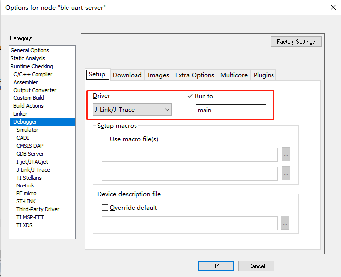
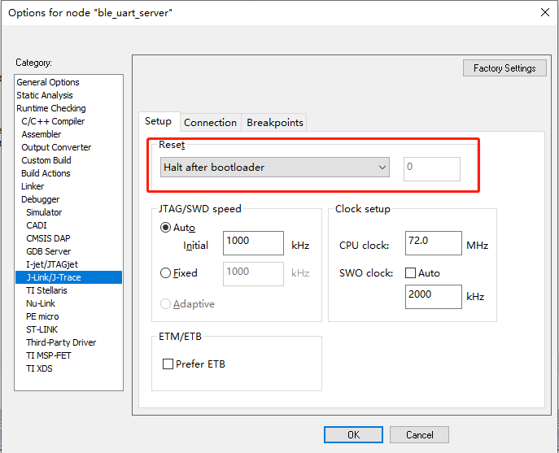
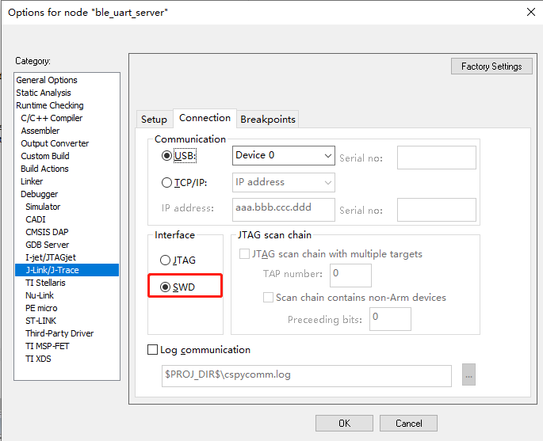
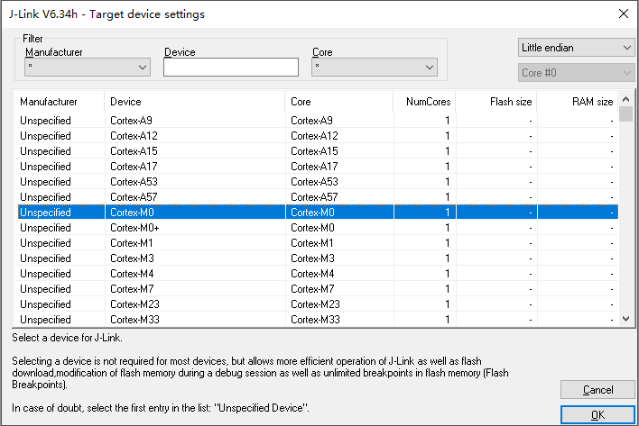

# IAR

## Environment Setup

请按照IAR官方指导，下载并正确安装 IAR For Arm 环境。

## Build

1. 以ble_uart_server工程为例，工程路径：`examples\ble\ble_uart_server\le501x\iar`；
2. 打开IAR的工程文件 `ble_uart_server.eww` ,使用 `F7` 或者 `project->Make` 开始编译；
3. 编译后的结果在工程文件路径下面的build文件夹下面，可执行文件在 `build\Exe` 下。

## Program

根据[FLASH布局](../arch/flash_layout)一节的介绍，对于BLE应用，Flash被划分为5个部分，其中`Info Page & Second Bootloader`、`BLE Host & Controller Protocol Stack`和`App`三个区域的数据需要预先写入Flash，程序才能正确运行。

> - 以ble_uart_server工程为例：
> - Info Page & Second Bootloader：ble_uart_server\le501x\iar\Build\Exe\info_sbl.hex
> - BLE Host & Controller Protocol Stack：SDK\soc\arm_cm\le501x\bin\fw.hex
> - App：ble_uart_server\le501x\iar\Build\Exe\ble_uart_server.hex

- 量产时，只需要烧录对应工程编译出来的 XXX_production.hex即可，该文件是由上述三个HEX文件合并之后的固件。

## Debug

**注意：** IAR 工程目前仅支持 `Debug without Downloading `  功能，因此如果需要在线调试时需要提前烧录好编译的HEX文件。

完成IAR环境安装后，以ble_uart_server工程为例，打开`examples\ble\ble_uart_server\le501x\iar`路径下的IAR工程文件。

- 打开Options配置，`Project->Options`，在Debugger配置页中选择 JLINK 作为调试工具，并且选择Run to main。

   

- 配置 JLINK 

   

   

- 选择 Debug without Downloading 功能开始调试，第一次调试时需要我们手动选择芯片型号，这里我们选择 Cortex-M0 即可。

   

- JLINK在线调试功能配置已经完成。

  

