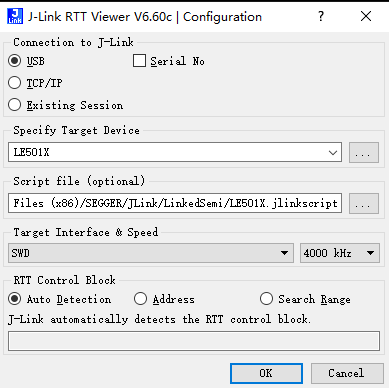

# J-Link

## 驱动下载

1. 打开Jlink驱动官方下载地址

    <https://www.segger.com/downloads/jlink/#J-LinkSoftwareAndDocumentationPack>

2. 选择一个版本下载下来，推荐使用6.60c

    

## 安装&配置

1. 双击下载的JLink_XXX.exe文件进行安装，无特殊情况按照默认配置执行安装即可，记一下安装的路径，下面的环节用得到；
2. 将JLink安装路径（JFlash.exe 、JLinkGDBServerCL.exe 所在目录）添加到系统环境变量PATH；
3. 将SDK包 ` tools/prog ` 目录下的所有内容拷贝到Jlink的安装路径，无特殊应用直接覆盖原有文件。

## 常用操作

### JFlash

1. JFlash可以烧录HEX文件到芯片里，或者读取芯片内的数据；

2. 在jlink安装路径下面找到JFlash.exe，双击打开，考虑后续方便打开也可以右键->发送到->左面快捷方式；

3. File->New project 配置 target device为 `LinkedSemi LE501X`

   

4. 导入待烧录hex文件，点击File->Open data file...选择要烧录的hex文件，或者直接将文件拖入JFLash中；

5. 在jlink与调试板连接好的情况下， 点击Target->Connect，如果能够连接成功会在LOG窗口最后一行显示“Connected successfully”，否则请检查硬件接线是否正确；

6. 芯片内flash全擦操作，  Target->Manual Programming->Erase ；

7. 执行烧录， Target->Production Programming ；

8. flash数据全部回读，Target->Manual Programming->Read Back;

### JLinkRTTViewer

1. 在使能 JLINK_RTT 功能后（SDK中默认使能），可以使用 JLinkRTTViewer.exe 工具查看程序内的log信息；

2. 执行下图中配置即可

   
