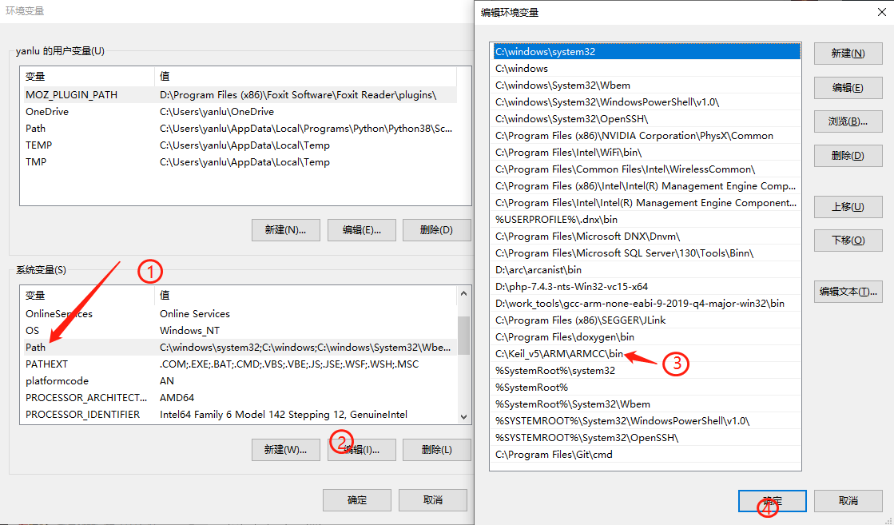
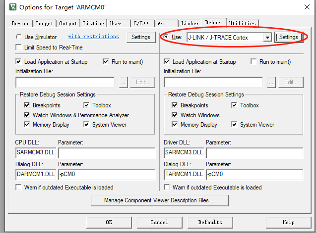
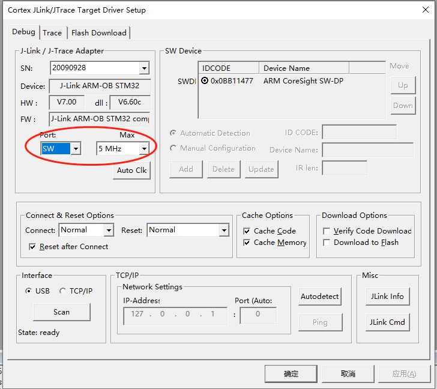
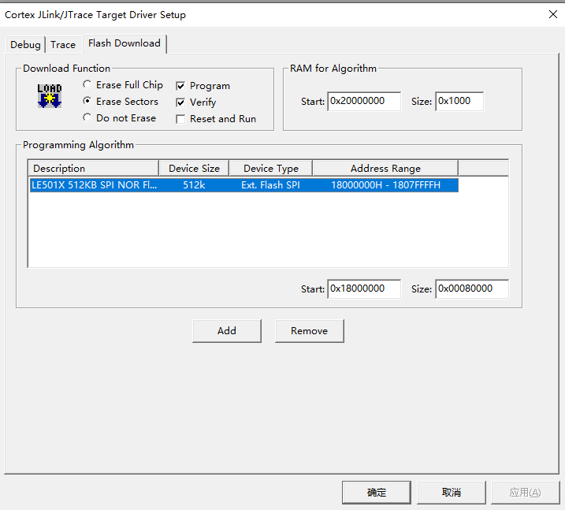

# Keil
获取地址：[KEIL官方链接](http://www.keil.com/fid/qtcbv3wb9c9j1wrdw6w1a24gf9liqqd1ig1yd1/files/umdkarm/MDK525.EXE)

注意事项：需要使用5.25版本以上，并且要在激活之后才能正常使用。

## Environment Setup

1. 打开获取的 [SDK](https://gitee.com/linkedsemi/LS_SDK)目录，将 `tools\prog\LinkedSemi\le501x_flash_algo.elf` 文件复制一份并修改文件名为le501x_flash_algo.FLM，并将le501x_flash_algo.FLM文件拷贝到keil安装目录下的 `ARM\Flash` 路径中；

2.  将fromelf执行文件的绝对路径添加系统环境变量中，重启keil生效，该文件所在路径在keil的安装目录下面 `ARM\ARMCC\bin` ，否则在使用keil编译时会报“fromelf不是内部或外部命令，也不是可运行的程序或批处理文件”的警告。（ [如何设置添加环境变量](https://jingyan.baidu.com/article/47a29f24610740c0142399ea.html) ） 

   

## Build

1.  以ble_uart_server工程为例，工程路径：`examples\ble\ble_uart_server\le501x\uvision5`；
2. 执行keil的build或者Rebuild功能，编译结果显示`.\UVBuild\ble_uart_server.axf" - 0 Error(s), 0 Warning(s).`则说明环境安装正确；
3. 编译后的文件输出路径：`examples\ble\ble_uart_server\le501x\uvision5\UVBuild`。

## Program

根据[FLASH布局](../arch/flash_layout)一节的介绍，对于BLE应用，Flash被划分为5个部分，其中`Info Page & Second Bootloader`、`BLE Host & Controller Protocol Stack`和`App`三个区域的数据需要预先写入Flash，程序才能正确运行。

> - 以ble_uart_server工程为例：
> - Info Page & Second Bootloader：ble_uart_server\le501x\uvision5\UVBuild\info_sbl.hex
> - BLE Host & Controller Protocol Stack：SDK\soc\arm_cm\le501x\bin\fw.hex
> - App：ble_uart_server\le501x\uvision5\UVBuild\ble_uart_server.hex

- 量产时，只需要烧录对应工程编译出来的 XXX_production.hex即可，该文件是由上述三个HEX文件合并之后的固件。
- 开发调试阶段，只需要提前烧录一次XXX_production.hex，之后便可以正常使用keil调试，否则程序跑不进main函数。

## Debug

完成keil环境安装后，以ble_uart_server工程为例，打开`examples\ble\ble_uart_server\le501x\uvision5`路径下的keil工程文件。

1.  选择 J-Link 作为调试工具 

   

2.  选择SW作为调试 

   

3.  在 flash download 选项卡中配置下载选项，不能选择 `Erase Full Chip` 选项，如果在编程算法选项内没有找到下图的选项，请检查软件开发环境搭建章节内的keil环境配置的第二条内容是否执行正确。 

   