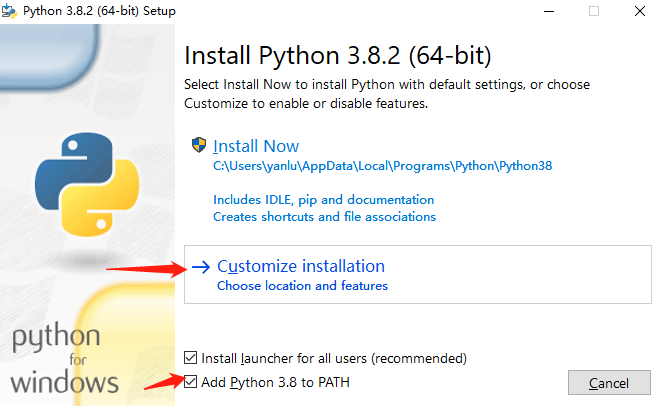
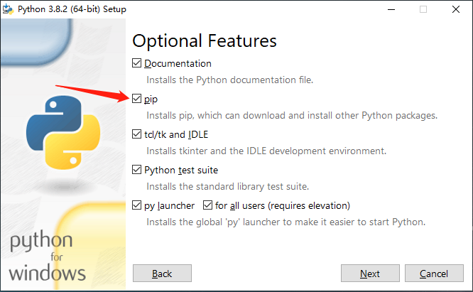
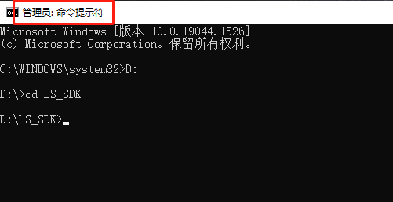
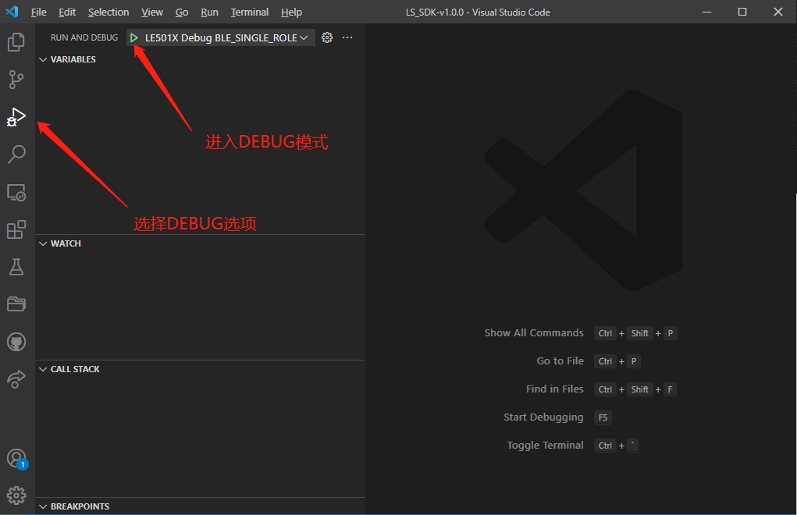

# VSCode

请提前下载好以下工具，下载地址：

[GCC(ARM) 10.2.1](https://developer.arm.com/-/media/Files/downloads/gnu-rm/10-2020q4/gcc-arm-none-eabi-10-2020-q4-major-win32.zip?revision=ffcaa06c-940d-4319-8d7e-d3070092d392&hash=474B77905A06C0E3653EDF5DA1C12FE8A19E8D19)

[Python 3.8.2 (64bit)](https://www.python.org/ftp/python/3.8.2/python-3.8.2-amd64.exe)

[VS Code (64bit)](https://go.microsoft.com/fwlink/?Linkid=852157)

## Environment Setup

### GCC

- 解压GCC，将`{GCC_SETUP_DIR}/bin`路径添加到系统环境变量PATH中；

### Python

1. 勾选 Add Python 3.8 to PATH，然后选择 Customize install 开始安装

   

2. 确认 pip 模块已经被勾选，其它配置默认就行，然后点击 Next 进行下一步

   

3.  点击 Install 等待安装完成 

4. [**以系统管理员身份**打开命令行](https://jingyan.baidu.com/article/f0e83a255d020522e4910155.html)，然后切换到SDK根下目录，例如SDK下载在D盘下 `D:\LS_SDK` ,首先在CMD界面内输入 ``D:`` 切换到D盘，然后再使用 ``cd LS_SDK`` 进入到SDK根目录里

   

5. 进入SDK根目录，以系统管理员身份打开命令行，执行下述命令，安装Python依赖库

   - pip install -r requirements.txt

6. 如果下载速度比较慢导致下载失败，请尝试更换国内pip源，或者使用以下命令

   - pip install -r requirements.txt -i https://pypi.tuna.tsinghua.edu.cn/simple

### VSCode

1. 安装下载的VSCode，默认配置安装就行；
2. 用VS Code打开SDK目录，点击左侧Extensions（快捷键 ``Ctrl + Shift + X`` ），在搜索框输入 ``@recommended`` ,安装所有Workspace Recommendations插件

## Build

1. 完成前面操作后，打开VSCode，将SDK的目录拖入到vscode界面里面，通过快捷`` Ctrl + ` ``打开Terminal
2. 在Terminal中通过 `CD`命令切换到相应工程的路径中，以ble_uart_server工程为例，输入命令`cd examples/ble/ble_uart_server`，按回车键进到指定路径后输入 `scons` ，开始执行编译 。
3. 编译后的输出结果能看到有ble_uart_server_production.hex文件生成，并且没有任何报错，则说明环境安装正确；

## Program

根据[FLASH布局](../arch/flash_layout)一节的介绍，对于BLE应用，Flash被划分为5个部分，其中`Info Page & Second Bootloader`、`BLE Host & Controller Protocol Stack`和`App`三个区域的数据需要预先写入Flash，程序才能正确运行。

> - 以ble_uart_server工程为例：

> - Info Page & Second Bootloader：ble_uart_server\build\le501x\info_sbl.hex

> - BLE Host & Controller Protocol Stack：SDK\soc\arm_cm\le501x\bin\fw.hex

> - App：ble_uart_server\build\le501x\ble_uart_server.hex

- 量产时，只需要烧录对应工程编译出来的 XXX_production.hex即可，该文件是由上述三个HEX文件合并之后的固件。

- 开发调试阶段，只需要提前烧录一次XXX_production.hex，之后便可以正常使用vscode调试，否则程序跑不进main函数。

## Debug

以ble_uart_server工程为例：

1. 将ble_uart_server\launch.json.txt文件拷贝到SDK根目录下的.vscode路径下面，并将文件名修改为launch.json；

2. 按照下图所示，先选择debug选项，然后选择绿色的三角形开始进入DEBUG模式，开始调试之前请确认Flash中Info Page & Second Bootloader 和 BLE Host & Controller Protocol Stack的数据存在。
   
   
   - Debug {example 1}：表示复位系统，自动烧录 `{example 1}` 应用镜像到Flash中，并从头运行 
   
   - Attach {example 1} ：表示以 `{example 1}` 为程序，调试器直接连接到当前运行现场 

