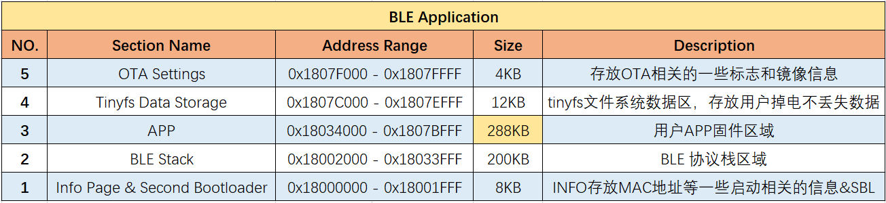
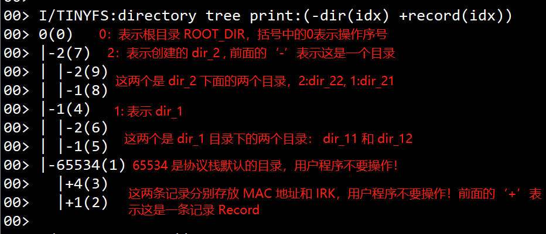
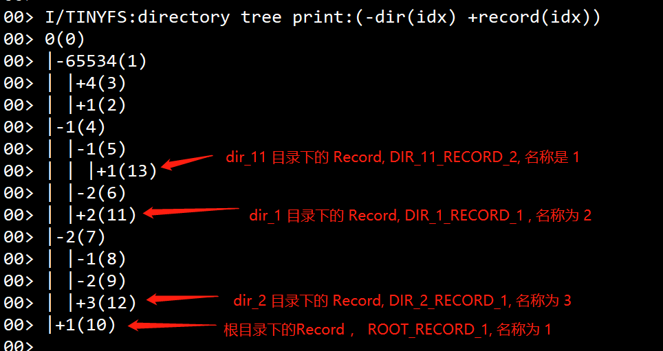
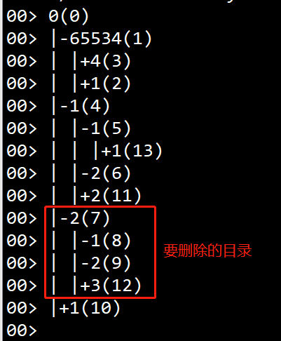
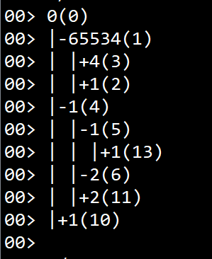
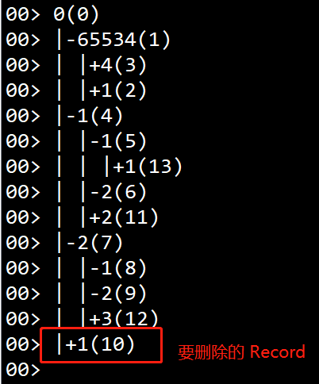
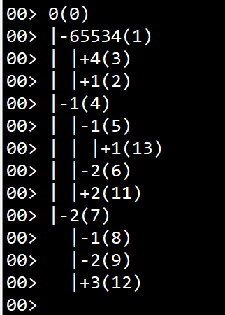
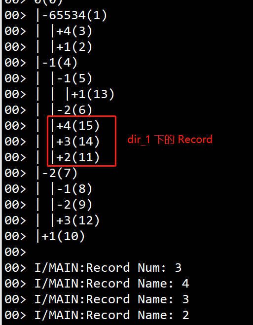

# Tinyfs

## 1. Tinyfs简介

### 1.1 什么是Tinyfs

Tinyfs是一种简化的 Nor Flash 文件系统，用于非易失性数据存储。具有用于管理目录和记录的树形结构，具有掉电保护功能。通过滚动写入/擦除的方式实现磨损平衡。

Tinyfs 使用时可以类比电脑磁盘上的文件夹和文件的创建、读取和删除操作。在系统初始化阶段，tinyfs 会创建一个根目录ROOT_DIR，后续文件夹的添加或者数据记录的添加都在这个根目录下进行，文件夹和文件的增加和删除都有相关的API接口进行操作；Tinyfs抽象出Directory 和 Record，分别表示目录和文件，用户数据存储在目录下的文件中；

目前仅支持在BLE和MESH应用中使用Tinyfs，单MCU应用可以使用SPI Flash 的接口直接操作Flash，详细flash访问接口参考OTA应用说明在线文档;

### 1.2 Tinyfs数据空间大小和在Flash中的位置

  如下图中的区域4 , 从Flash 的 0x1807C000 - 0x1807EFFF 共12KB 空间为 tinyfs 数据存储的区域；




## 2. Tinyfs常用接口说明

### 2.1 初始化 （tinyfs init）

在BLE应用中，**tinyfs不需要单独进行初始化**，系统初始化sys_init_app 中会调用tinyfs_init进行初始化操作；初始化时除了会创建根目录 ROOT_DIR ，同时也会在根目录下创建一个协议栈用到的目录（目录名称是 65534），在这个目录下会记录设备的 MAC 地址和IRK信息；

### 2.2 创建目录 (Make Directory)

```c
#define DIR_1_NAME 0x1
#define DIR_11_NAME 0x1
#define DIR_12_NAME 0x2
#define DIR_2_NAME 0x2
#define DIR_21_NAME 0x1
#define DIR_22_NAME 0x2

tinyfs_dir_t dir_1;
tinyfs_dir_t dir_11;
tinyfs_dir_t dir_12;
tinyfs_dir_t dir_2;
tinyfs_dir_t dir_21;
tinyfs_dir_t dir_22;

void make_tinyfs_dir(void)
{
	uint8_t ret_val;
	ret_val = tinyfs_mkdir(&dir_1,ROOT_DIR,DIR_1_NAME);    // 在根目录 ROOT_DIR 下创建目录 dir_1， 目录名称为 1
	LS_ASSERT(ret_val == TINYFS_NO_ERROR || ret_val == TINYFS_DIR_KEY_ALREADY_EXISTED);
    
	ret_val = tinyfs_mkdir(&dir_11,dir_1,DIR_11_NAME);    // 在目录 dir_1 下创建目录 dir_11， 目录名称为 1
	LS_ASSERT(ret_val == TINYFS_NO_ERROR || ret_val == TINYFS_DIR_KEY_ALREADY_EXISTED);
    
	ret_val = tinyfs_mkdir(&dir_12,dir_1,DIR_12_NAME);    // 在目录 dir_1 下创建目录 dir_12， 目录名称为 2
	LS_ASSERT(ret_val == TINYFS_NO_ERROR || ret_val == TINYFS_DIR_KEY_ALREADY_EXISTED);
    
	ret_val = tinyfs_mkdir(&dir_2,ROOT_DIR,DIR_2_NAME);    // 在根目录 ROOT_DIR 下创建目录 dir_2， 目录名称为 2
	LS_ASSERT(ret_val == TINYFS_NO_ERROR || ret_val == TINYFS_DIR_KEY_ALREADY_EXISTED);
    
	ret_val = tinyfs_mkdir(&dir_21,dir_2,DIR_21_NAME);    // 在目录 dir_2 下创建目录 dir_21， 目录名称为 1
	LS_ASSERT(ret_val == TINYFS_NO_ERROR || ret_val == TINYFS_DIR_KEY_ALREADY_EXISTED);
    
	ret_val = tinyfs_mkdir(&dir_22,dir_2,DIR_22_NAME);    // 在目录 dir_2 下创建目录 dir_22， 目录名称为 1
	LS_ASSERT(ret_val == TINYFS_NO_ERROR || ret_val == TINYFS_DIR_KEY_ALREADY_EXISTED);
}
```

执行上面的创建目录后整个目录的结构：



**目录创建接口说明：**

```C
/*
 	参数说明:
	tinyfs_dir_t *dir_to_make : 要创建的目录；
	tinyfs_dir_t upper_dir : 创建目录的父目录；
	uint16_t dir_name : 目录的名称，16-bit数据表示
*/

uint8_t tinyfs_mkdir(tinyfs_dir_t *dir_to_make, tinyfs_dir_t upper_dir, uint16_t dir_name);
```

**注意事项：**

1. 目录创建的接口只有3个参数，要创建的目录和上级目录，以及要创建目录的名称；
2. 为了节省空间，目录的名称统一用16-bit数据表示，**同级目录下的目录名称不能有重复**，不同目录下的目录名称可以相同；（和我们在电脑上创建目录类似）
3. 协议栈默认创建的目录 65534， 用户程序不能修改
4. 上面的目录结构是通过 **tinyfs_print_dir_tree** 打印出来的；


### 2.3 写入记录数据 （Write Record）

```C
#define ROOT_RECORD_1 0x1
#define ROOT_RECORD_1_DATA "root_record_1_data"
#define DIR_1_RECORD_1 0x2
#define DIR_1_RECORD_1_DATA "dir_1_record_1_data"
#define DIR_2_RECORD_1 0x3
#define DIR_2_RECORD_1_DATA "dir_2_record_1_data"
#define DIR_11_RECORD_2 0x1
#define DIR_11_RECORD_2_DATA "dir_11_record_2_data"

void tinyfs_write_record(void)
{
	uint8_t ret_val;
	
	// 在根目录 ROOT_DIR 下写入数据记录 ROOT_RECORD_1, 记录的名称是 1，写入的数据是 ROOT_RECORD_1_DATA
	ret_val = tinyfs_write(ROOT_DIR,ROOT_RECORD_1,(uint8_t *)ROOT_RECORD_1_DATA,sizeof(ROOT_RECORD_1_DATA));
    LS_ASSERT(ret_val == TINYFS_NO_ERROR);
	
	// 在目录 dir_1 下写入数据记录 DIR_1_RECORD_1, 记录的名称是 2，写入的数据是 DIR_1_RECORD_1_DATA
    ret_val = tinyfs_write(dir_1,DIR_1_RECORD_1,(uint8_t *)DIR_1_RECORD_1_DATA,sizeof(DIR_1_RECORD_1_DATA));
    LS_ASSERT(ret_val == TINYFS_NO_ERROR);
	
	// 在目录 dir_2 下写入数据记录 DIR_2_RECORD_1, 记录的名称是 3，写入的数据是 DIR_2_RECORD_1_DATA
    ret_val = tinyfs_write(dir_2,DIR_2_RECORD_1,(uint8_t *)DIR_2_RECORD_1_DATA,sizeof(DIR_2_RECORD_1_DATA));
    LS_ASSERT(ret_val == TINYFS_NO_ERROR);
	
	// 在目录 dir_11 下写入数据记录 DIR_11_RECORD_2, 记录的名称是 1，写入的数据是 DIR_11_RECORD_2_DATA
    ret_val = tinyfs_write(dir_11,DIR_11_RECORD_2,(uint8_t *)DIR_11_RECORD_2_DATA,sizeof(DIR_11_RECORD_2_DATA));
    LS_ASSERT(ret_val == TINYFS_NO_ERROR);
	
	tinyfs_write_through();
}
```

写入数据后：



**写入记录数据的接口说明：**

```C
/*
 	参数说明:
	tinyfs_dir_t dir : 要写入数据的目录;
	uint16_t record_name : Record 的名称，16-bit数据；
	uint8_t *data : 要写入的数据;
	uint16_t length : 写入数据的长度;
*/

uint8_t tinyfs_write(tinyfs_dir_t dir, uint16_t record_name, uint8_t *data, uint16_t length);
```

**注意事项：**

1. 写入数据的目录如果不存在，函数会返回：TINYFS_PARENT_DIR_NOT_FOUND；
2. 注意在tinyfs 擦除，写入的时候，注意要调用 tinyfs_write_through 才会立即写入，否则要等缓存 buf 满才会写入 flash; 


### 2.4 读出数据(Read Record)

```c
uint8_t dir_11_record_2[30];
void dir_11_record_2_read(void)
{
	uint16_t length = 30;
	
	//读出 dir_11 目录下的 DIR_11_RECORD_2 记录数据，读回的数据放在 dir_11_record_2， 读回数据长度为 length
	uint8_t ret_val = tinyfs_read(dir_11,DIR_11_RECORD_2,dir_11_record_2,&length);
    
	LS_ASSERT(ret_val == TINYFS_NO_ERROR &&								// 检查函数返回值
			  length == sizeof(DIR_11_RECORD_2_DATA) &&					// 检查读回的数据长度和实际写入的数据长度是否相同
			  memcmp(DIR_11_RECORD_2_DATA,dir_11_record_2,length) == 0 );// 检查读回的数据和写入的数据是否相同
	
	LOG_I("Tinyfs Read DIR_11_RECORD_2_DATA: %s", dir_11_record_2);
}
```

读取记录数据的接口说明：

```C
/*
 	参数说明:
	tinyfs_dir_t dir : 要读取数据的目录;
	uint16_t record_name : Record 的名称，16-bit数据；
	uint8_t *data : 读出数据存放的 buf;
	uint16_t *length_ptr : 需要读出数据的长度，也会返回实际读回的数据长度；
*/

uint8_t tinyfs_read(tinyfs_dir_t dir, uint16_t record_name, uint8_t *data, uint16_t *length_ptr);
```

**注意事项：**

1. **读取数据的长度不能小余实际写入数据的长度**，如果偏小函数会返回 TINYFS_INSUFFICIENT_RECORD_DATA_BUF；实际读回的数据长度也会通过 length_ptr 返回;


### 2.5 删除目录 （Delete Directory）

```C
void tinyfs_delete_dir_2()
{
    bool force = true; // DIR_2 目录下还有其它目录和记录，所以参数为 true
    uint8_t ret_val = tinyfs_del_dir(dir_2,force);
    LS_ASSERT(ret_val == TINYFS_NO_ERROR);
}
```

删除前的目录结构：



删除后：(可以看到 dir_2 已经被删除)



删除目录的接口说明：

```C
/*
 	参数说明:
	tinyfs_dir_t dir : 要删除的目录;
	bool force : 强制删除；
*/

uint8_t tinyfs_del_dir(tinyfs_dir_t dir, bool force);
```

**注意事项：**

1. 删除目录时，如果该目录下还有其他目录或者Record，force 需要配置成 true, 否则该函数会返回 TINYFS_DIR_NOT_EMPTY；


### 2.6 删除记录 （Delete Record）

```C
void tinyfs_delete_root_record_1()
{
	// 删除根目录 ROOT_DIR 下的 ROOT_RECORD_1 数据
    uint8_t ret_val = tinyfs_del_record(ROOT_DIR,ROOT_RECORD_1);
    LS_ASSERT(ret_val == TINYFS_NO_ERROR);
}
```

删除记录前：



删除后



**删除目录的接口说明：**

```C
/*
 	参数说明:
	tinyfs_dir_t dir : 要删除Record所在的目录;
	bool force : 要删除Record 的名称；
*/

uint8_t tinyfs_del_record(tinyfs_dir_t dir, uint16_t record_name);
```

**注意事项：**

1. 如果要删除的Record的目录或者Record名称不对，函数会返回 TINYFS_PARENT_DIR_NOT_FOUND 或 TINYFS_RECORD_KEY_NOT_FOUND；


### 2.7 数据生效（Validate All Changes）

接口说明：

```c
uint16_t tinyfs_write_through(void);
```

**注意事项：**

1. 根据芯片内部NOR Flash 的特性，引入了写缓存机制，这个机制可以有效利用Flash空间，这就要求删除和写入操作后调用 tinyfs_write_through将数据从缓存区写入Flash;

2. tinyfs_write_through 建议在写完所有Record的数据后，调用一次，不用每写一个数据调用一次；

   

### 2.8 获取目录下的所有Record信息

```C
void tinyfs_get_dir_1_records(void)
{
	uint16_t list_length = 20;
	uint16_t list_name[20];
	
	// 获取目录 dir_1 下的所有的 Record, Recors 数量记录在 list_length， Record Name 记录在 list_name
	uint8_t ret_val = tinyfs_record_list_get(dir_1,&list_length,list_name);
	LS_ASSERT(ret_val == TINYFS_NO_ERROR);
	
	LOG_I("Record Num: %d ", list_length);
	for(uint8_t i =0; i<list_length; i++)
	{
		LOG_I("Record Name: %d", list_name[i]);
	}
}
```



**接口说明：**

```C
uint8_t tinyfs_record_list_get(tinyfs_dir_t dir,uint16_t *num,uint16_t *list);
```


### 2.9 打印目录结构

**API接口说明**

```C
void tinyfs_print_dir_tree(void);
```

**注意事项：**

1. 如前面的截图，这个接口会用树形结构打印出整个文件系统中所有的目录和数据记录，目录前方是 '-' 号，Record 前方是 '+'号；符号后面是目录或者文件的名称，名称后面括号中是这条信息加入文件系统的序号；


### 2.10 Node 数量的配置

Tinyfs 中Directory 和 Record都属于Node，SDK默认的Node数量是5，默认值是 soc/sdk_default_config.h 中的配置：

```c
// 默认Tinyfs Node 数量是5

#ifndef SDK_USER_TINYFS_NODE_MAX
#define SDK_USER_TINYFS_NODE_MAX 5
#endif
```

这里需要注意的是，tinyfs 除了保存用户数据，还会存储协议栈的数据，包括配对信息和MAC 地址等； SDK_USER_TINYFS_NODE_MAX 宏配置的只是应用程序用到的Node数量，整个系统Node的总数取决于应用层的 Node 数和配对信息存储的数量：

```c
#define TINYFS_NODE_MAX ((SDK_BLE_STORAGE_PEER_MAX)*3 + 4 + SDK_USER_TINYFS_NODE_MAX)
```

实际使用中如果应用层用户数据的 directory 和 record 数量超过了默认值5，会占用配对信息的空间，可能会导致后面配对信息储存失败。所以，**实际应用时要根据应用层实际用到的 Node 数量在 app_config.h 中重新定义 SDK_USER_TINYFS_NODE_MAX** ；


### 2.11 tinyfs 接口返回值含义和说明

tinyfs 接口在使用中可以通过返回值判断接口执行是否成功，了解返回值的含义可以方便定位接口使用时遇到的问题，函数返回值在 **module/tinyfs/tinyfs.h** 中定义：

```c
enum tinyfs_error_code
{
    TINYFS_NO_ERROR,					  // 0, 正常；
    TINYFS_RECORD_DATA_CORRUPTED,		  // 1, 读取数据时CRC校验失败，数据已经出错；
    TINYFS_INSUFFICIENT_NODE_BUF,		  // 2, 创建目录或者写入数据时，节点空间分配失败；可能是储存数据太多flash空间不够或者Node数量超过配置的数值；
    TINYFS_INSUFFICIENT_RECORD_DATA_BUF,  // 3, 读取数据时，实际数据大于要读取的数据长度；可以改大tinyfs_read读取数据长度；
    TINYFS_DIR_IDX_OVERFLOW,			  // 4, 目录创建数量已经到达最大值（0xFFFF）;
    TINYFS_PARENT_DIR_NOT_FOUND,		  // 5, 上级目录不存在；检查相关接口的父目录是否正确；
    TINYFS_DIR_NOT_EXISTED,				  // 6, 删除目录时发现不存在要删除的目录；
    TINYFS_DIR_NOT_EMPTY,				  // 7, 删除目录时，目录下非空；如果要强制删除 tinyfs_del_dir 的force参数为true;
    TINYFS_DIR_KEY_ALREADY_EXISTED,		  // 8, 创建目录时，要创建的目录已经存在；
    TINYFS_RECORD_KEY_ALREADY_EXISTED,	  // 9, 
    TINYFS_RECORD_KEY_NOT_FOUND,		  // 10, 读取或者删除Record时对应的Record不存在；
    TINYFS_TMP_BUF_OVERFLOW,			  // 11, 获取目录下的Record数量时，Record实际数量超过记录Record信息的buf长度；
};
```

