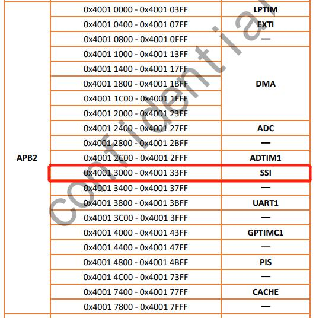
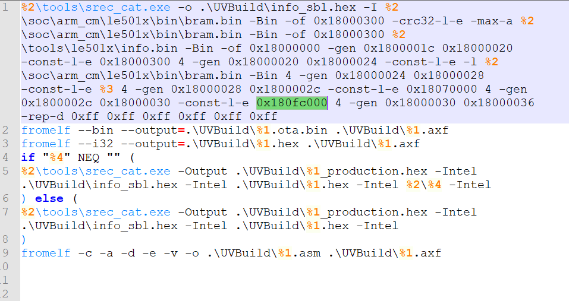
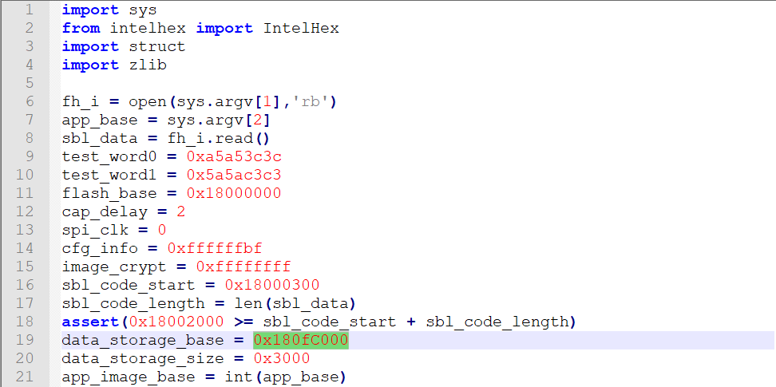

# LE5x1x注意事项

## 一、GPIO
### 1、GPIO上电复位默认状态
5010/5110芯片GPIO上电复位默认高阻状态，但是存在以下几个特殊IO需要应用时特别注意：  
+ PB05/PB06上电默认为SWD仿真功能口，SDK在上电初始化时默认使能了弱下拉；如果用户需要把这两个GPIO当做IO功能使用，需要应用程序把他们设置为GPIO功能模式。
>注意：当用户设置PB05/06为GPIO功能模式后，jlink将无法连接。只有通过复位同时拉高PB14进入boot模式，并且芯片不在加密状态，jlink才能重新芯片。  
+ PC01上电默认高电平，应用开发时，硬件设计需要注意初始电平特点，建议该IO设计成低电平有效，防止上电时误触发动作。
+ PB00/PB01上电默认boot的uart1串口通信功能，默认电平为高电平，应用开发时，如果当普通GPIO功能，建议该IO设计成低电平有效，防止上电时误触发动作。
>注意：PB00/PB01上电默认uart复用功能，但是在SDK软件中，初始化GPIO默认会恢复GPIO功能模式，所以在PB00/PB01上电过程中，从上电到进入用户main初始化IO会有大约30ms左右时间为uart模式，IO呈现高电平状态。  
### 2、休眠下IO状态
+ 芯片在LP0模式下，GPIO可以保持睡眠前状态，LP0唤醒后IO不需要重新配置。
+ 芯片在LP2/LP3模式下，GPIO部分控制寄存器失效，GPIO不能保持谁面前状态，但是GPIO上下拉有效，在SDK中，在进入睡眠流程时通过配置GPIO上下拉电阻状态使GPIO保持睡眠前GPIO电平状态，LP2/LP3唤醒后CPU软件重新复位运行。
>注意：在LP2/LP3睡眠时，GPIO虽然保持睡眠前电平状态，但是电平是通过上下拉电阻固定，带载能力会大大降低，应用时需要特别注意。  
### 3、wakeup下降沿唤醒问题
5010/5110芯片支持4个GPIO唤醒：PA00、PA07、PB11、PB15。且支持上升沿或下降沿唤醒。  
**当配置多个唤醒源，且唤醒沿不一致时，如果其中唤醒源上升沿唤醒，会误触发其他配置了下降沿的唤醒源产生下降沿唤醒标志位。**  
应用时，建议用户两种规避方式：1、尽量使用上升沿唤醒；2、使用下降沿唤醒时，唤醒后通过读取IO输入数据寄存器bit位判断是哪个唤醒IO发生唤醒。

## 二、GPTIMB、LPTIM
目前SDK BLE应用中把GPTIMB和LPTIM定时器应用于内部LRC校准，用户需要避免对GPTIMB和LPTIM定时器的使用。  

## 三、ADC
### 1、规则组连续模式采样速度
用户在中断方式使用规则组连续转换模式时，需要注意ADC采样速度，**当ADC采样速度大于4M时**，CPU有可能会不能及时通过中断的方式取出当前转换通道ADC转换值，而被下一个通道转换数据覆盖。   
当用户需要使用规则组多通道连续采样，且速率大于4M时，建议用户使用DMA的方式读取ADC数据，SDK中已为用户提供对应HAL库接口。  
### 2、多通道数据采样
无论规则组还是注入组，ADC多通道采样配置只对连续采样模式或者扫描模式有意义。如果用户配置了多个通道采样，但是未使能连续采样模式或扫描模式，每次触发ADC采样，ADC均采样第一个转换通道RSQ1或JSQ1。
### 3、ADC高速采样
+ 当用户需要多通道连续采样，且ADC采样速率大于等于8M时，建议ADC的转换时间SMPR配置为最大15clk，否则ADC不同通道间会相互干扰影响采样结果。
+ 当用户在ADC采样速度大于等于16M时，如果通过寄存器直接配置的方式修改ADC通道配置参数，在配置完成后需要delay 10us后再触发ADC采样，否则新配置不能生效。

## 四、DMA
用户在使用DMA时需要注意：使用DMA的外设，当启动DMA传输的同时，禁止CPU访问该外设所在的总线上其他外设，否则，当前DMA数据传输有一定概率出错。  
例如：  
当SSI模块使用DMA从RAM传输数据到发送寄存器时，由于SSI模块所在的总线是APB2，所以，此时应用软件应避免CPU去访问APB2总线上其他外设，比如ADC、UART1等。  
   

## 五、适配1M Flash
用户在使用1M Flash 的5010芯片的时候，需要修改TinyFS数据存储区的基地址。

### Keil 环境
- 用记事本或者其它文本编辑软件打开SDK目录下的tools\le5010x\after_build.bat文件；

- 找到after_build.bat文件中0x1807c000的数据，然后修改为0x180fc000重新编译即可。

### VS Code环境

- 用记事本或者其它文本编辑软件打开SDK目录下的tools\le5010x\info_sbl_merge.py文件；

- 找到info_sbl_merge.py文件中0x1807C000的数据，然后修改为0x180FC000重新编译即可。
