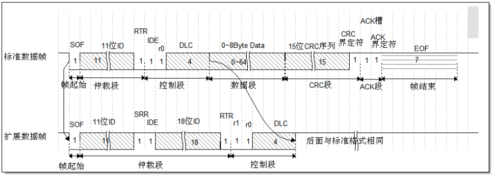

# CAN

## 一、CAN 协议简介

CAN 是控制器局域网络 (Controller Area Network) 的简称，它是由研发和生产汽车电子产品著称的德国 BOSCH 公司开发的，是 ISO 国际标准化的串行通信协议。

### 1.1 CAN 物理层

CAN 通讯是没有时钟信号的，它是一种异步通讯，只有CAN_Hgh 和 CAN_Low 两条信号线，共同构成一组差分信号线，以差分信号的形式进行通讯。

CAN 通讯节点由一个 CAN 控制器及 CAN 收发器组成，控制器与收发器之间通过 CAN_Tx 及 CAN_Rx 信号线相连，收发器与 CAN 总线之间使用 CAN_High 及 CAN_Low 信号线相连。其中 CAN_Tx 及 CAN_Rx 使用普通的类似 TTL 逻辑信号，而 CAN_High 及 CAN_Low 是一对差分信号线。  

由于 CAN 总线协议的物理层只有 1 对差分线，在一个时刻只能表示一个信号，所以对通讯节点来说，CAN 通讯是半双工的，收发数据需要分时进行。在 CAN 的通讯网络中，因为共用总线，在整个网络中同一时刻只能有一个通讯节点发送信号，其余的节点在该时刻都只能接收。  

当 CAN 节点需要发送数据时，控制器把要发送的二进制编码通过 CAN_Tx 线发送到收发器，然后由收发器把这个普通的逻辑电平信号转化成差分信号，通过差分线 CAN_High 和 CAN_Low 线输出到 CAN 总线网络。而通过收发器接收总线上的数据到控制器时，则是相反的过程，收发器把总线上收到的 CAN_High 及 CAN_Low 信号转化成普通的逻辑电平信号，通过 CAN_Rx 输出到控制器中。  

例如，我们芯片的 CAN 片上外设  就是通讯节点中的控制器，为了构成完整的节点，还要给它外接一个收发器。 

### 1.2 CAN 协议层

#### 1.2.1 位时序

为了实现数据同步，CAN 协议把每一个数据位的分成以下4段，这些段又由可称为Time Quantum（Tq）的最小单位构成。

- SS 段 (SYNC SEG) ：SS 译为同步段，若通讯节点检测到总线上信号的跳变沿被包含在 SS 段的范围之内，则表示节点与总线的时序是同步的，当节点与总线同步时，采样点采集到的总线电平即可被确定为该位的电平。 SS 段的大小固定为 1Tq。  

- PTS 段 (PROP SEG)：PTS 译为传播时间段，这个时间段是用于补偿网络的物理延时时间。是总线上输入比
  较器延时和输出驱动器延时总和的两倍。 PTS 段的大小可以为 1~8Tq。  
- PBS1 段 (PHASE SEG1)：PBS1 译为相位缓冲段，主要用来补偿边沿阶段的误差，它的时间长度在重新同步的时候可以加长。 PBS1 段的初始大小可以为 1~8Tq。  
- PBS2 段 (PHASE SEG2)：PBS2 这是另一个相位缓冲段，也是用来补偿边沿阶段误差的，它的时间长度在重新
  同步时可以缩短。 PBS2 段的初始大小可以为 2~8Tq。  

信号的采样点位于PBS1段与PBS2段之间，通过控制各个段的长度，可以对采样点的位置进行偏移，以便准确采样。

#### 1.2.2 通讯的波特率

总线上的各个通讯节点只要约定好 1 个 Tq 的时间长度以及每一个数据位占据多少个 Tq，就可以确定 CAN 通讯的波特率。  

#### 1.2.3 数据同步

- 硬同步

  接收单元在总线空闲状态检测出帧起始时进行的同步调整。

  挂载在CAN总线上的设备，在不发送数据的时候，会时刻监听总线上的信号，当总线上面出现帧起始信号时监听节点发现起始信号不在节点内部时序的SS段范围内，节点会将自己的位时序中的SS段平移至总线出现起始信号下降沿的部分，获得同步。

- 重新同步

  在接收过程中检测出总线上的电平变化时进行的同步调整。

  每当检测出边沿时，根据 SJW 值通过加长 PBS1 段，或缩短 PBS2 段，以调整同步。但如果发生了超出 SJW值的误差时，最大调整量不能超过 SJW 值。  

#### 1.2.4 报文种类

| 帧     | 描述                                               |
| ------ | -------------------------------------------------- |
| 数据帧 | 用于节点向外传送数据                               |
| 遥控帧 | 用于向远端节点请求数据                             |
| 错误帧 | 用于向远端节点通知校验错误，请求重新发送上一个数据 |
| 过载帧 | 用于通知远端节点：本节点尚未做好接收准备           |
| 帧间隔 | 用于将数据帧及遥控帧与前面的帧分离开来             |

数据帧的结构




## 二、CAN 接口介绍

### 2.1 初始化

- 首先需要初始化用到的IO，使用以下接口即可：

```c
void pinmux_bxcan_init(uint8_t txd,uint8_t rxd);
```

- 然后开始初始化CAN外设，在初始化的时候需要把设备的工作模式以及通信的波特率配置好：

```c
HAL_StatusTypeDef HAL_CAN_Init(CAN_HandleTypeDef* hcan);
```

（1）工作模式配置说明：

1. TTCM 时间触发模式

   TTCM(Time triggered communication mode) 时间触发模式，它用于配置 CAN 的时间触发通信模式，在此模式下， CAN 使用它内部定时器产生时间戳，并把它保存在CAN_RDTxR、 CAN_TDTxR 寄存器中。内部定时器在每个 CAN 位时间累加，在接收和发送的帧起始位被采样，并生成时间戳。利用它可以实现 ISO 11898-4 CAN 标准的分时同步通信功能。  

2. ABOM 自动离线管理 

   ABOM (Automatic bus-off management) 自动离线管理，它用于设置是否使用自动离线管理功能。当节点检测到它发送错误或接收错误超过一定值时，会自动进入离线状态，在离线状态中， CAN 不能接收或发送文。处于离线状态的时候，可以软件控制恢复或者直接使用这个自动离线管理功能，它会在适当的时候自动恢复。  

3. AWUM 自动唤醒  

   AWUM (Automatic bus-off management)，自动唤醒功能， CAN 外设可以使用软件进入低功耗的睡眠模式，如果使能了这个自动唤醒功能，当 CAN 检测到总线活动的时候，会自动唤醒。  

4. NART 自动重传  

   NART(No automatic retransmission) 禁止报文自动重传功能，使能后，无论发送结果如何，消息只发送一次。否则，当报文发送失败会自动重传。

5. RFLM 锁定模式  

   RFLM(Receive FIFO locked mode)FIFO 锁定模式，该功能用于锁定接收 FIFO 。锁定后，当接收 FIFO 溢出时，会丢弃下一个接收的报文。若不锁定，则下一个接收到的报文会覆盖原报文。  

6. TXFP 报文发送优先级的判定方法  

   TXFP(Transmit FIFO priority) 报文发送优先级的判定方法，当 CAN 外设的发送邮箱中有多个待发送报文时，本功能可以控制它是根据报文的 ID 优先级还是报文存进邮箱的顺序来发送。

（2）测试模式

通过配置CAN_BTR寄存器的SILM和LBKM位可以使用正常模式、静默模式、回环模式及静默回环模式。应用上面可以通过下面的宏来选择

```
CAN_MODE_NORMAL /*!< Normal mode   */
CAN_MODE_LOOPBACK /*!< Loopback mode */
CAN_MODE_SILENT /*!< Silent mode   */
CAN_MODE_SILENT_LOOPBACK /*!< Loopback combined with silent mode */
```

（3）波特率

我们芯片外设的CAN 位时序中只包含3段，SS、BS1、BS2，采样点位于BS1和BS2段的交界处，其中SS段固定1Tq，BS1和BS2段的长度应用可配。  BaudRate  = 1 / NominalBitTime，NominalBitTime  表示 SS段+BS1段+BS2段的时间总和。  


波特率计算说明：

```c
Can_Handle.Init.BS1 = CAN_BS1_4TQ;
Can_Handle.Init.BS2 = CAN_BS2_3TQ;
Can_Handle.Init.Prescaler = 7; 
```

通过上面三行代码配置可以确定CAN的波特率。SS段的时间固定是1TQ，BS1段的时间 T<sub>S1</sub> = 4 TQ ，BS2段的时间T<sub>S2</sub> = 3 TQ，所以T<sub>1bit</sub> = 1TQ +  T<sub>S1</sub> + T<sub>S2</sub>  =  8TQ。

其中TQ的时间与CAN外设所挂载的时钟总线及分频器配置有关，CAN 外设的时钟是经过APB 2分频后的时钟，既  T<sub>PCLK</sub> =  1 / (SDK_HCLK_MHZ *1MHz /2)。在 SDK_HCLK_MHZ=64 并且 Can_Handle.Init.Prescaler = 7 的条件下，T<sub>1TQ</sub> = (Prescaler + 1) x T<sub>PCLK</sub> = 0.25 us ;

NominalBitTime = T<sub>1bit</sub> = 8*0.25us = 2us ==> BaudRate  = 500K bps。

### 2.2 CAN 接收过滤配置

#### 2.2.1接收筛选器介绍

CAN 外设总共有14个筛选器组，每个筛选器组包含两个寄存器CAN_FxR1和CAN_FxR2，各个寄存器位代表的意义与下图中两个寄存器下面“映射”的一栏一致。根据筛选ID的长度以及过滤模式，总共有4种筛选配置可供选择。


| 模式             | 说明                                                         |
| ---------------- | ------------------------------------------------------------ |
| 32 位掩码模式    | CAN_FxR1 存储 ID，CAN_FxR2 存储哪个位必须要与 CAN_FxR1 中的 ID 一致，<br />2 个寄存器表示 1 组掩码。 |
| 32 位标识符模 式 | CAN_FxR1 和 CAN_FxR2 各存储 1 个 ID， 2 个寄存器表示 2 个筛选的 ID |
| 16 位掩 码模式   | CAN_FxR1 高 16 位存储 ID，低 16 位存储哪个位必须要与高 16 位的 ID 一致；<br />CAN_FxR2 高 16< 位存储 ID，低 16 位存储哪个位必须要与高 16 位的 ID 一致 <br />2 个寄存器表示 2 组掩码。 |
| 16 位标识符模式  | CAN_FxR1 和 CAN_FxR2 各存储 2 个 ID， 2 个寄存器表示 4 个筛选的 ID |


#### 2.2.2 软件配置 

```c
/**
* @brief CAN filter init structure definition
* CAN 筛选器结构体
*/
typedef struct {
    uint32_t FilterIdHigh; /*CAN_FxR1 寄存器的高 16 位 */
    uint32_t FilterIdLow; /*CAN_FxR1 寄存器的低 16 位 */
    uint32_t FilterMaskIdHigh; /*CAN_FxR2 寄存器的高 16 位 */
    uint32_t FilterMaskIdLow; /*CAN_FxR2 寄存器的低 16 位 */
    uint32_t FilterFIFOAssignment; /* 设置经过筛选后数据存储到哪个接收 FIFO */
    uint32_t FilterNumber; /* 筛选器编号，范围 0-14*/
    uint32_t FilterMode; /* 筛选器模式 */
    uint32_t FilterScale; /* 设置筛选器的尺度 */
    uint32_t FilterActivation; /* 是否使能本筛选器 */
} CAN_FilterInitTypeDef;
```

配置完这些结构体成员后，我们调用库函数 HAL_CAN_ConfigFilter 即可把这些参数写入到筛选控制寄存器中，从而使用筛选器。  

| 模式          | FilterIdHigh    | FilterIdLow     | FilterMaskIdHigh    | FilterMaskIdLow    |
| ------------- | --------------- | --------------- | ------------------- | ------------------ |
| 32 位列表模式 | ID1 的高 16 位  | ID1 的低 16 位  | ID2 的高 16 位      | ID2 的低 16 位     |
| 16 位列表模式 | ID1 的完整数 值 | ID2 的完整数 值 | ID3 的完整数值      | ID1 掩码的低 16 位 |
| 32 位掩码模式 | ID1 的高 16 位  | ID1 的低 16 位  | ID1 掩码的高 16 位  | ID1 掩码的低 16 位 |
| 16 位掩码模式 | ID1 的完整数 值 | ID2 的完整数 值 | ID1 掩码的完整数 值 | ID2 掩码完整数值   |

### 2.3 CAN 发送数据

```c
/**
* @brief CAN Tx message structure definition
* 发送结构体
*/
typedef struct {
uint32_t StdId; /* 存储报文的标准标识符 11 位， 0-0x7FF. */
uint32_t ExtId; /* 存储报文的扩展标识符 29 位， 0-0x1FFFFFFF. */
uint8_t IDE; /* 存储 IDE 扩展标志 */
uint8_t RTR; /* 存储 RTR 远程帧标志 */
uint8_t DLC; /* 存储报文数据段的长度， 0-8 */
uint8_t Data[8]; /* 存储报文数据段的内容 */
} CanTxMsgTypeDef;
```

在需要发送报文时，先定义一个上面发送类型的结构体，然后把报文的内容按成员赋值到该结构体中，然后再使用发送既可以把报文发送出去。

- 阻塞式发送

  ```c
  HAL_StatusTypeDef HAL_CAN_Transmit(CAN_HandleTypeDef *hcan, uint32_t Timeout);
  ```

- 中断发送

  ```c
  HAL_StatusTypeDef HAL_CAN_Transmit_IT(CAN_HandleTypeDef *hcan);
  ```

  中断发送完成回调

  ```c
  void HAL_CAN_TxCpltCallback(CAN_HandleTypeDef* hcan);
  ```

### 2.4 CAN 接收数据

```c
/**
* @brief CAN Rx message structure definition
* 接收结构体
*/
typedef struct {
    uint32_t StdId; /* 存储了报文的标准标识符 11 位， 0-0x7FF. */
    uint32_t ExtId; /* 存储了报文的扩展标识符 29 位， 0-0x1FFFFFFF. */
    uint8_t IDE; /* 存储了 IDE 扩展标志 */
    uint8_t RTR; /* 存储了 RTR 远程帧标志 */
    uint8_t DLC; /* 存储了报文数据段的长度， 0-8 */
    uint8_t Data[8]; /* 存储了报文数据段的内容 */
    uint8_t FMI; /* 存储了 本报文是由经过筛选器存储进 FIFO 的， 0-0xFF */
    uint8_t FIFONumber; /* 配置接收 FIFO 编号，可以是 CAN_FIFO0 或者 CAN_FIFO1 */
} CanRxMsgTypeDef;
```

- 阻塞式接收

  ```c
  HAL_StatusTypeDef HAL_CAN_Receive(CAN_HandleTypeDef *hcan, uint8_t FIFONumber, uint32_t Timeout);
  ```

  当函数返回 HAL_OK 时表示接收完成，数据存放在初始化时的接收结构体里面。

- 中断方式接收

  ```c
  HAL_StatusTypeDef HAL_CAN_Receive_IT(CAN_HandleTypeDef *hcan, uint8_t FIFONumber);
  ```

  当正确收到数据时，会产生回调

  ```c
  void HAL_CAN_RxCpltCallback(CAN_HandleTypeDef* hcan);
  ```

  


