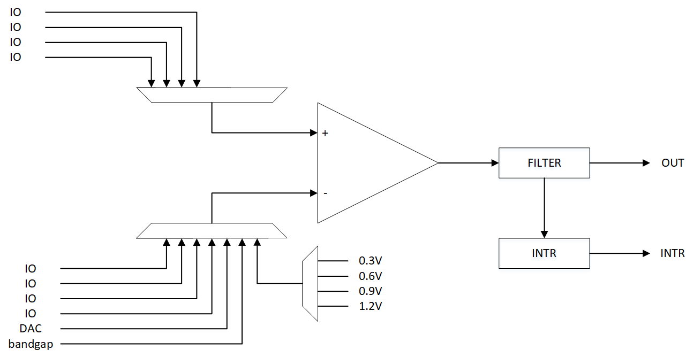

.. _COMP_ref:

COMP
==============

一、COMP简介
------------------
比较器有两个输入端IN+和IN-，其中一个输入端作为参考点来比较，当另一输入端电压小于参考电压时比较器输出低电平，反之输出高电平。

二、COMP接口介绍
----------------------
2.1 初始化
++++++++++++++++++++++++++++++
首先需要进行COMP模块初始化

.. code ::

    typedef struct __COMP_HandleTypeDef
    {
        reg_comp_t *COMP;
    } COMP_HandleTypeDef;

    HAL_COMP_Init(COMP_HandleTypeDef *hcomp);

.. note ::
    调用初始化函数前需要配置COMP具体实例对象。

2.2 设置参数
++++++++++++++++++++++++++++++
将COMP参数配置到寄存器中
.. code ::

    typedef struct
    {
        uint32_t
            comp_en : 1,        // comp比较器使能
            clk_mode : 3,       // 时钟模式
            hysteresis : 2,     // 迟滞选择
            vrefctl : 2,        // 内部基准电压选择
            vrefsel : 3,        // 参考源选择
            input : 2,          // 输入选择
            reserved1 : 3,      // 保留位
            flt_prd : 2,        // MS中的滤波周期
            flt_byp : 1,        // pass滤波器
            risingintr_en : 1,  // 上升沿中断使能
            fallingintr_en : 1, // 下降沿中断使能
            reserved2 : 11;     // 保留位
    } COMP_Param;
    HAL_COMP_Config(COMP_HandleTypeDef *hcomp, COMP_Param *param);

2.3 开启或关闭COMP
++++++++++++++++++++++++++++++

.. code ::

    HAL_COMP_Start(COMP_HandleTypeDef *hcomp);
    
    HAL_COMP_Stop(COMP_HandleTypeDef *hcomp);
    
    HAL_COMP_Callback(COMP_HandleTypeDef *hcomp, enum comp_intr_edge edge, bool status);

.. note :: 

    | edge：保存的数据是中断触发沿。
    | status：比较器输出状态。
    | HAL_COMP_Callback属于弱定义，用户可以自行定义，并完成相应的逻辑处理。
    | COMP开启后，当输出的信号从1->0（或0->1），并且在控制寄存器中使能下降沿(上升沿)中断，则会调用HAL_COMP_Callback回调函数。

2.4 反初始化
++++++++++++++++++++++++++++++
通过反初始化接口，应用程序可以关闭COMP外设，从而在运行BLE的程序的时候，降低系统的功耗

.. code ::

    HAL_COMP_DeInit(void);