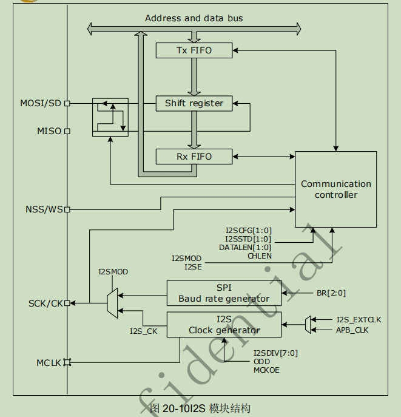

.. _i2s_ref:

I2S
======

Inter-IC Sount Bus(I2S)是针对数字音频设备之间的音频数据传输而制定的一种总线标准，
在I2S标准中，既规定了硬件接口规范，也规定了数字音频数据的格式。

I2S主要特性
>>>>>>>>>>>>>>

#. 主设备或从设备模式
#. 半双工通信（仅作为发送或接收）
#. 8 位可编程线性预分频器，可实现精确的音频采样频率（从 8 kHz 到 192 kHz）
#. 数据格式可以是 16 位、24 位或 32 位
#. 数据包帧由音频通道固定为 16 位（可容纳 16 位数据帧）或 32 位（可容纳 16 位、 24 位、32 位数据帧）
#. 从发送模式下的下溢标志、接收模式下的上溢标志（主模式和从模式），以及接收和发送模式下的帧错误标志（仅从模式）
#. 可编程时钟极性
#. 支持的 I2S 协议：
   — I2S Phillps 标准
   — MSB 对齐标准（左对齐）
   — LSB 对齐标准（右对齐）
   — PCM 标准（在 16 位通道帧或扩展为 32 位通道帧的 16 位数据帧上进行短帧和长帧同步）
#. 数据方向始终为 MSB
#. 支持Rx和Tx FIFO，深度是16
#. 支持DMA传输
#. 可输出主时钟以驱动外部音频元件,频率固定为 256 × FS（其中 FS 为音频采样频率）  

一、I2S模块初始化
-------------------

1.1 选择I2S模块的复用IO
........................

芯片支持该模块复用IO全映射，所以用户可以通过调用IO 的初始化接口，将任意IO配置CK、WS、SD、及MCK功能，与外部设备进行通信。

.. code ::

    void iis_master_ck_io_cfg(uint8_t ck);
    void iis_master_ws_io_cfg(uint8_t ws);
    void iis_master_sd_io_cfg(uint8_t sd, uint8_t mode);
    void iis_master_mck_io_cfg(uint8_t mck);

1.2 设置I2S模块参数
.....................

在使用I2S模块前，需要设置I2S模块的参数，其结构体的参数原型如下：

.. code ::

    struct Interrupt_Env
    {
        uint8_t                    *pBuffPtr;                         /*!< Pointer to transfer Buffer */
        uint16_t              	   Count;                               /*!<  Transfer Counter */
        void (*i2s_transfer_Fun)(struct __I2S_HandleTypeDef *hi2s);   /*!< function pointer on transfer_Fun */
    };

    struct DMA_Env
    {
        uint8_t DMA_Channel;
        uint8_t dummy;
    };

    typedef struct __I2S_HandleTypeDef
    {
        reg_spi_t                 *Instance;     /*!< I2S registers base address  */

        I2S_InitTypeDef            Init;         /*!< I2S communication parameters */

        void                       *DMAC_Instance;    /*!< I2S DMA Instance  */

        union{
                struct Interrupt_Env  Interrupt;         /*!< Interrupt Env  */
                struct DMA_Env        DMA;               /*!< DMA Env  */
        }Tx_Env,Rx_Env;                                /*!< Tx Rx Environment */

    } I2S_HandleTypeDef;

I2S模块具体参数设置可参阅该模块ls_hal_spi_i2s.h文件。

1.3 初始化I2S模块
..................

通过初始化接口，实现用户对I2S模块进行参数配置。

.. code ::

    HAL_StatusTypeDef HAL_I2S_Init(I2S_HandleTypeDef *hi2s);

如果初始化成功后便可以返回值为HAL_OK，否则为HAL_ERROR。

二、反初始化
--------------

2.1 反初始化I2S模块
......................

通过反初始化接口，应用程序可以关闭I2S模块，降低系统的功耗。

.. code ::

    HAL_StatusTypeDef HAL_I2S_DeInit(I2S_HandleTypeDef *hi2s);

2.2 反初始化复用IO
...................

反初始化IO接口的主要目的是为了避免在进入低功耗模式时，IO上产生漏电，或者给对接设备发送不必要的数据。
调用I2S IO反初始化接口后,会将I2S复用IO恢复回GPIO功能。

.. code ::

    void pinmux_iis2_ck_deinit(void);
    void pinmux_iis2_ws_deinit(void);
    void pinmux_iis2_sd_deinit(void);
    void pinmux_iis2_mck_deinit(void);

.. note ::

    I2S初始化动作会向系统注册I2S进入工作状态，当系统检测到有任一外设处于工作状态时，都不会进入低功耗休眠。
    因此，应用中如I2S使用完毕，需要进入低功耗状态之前，必须反初始化I2S。

三、I2S模块通信
---------------

#. 支持主机和从机两种模式；
#. 每种模式均支持 3 种通信方法：阻塞方式、非阻塞（中断）方式、DMA 方式。在使用的时候，这 3 种方式只能选其一。
#. 每种通信方式均支持单收、单发。

3.1 阻塞方式
.............   

以阻塞方式使用I2S设备的API接口如下所示：

.. code ::

    HAL_StatusTypeDef HAL_I2S_Transmit(I2S_HandleTypeDef *hi2s, uint16_t *pTxData, uint16_t Size, uint32_t Timeout);
    HAL_StatusTypeDef HAL_I2S_Receive(I2S_HandleTypeDef *hi2s, uint16_t *pRxData, uint16_t Size, uint32_t Timeout);

顾名思义，阻塞方式是指应用软件调用该接口后，CPU需要等待本次通信完成后才退出，会一定程度上降低CPU的利用率。

3.2 非阻塞（中断）方式
........................

以中断方式使用I2S设备的API接口如下所示：

.. code ::

    HAL_StatusTypeDef HAL_I2S_Transmit_IT(I2S_HandleTypeDef *hi2s, uint16_t *pTxData, uint16_t Size);
    HAL_StatusTypeDef HAL_I2S_Receive_IT(I2S_HandleTypeDef *hi2s, uint16_t *pRxData, uint16_t Size);

3.3 DMA方式
.............

以DMA方式使用I2S设备的API接口如下所示：

.. code ::

    HAL_StatusTypeDef HAL_I2S_Transmit_DMA(I2S_HandleTypeDef *hi2s, void *Data, uint16_t Count);
    HAL_StatusTypeDef HAL_I2S_Receive_DMA(I2S_HandleTypeDef *hi2s, void *Data, uint16_t Count);

.. note ::

    DMA方式在使用时需要注意：DMA只支持访问特定的8Kram（0xa000~0xbFFF），所以，DMA使用的变量或数组必须指定在这8K内，建议用户在申请变量时加 DMA_RAM_ATTR 限定。例如：DMA_RAM_ATTR uint8_t aTxBuffer[BUFFERSIZE];
    

四、代码示例
----------------

示例代码请参阅下面章节：应用说明->I2S设备使用示例。    
