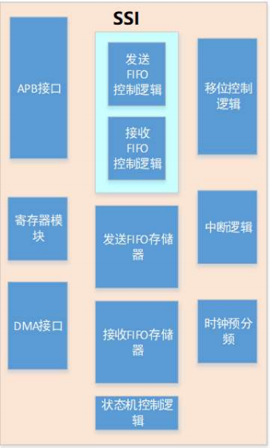

.. _ssi_ref:

SSI
==============

一、SSI简介
--------------
SSI是一个全双工主/从同步串行接口,主机通过APB接口访问SSI上的数据、控制和状态信息。SSI通过一组DMA信号与DMA控制器
进行连接,SSI可配置为两种操作模式之一:串行主模式或串行从模式
SSI 可以使用以下接口之一连接到任何串行主或串行从外围设备:

--摩托罗拉串行外围接口(SPI):来自摩托罗拉的四线全双工串行协议。串行时钟相位和极性有四种可能的组合。时钟相位(SCPH)决定串行传输是从从选择信号的下降沿开始，还是从串行时钟的第一个边缘开始。当SSI空闲或禁用时，从机选择线保持高位。有关更多信息，请参阅“摩托罗拉串行外围接口(SPI)”

--德州仪器串行协议(SSP):一种四线全双工串行协议。被用于SPI和 Microwire 协议的从机选择线同时作为SSP协议的帧指示。有关更多信息，请参阅“德州仪器同步串行协议(SSP)”

--National MICROWIRE:半双工串行协议，它使用一个控制字从串行主机传输到目标串行从机。有关更多信息，请参阅“National MICROWIRE”

可以对控制寄存器0(SSI CRO)中的 FRF(帧格式)位字段进行编程，以选择使用哪个协议。

SSI功能描述
--------------
SSI支持的串行协议允许通过硬件或软件的选择或寻址到串行从机。在硬件上实现时，串行从机是在专用硬件控制选择线下选择的。从昌行主机生成的选择行数等于总线上的串行从机的
数量。串行主设备在开始数据传输之前判断目标串行从机的选择线。

当在软件中实现时，所有串行从设备的输入选择应起源于串行主机上的单个从机选择输出。在这种模式下，假定昌行主机只有一个从机选择输出。如果系统中有多个串行主机，所有主机
的从机选择输出可以逻辑地生成一个从机选择输入，用于所有串行从设备。

软件域中的主程序控制目标从设备的选择:软件将使用所有从设备的 SSIENR 寄存器,以控制哪个从设备来响应串行主设备发出的传输请求。

二、SSI模块初始化
-------------------

2.1 选择SSI模块的复用IO
........................

芯片支持该模块复用IO全映射，所以用户可以通过调用IO 的初始化接口，将任意IO配置CLK、MOSI、MISO、及NSS功能，与外围设备进行通信。

.. code ::

    pinmux_ssi_clk_init(PB09);		/* CLK-------------PB09 */	
	pinmux_ssi_nss0_init(PB08);	    /* SSN-------------PB08 */	
	pinmux_ssi_dq0_init(PA07);		/* MOSI------------PA07 */	
	pinmux_ssi_dq1_init(PA00);		/* MISO------------PA00 */

.. note ::

    SNN是SSI片选脚，当SSI为主机时，也可以用普通IO替代，如果工程师需要用IO功能替代时，可以不初始化该复用IO。

2.2 设置SSI模块参数
.....................

在使用SSI模块前，需要设置SSI模块的参数，其结构体的参数原型如下：

.. code ::

    typedef struct __SSI_HandleTypeDef
    {
        reg_ssi_t *REG;              /**< Register Base Pointer */
        SSI_InitTypeDef Init;        /**< Initialization Parameters */
        volatile uint32_t *DR_REG;   /**< Used Data Register */
        void *DMAC_Instance;         /**< DMA Controller Handle Pointer */
        union{
            struct SSI_DMA_Env DMA;     /**< DMA Env */
            struct SSI_Interrupt_Env Interrupt; /**< Interrupt Env */
        }Tx_Env,Rx_Env;              /**< Tx Rx Environment */
        uint8_t Hardware_CS_Mask;    /**< Hardware CS Bit Mask, 0 for Software CS */
    }SSI_HandleTypeDef;

SSI模块具体参数设置可参阅该模块ls_hal_ssi.h文件。

2.3 初始化SSI模块
..................

通过初始化接口，实现用户对SSI模块进行参数配置。

.. code ::

    HAL_StatusTypeDef HAL_SSI_Init(SSI_HandleTypeDef *hssi);

如果初始化成功后便可以返回值为HAL_OK，否则为HAL_ERROR。

三、反初始化
--------------

3.1 反初始化SSI模块
......................

通过反初始化接口，应用程序可以关闭SSI模块，降低系统的功耗。

.. code ::

    HAL_StatusTypeDef HAL_SSI_Deinit(SSI_HandleTypeDef *hssi);

3.2 反初始化复用IO
...................

反初始化IO接口的主要目的是为了避免在进入低功耗模式时，IO上产生漏电，或者给对接设备发送不必要的数据。
调用SSI IO反初始化接口后,会将SSI复用IO恢复回GPIO功能。

.. code ::

    void pinmux_ssi_clk_deinit(void);
    void pinmux_ssi_nss0_deinit(void);
    void pinmux_ssi_dq0_deinit(void);
    void pinmux_ssi_dq1_deinit(void);

.. note ::

    SSI初始化动作会向系统注册进入工作状态，当系统检测到有任一外设处于工作状态时，都不会进入低功耗休眠。
    因此，应用中如SSI使用完毕，需要进入低功耗状态之前，必须反初始化SSI。

四、SSI模块通信
---------------

#. 每种模式均支持 3 种通信方法：阻塞方式、非阻塞（中断）方式、DMA 方式。在使用的时候，这 3 种方式只能选其一。
#. 每种通信方式均支持单收、单发、收发同步接口。

4.1 阻塞方式
.............   

以阻塞方式使用SSI设备的API接口如下所示：

.. code ::

    HAL_SSI_Transmit(SSI_HandleTypeDef *hssi,void *Data,uint16_t Count)
    HAL_SSI_Receive(SSI_HandleTypeDef *hssi,void *Data,uint16_t Count)
    HAL_SSI_TransmitReceive(SSI_HandleTypeDef *hssi,void *TX_Data,void *RX_Data,uint16_t Count)
    HAL_SSI_TransmitReceive_HalfDuplex(SSI_HandleTypeDef *hssi,void *TX_Data,uint16_t TX_Count,void *RX_Data,uint16_t RX_Count)

顾名思义，阻塞方式是指应用软件调用该接口后，CPU需要等待本次通信完成后才退出，会一定程度上降低CPU的利用率。

4.2 非阻塞（中断）方式
........................

以中断方式使用SSI设备的API接口如下所示：

.. code ::

    HAL_SSI_Transmit_IT(SSI_HandleTypeDef *hssi,void *Data,uint16_t Count)
    HAL_SSI_Receive_IT(SSI_HandleTypeDef *hssi,void *Data,uint16_t Count)
    HAL_SSI_TransmitReceive_IT(SSI_HandleTypeDef *hssi,void *TX_Data,void *RX_Data,uint16_t Count)
    HAL_SSI_TransmitReceive_HalfDuplex_IT(SSI_HandleTypeDef *hssi,void *TX_Data,uint16_t TX_Count,void *RX_Data,uint16_t RX_Count)

4.3 DMA方式
.............

以DMA方式使用SSI设备的API接口如下所示：

.. code ::

    HAL_SSI_Transmit_IT(SSI_HandleTypeDef *hssi,void *Data,uint16_t Count)
    HAL_SSI_Receive_IT(SSI_HandleTypeDef *hssi,void *Data,uint16_t Count)
    HAL_SSI_TransmitReceive_IT(SSI_HandleTypeDef *hssi,void *TX_Data,void *RX_Data,uint16_t Count)
    HAL_SSI_TransmitReceive_HalfDuplex_IT(SSI_HandleTypeDef *hssi,void *TX_Data,uint16_t TX_Count,void *RX_Data,uint16_t RX_Count)
    

五、代码示例
----------------

示例代码请参阅下面章节：应用说明->SSI设备使用示例。    
