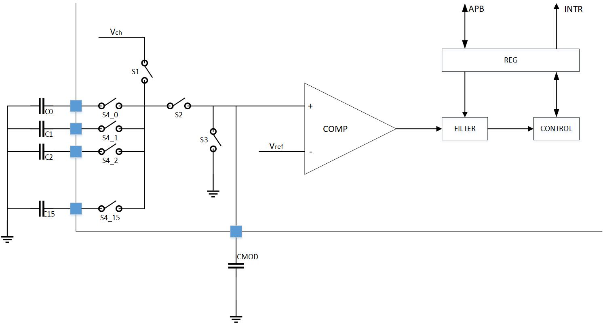

.. _TOUCHKEY_ref:

TOUCHKEY
==============

一、TOUCHKEY简介
------------------
    TouchKey是一种基于电容检测原理实现的触摸按键。电容式传感技术能够检测电极附近的手指是否存在，电极受到电介质（例如玻璃、塑料）的保护，使其免受直接接触。手指（或任何导电物体）引入的电容变化是使用基于表面电荷转移获取原理的成熟实现来测量的。触摸传感固件库完全支持触摸传感控制器，该固件库可免费使用，并允许在最终应用中可靠地实现触摸传感功能。

    
二、TOUCHKEY接口介绍
----------------------
2.1 初始化
++++++++++++++++++++++++++++++
首先需要进行TOUCHKEY模块初始化。

.. code ::

    HAL_TOUCHKEY_Init(void);

    HAL_TOUCHKEY_SetParam(TOUCHKEY_PARAM *param);

    typedef struct
    {
        uint16_t clk_hprd;        // 对C~x充电周期(clk_lprd <= 0x3ff)
        uint16_t clk_lprd;        // 对C~MOD充电周期(clk_lprd <= 0x3ff)
        uint32_t scan_mtim;       // 最大计数值(scan_mtim <= 0xfffff)
        uint16_t scan_channel_en; // 通道使能(scan_channel_en <= 0xffff)
        uint8_t scan_flt_prd;     // 滤波周期(scan_flt_prd <= 0x3)
        uint8_t scan_iter;        // 每个通道的扫描迭代次数(scan_iter <= 0xf)
        uint8_t scam_disch_prd;   // 放电周期(scam_disch_prd <= 0x7)
        uint8_t touchkey_cp_vctl; // 外部参考电压(touchkey_cp_vctl <= 0x3)
    } TOUCHKEY_PARAM;

.. note ::
    | 在TouchKey外设工作时，输出的结果受结构体TOUCHKEY_PARAM中的元素影响
    | 在开始扫描之前，需要执行HAL_TOUCHKEY_SetParam把TOUCHKEY_PARAM中的数据写入指定寄存器中

2.2 开始扫描
++++++++++++++++++++++++++++++
2.2.1 轮询模式
......................

.. code ::

    HAL_TOUCHKEY_StartScan(uint32_t count[16]);

.. note ::

    | 参数count用于接收扫描结果，从通道0-通道15顺序存储，未使能通道输出值为0。

2.2.2 中断模式
......................

.. code ::

   HAL_TOUCHKEY_StartScan_IT();

2.2.3 回调函数 
......................
.. code ::
    
    HAL_TOUCHKEY_END_Callback(uint32_t count[16]){}
    
    HAL_TOUCHKEY_ERR_Callback(){}

.. note ::

    | 扫描结束，会执行回调函数：HAL_TOUCHKEY_END_Callback
    | 发生错误，会执行回调函数：HAL_TOUCHKEY_ERR_Callback
    | 参数count用于接收扫描结果，从通道0-通道15顺序存储，未使能通道输出值为0
    | 这两个函数属于弱定义，用户可以自行定义，并完成相应的逻辑处理
    

2.3 反初始化
++++++++++++++++++++++++++++++

反初始化TOUCHKEY模块
.........................

通过反初始化接口，应用程序可以关闭TOUCHKEY外设，从而在运行BLE的程序的时候，降低系统的功耗

.. code ::

    HAL_TOUCHKEY_DeInit(void);