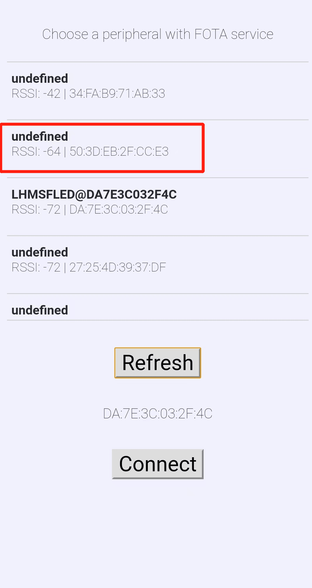

# BLE MESH协议栈OTA升级流程

​	本文档介绍了利用tmall_mesh_gatt_ls_ota、fota工程实现mesh协议栈OTA升级功能，该测试流程中包含了新OTA的所有功能，下面演示了从SDK1.1升级mesh stack到SDK2.0及更高版本的操作步骤

**Note: SDK1.0及以下版本不支持mesh stack OTA升级**

## 需要准备的文件

1. 编译sdk1.1 tmall_mesh_gatt_ls_ota工程，生成带有OTA服务的原始固件：tmall_mesh_gatt_ls_ota_production.hex

2. sdk1.1 fota 固件：old_fota.bin（ 打开fota工程，找到链接脚本single_bank_fota_link.txt文件，将文件中的FLASH (rx) : ORIGIN = 0x18070000 地址修改为0x18071000， 编译得到fota.ota.bin文件，重命名为old_fota.bin（上述为GCC环境下编译，armcc环境下需修改脚本文件中FLASH_BASE_USER的值））

3. 在sdk2.0安装路径ls_sdk\stack\build\le501x目录下找到fw.hex和mesh_stack.hex文件并都转为bin文件，分别命名为new_fw.bin和new_mesh_stack.bin

4. 打开sdk2.0 fota工程，找到连接脚本single_bank_fota_link.txt文件，将文件中的FLASH (rx) : ORIGIN = 0x18071000 地址修改为0x18066000，重新scons编译，得到文件fota.ota.bin，重命名为new_fota.bin。（上述为GCC环境下编译，armcc环境下需修改脚本文件中FLASH_BASE_USER的值）

5. 编译sdk1.1 tmall_mesh_gatt_ls_ota工程,找到生成的ota.bin文件并重命名为 new_tmall_mesh_gatt_ls_ota.ota.bin

## 升级流程

1. 烧录sdk1.1的固件 tmall_mesh_gatt_ls_ota_production.hex并运行程序

2. 打开BLE_FOTA  APP，搜索步骤1烧录的MAC地址为“50 ：3d ：eb：2f：cc：e3 ”的设备，并且建立连接

    

3. 选择sdk1.1的old_fota.bin文件，下载到地址0x18071000地址处，boot address地址也填为0x18071000，选择need reboot，然后按下start fota，开始ota，等待界面显示finish cmd sent后点击“Disconnect”断开连接

    

4. 在APP中点击Refresh刷新，搜索广播名FOTA的设备，并建立连接

5. 选择要OTA升级的文件：new_fw.bin，将set ota address select的值填写为0x18034000, 不需要勾选need reboot，然后直接start fota，等到界面显示finish cmd sent后开始下一步操作

    

6. 断开连接并重新连接APP，选择将要OTA的文件：new_fota.bin，其中set ota address select的地址填选为 0x18066000，勾选need reboot，填写以下地址：

   - fw copy src addr ：0x18034000 

   - fw copy dst addr：0x18002000 

   - fw copy size：0x32000（找到new_fw.bin文件然后在右键属性里查看文件实际大小转换为16进制填在此处）

   - boot addr：0x18066000

​	按下start fota，等待界面显示finish cmd并自动断开蓝牙后开始下一步

​     

​	之后将地址改为0x18071000按下start fota，等待界面显示finish cmd并自动断开蓝牙后开始下一步

7. 打开app，搜索广播名 FOTA的设备，并建立连接

8. 选择ota文件 ：new_mesh_stack.bin ，set ota address select的值设为0x18034000，按下start fota，等待界面显示finish cmd sent并自动断开蓝牙

    

9. 选择ota文件 ：new_tmall_mesh_gatt_ls_ota.bin，set ota address select的值为0x18056000，勾选need reboot 和 setting erase req，填写boot addr为0x18056000

    

10. 打开天猫精灵 app，搜索 MAC 地址为“50 ： 3d ： eb： 2f： cc： e3 ” 的设备，建立连接成功时说明MESH STACK OTA 升级已成功  

